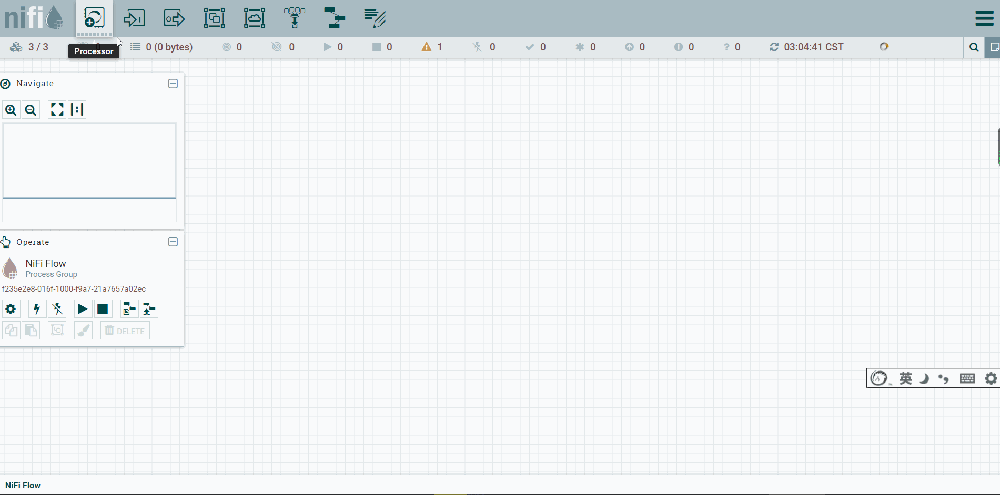

# Nifi概念

 

## Nifi是什么

​		Apache NiFi 是一个易于使用，功能强大且可靠的系统，用于处理和分发数据。可以自动化管理系统间的数据流。它使用高度可配置的指示图来管理数据路由、转换和系统中介逻辑，支持从多种数据源动态拉取数据。NiFi原来是NSA的一个项目，目前已经代码开源，是Apache基金会的顶级项目之一。

​		NiFi是基于Java的，使用Maven支持包的构建管理。 NiFi基于Web方式工作，后台在服务器上进行调度。用户可以将数据处理定义为一个流程，然后进行处理，NiFi后台具有数据处理引擎、任务调度等组件。

​		简单的说，NiFi就是为了解决不同系统间数据自动流通问题而建立的。

​		虽然dataflow这个术语在各种场景都有被使用，但我们在这里使用它来表示不同系统间的自动化的可管理的信息流。自企业拥有多个系统开始，一些系统会有数据生成，一些系统要消费数据，而不同系统之间数据的流通问题就出现了。这些问题出现的相应的解决方案已经被广泛的研究和讨论，其中企业集成eip就是一个全面且易于使用的方案。


**dataflow要面临的一些挑战包括：**

- **Systems fail**

  系统调用失败，网络故障，磁盘故障，软件崩溃，人为事故。

- **Data access exceeds capacity to consume**

  数据访问超出了消耗能力。有时，给定的数据源可能会超过处理链或交付链的某些部分的处理能力，而只需要一个环节出现问题，整个流程都会受到影响。

- **Boundary conditions are mere suggestions**

  超出边界问题，总是会得到太大、太小、太快、太慢、损坏、错误或格式错误的数据。

- **What is noise one day becomes signal the next**

  现实业务或需求变更快，设计新的数据处理流程或者修改已有的流程必须要迅速。

- **Systems evolve at different rates**

  给定的系统所使用的协议或数据格式可能随时改变，而且常常跟周围其他系统无关。dataflow的存在就是为了连接这种大规模分布的，松散的，甚至根本不是设计用来一起工作的组件系统。

- **Compliance and security**

  法律，法规和政策发生变化。企业对企业协议的变化。系统到系统和系统到用户的交互必须是安全的，可信的，负责任的。

- **Continuous improvement occurs in production**

  通常不可能在测试环境中完全模拟生产环境。


​		多年来，数据流一直是架构中不可避免的问题之一。现在有许多活跃的、快速发展的技术，使得dataflow对想要成功的特定企业更加重要，比如soa,API，iot,bigData。此外，合规性，隐私性和安全性所需的严格程度也在不断提高。尽管不停的出现这些新概念新技术，但dataflow面临的困难和挑战依旧，其中主要的区别还是复杂的范围，需要适应需求变化的速度以及大规模边缘情况的普遍化。NiFi旨在帮助解决这些现代数据流挑战。


## NIFI核心概念

NiFi的基本设计概念与基于流程的编程fbp(Flow Based Programing)的主要思想密切相关。以下是一些主要的NiFi概念以及与FBP的关系：

| NiFi术语           | FBP Term                 | 描述                                                         |
| :----------------- | :----------------------- | :----------------------------------------------------------- |
| FlowFile           | 信息包Information Packet | FlowFile表示在系统中移动的每个对象，对于每个FlowFile，NIFI都会记录它一个属性键值对和0个或多个字节内容(FlowFile有attribute和content)。 |
| FlowFile Processor | 黑盒<br>Black Box        | 实际上是处理器起主要作用。在eip术语中，处理器就是不同系统间的数据路由，数据转换或者数据中介的组合。处理器可以访问给定FlowFile的属性及其内容。处理器可以对给定工作单元中的零或多个流文件进行操作，并提交该工作或回滚该工作。 |
| Connection         | 缓冲区Bounded Buffer     | Connections用来连接处理器。它们充当队列并允许各种进程以不同的速率进行交互。这些队列可以动态地对进行优先级排序，并且可以在负载上设置上限，从而启用背压。 |
| Flow Controller    | 调度器Scheduler          | 流控制器维护流程如何连接，并管理和分配所有流程使用的线程。流控制器充当代理，促进处理器之间流文件的交换。 |
| Process Group      | 分支网络subnet           | 进程组里是一组特定的流程和连接，可以通过输入端口接收数据并通过输出端口发送数据，这样我们在进程组里简单地组合组件，就可以得到一个全新功能的组件(Process Group)。 |

此设计模型也类似于seda（分阶段），带来了很多好处，有助于NiFi成为非常有效的、构建功能强大且可扩展的数据流的平台。其中一些好处包括：

- 有助于处理器有向图的可视化创建和管理
- 本质上是异步的，允许非常高的吞吐量和足够的自然缓冲
- 提供高并发的模型，开发人员不必担心并发的复杂性
- 促进内聚和松散耦合组件的开发，然后可以在其他环境中重复使用并方便单元测试
- 资源受限的连接(流程中可配置connections)使得背压和压力释放等关键功能非常自然和直观
- 错误处理变得像基本逻辑一样自然，而不是粗粒度的全部捕获(catch-all)
- 数据进入和退出系统的点，以及它是如何流动的，都是容易理解和跟踪的。


## NiFi架构


- **Web Server(网络服务器)**

  web服务器的目的是承载NiFi基于http的命令和控制API。

- **Flow Controller(流控制器)**

  是整个操作的核心，为将要运行的组件提供线程，管理调度。

- **Extensions(扩展)**

  有各种类型的NIFI扩展，这些扩展在其他文档中进行了描述。这里的关键点是NIFI扩展在JVM中操作和执行。

- **FlowFile Repository(流文件存储库)**

  对于给定一个流中正在活动的FlowFile,FlowFile Repository就是NIFI保持跟踪这个FlowFIle状态的地方。FlowFile Repository的实现是可插拔的（多种选择，可配置，甚至可以自己实现），默认实现是使用Write-Ahead Log技术(简单普及下，WAL的核心思想是：在数据写入库之前，先写入到日志.再将日志记录变更到存储器中。)写到指定磁盘目录。

- **Content Repository(内容存储库)**

  Content Repository是给定FlowFile的实际内容字节存储的地方。Content Repository的实现是可插拔的。默认方法是一种相当简单的机制，它将数据块存储在文件系统中。可以指定多个文件系统存储位置，以便获得不同的物理分区以减少任何单个卷上的争用。(所以环境最佳实践时可配置多个目录，挂载不同磁盘，提高IO)

- **Provenance Repository(源头存储库)**

  Provenance Repository是存储所有事件数据的地方。Provenance Repository的实现是可插拔的，默认实现是使用一个或多个物理磁盘卷。在每个位置内的事件数据都是被索引并可搜索的。


NiFi也能够在集群内运行。


Cluster Coordinator:	集群协调器，用来进行管理节点添加和删除的操作逻辑

Primary Node:	主节点，用来运行一些不适合在集群中运行的组件

Zookeeper Client:	zk节点

从NiFi 1.0版本开始，NIFI集群采用了Zero-Master Clustering模式。NiFi群集中的每个节点对数据执行相同的任务，但每个节点都在不同的数据集上运行。Apache ZooKeeper选择单个节点作为集群协调器，ZooKeeper自动处理故障转移。所有集群节点都会向集群协调器发送心跳报告和状态信息。集群协调器负责断开和连接节点。此外，每个集群都有一个主节点，主节点也是由ZooKeeper选举产生。我们可以通过任何节点的用户界面（UI）与NiFi群集进行交互，并且我们所做的任何更改都将复制到集群中的所有节点上。


## NIFI的性能

NIFI的设计目的是充分利用其运行的底层主机系统的能力。这种资源的最大化在CPU和磁盘方面尤其明显。

- **For IO**

  不同系统不同配置可预期的吞吐量或延迟会有很大差异，具体取决于系统的配置方式。鉴于大多数NiFi子系统都有可插拔的实现方法，所以性能取决于实现。但是，对于一些具体和广泛适用的地方，请考虑使用现成的默认实现。这些实现都是持久的，有保证的让数据流传递，并且是使用本地磁盘来实现。因此，保守点说，假设在典型服务器中的普通磁盘或RAID卷上的每秒读/写速率大约为50 MB，那么，对于大型数据流，NIFI应该能够有效地达到每秒100 MB或更多的吞吐量。这是因为预期添加到NiFi的每个物理分区和content repository都会出现线性增长。

- **For CPU**

  Flow Controller充当引擎的角色，指示特定处理器何时可以被分配线程去执行。编译处理器并在执行任务后立即释放线程。可以为Flow Controller提供一个配置值，该值指示它维护的各种线程池的可用线程。理想的线程数取决于主机系统内核数量，系统中是否正在运行其他服务，以及流程中要处理的流的性质。对于典型的IO大流量，合理的做法是让多线程可用。

- **For RAM**

  NiFi在JVM中运行，因此受限于JVM提供的内存。JVM垃圾回收（GC）成为限制实际堆总大小以及优化应用程序运行的一个非常重要的因素。NIFI作业在定期读取相同内容时可能会占用大量I/O。可以配置足够大的内存和磁盘以优化性能。


## NIFI关键特性

**流管理**

- **保证交付**

  NIFI的核心理念是，即使在非常高的规模下，也必须保证交付。这是通过有效地使用专门构建的Write-Ahead Log和content repository来实现的。它们一起被设计成具备允许非常高的事务速率、有效的负载分布、写时复制和能发挥传统磁盘读/写的优势。

- **数据缓冲 背压和压力释放**

  NIFI支持缓冲所有排队的数据，以及在这些队列达到指定限制时提供背压的能力（背压对象阈值和背压数据大小阈值），或在数据达到指定期限（其值已失效）时老化丢弃数据的能力。

- **队列优先级**

  NiFi允许设置一个或多个优先级方案，用于如何从队列中检索数据。默认情况是先进先出，但有时应该首先提取最新的数据(后进先出)、最大的数据先出或其他定制方案。

- **特殊流质量 (延迟和吞吐量)**

  可能在数据流的某些节点上数据至关重要，不容丢失，并且在 某些时刻这些数据需要在几秒钟就处理完毕传向下一节点才会有意义。对于这些 方面NIFI也可以做细粒度的配置。

**易用性**

- **可视化流程**

  数据流的处理逻辑和过程可能会非常复杂。能够可视化这些流程并以可视的方式来表达它们可以极大地帮助用户降低数据流的复杂度，并确定哪些地方需要简化。NiFi可以实现数据流的可视化建立，而且是实时的。并不是“设计、部署”，它更像泥塑。如果对数据流进行了更改，更改就会立即生效，并且这些更改是细粒度的和组件隔离的。用户不需要为了进行某些特定修改而停止整个流程或流程组。

- **流模版**

  FlowFIle往往是高度模式化的，虽然通常有许多不同的方法来解决问题，但能够共享这些最佳实践却大有帮助。流程模板允许设计人员构建和发布他们的流程设计，并让其他人从中受益和复用。

- **数据起源跟踪**

  在对象流经系统时，甚至在扇入、扇出、转换等过程，NIFI会自动记录、索引并提供可用的源数据。这些信息在支持法规遵从性、故障排除、优化以及其他方案中变得极其关键。

- **可以记录和重放的细粒度历史记录缓冲区**

  NiFi的content repository旨在充当历史数据的滚动缓冲区。数据仅在content repository老化或需要空间时才会被删除。content repository与data provenance能力相结合，为在对象的生命周期中的特定点（甚至可以跨越几代）实现可以查看内容，内容下载和重放等功能提供了非常有用的基础。

**灵活的缩放模型**

- **水平扩展 (Clustering)**

  NiFi的设计是可集群，可横向扩展的。如果配置单个节点并将其配置为每秒处理数百MB数据，那么可以相应的将集群配置为每秒处理GB级数据。但这也带来了NiFi与其获取数据的系统之间的负载平衡和故障转移的挑战。采用基于异步排队的协议（如消息服务，Kafka等）可以提供帮助解决这些问题。

- **扩展和缩小**

  NiFi还可以非常灵活地扩展和缩小。从NiFi框架的角度来看，在增加吞吐量方面，可以在配置时增加“调度”选项卡下处理器上的并发任务数。这允许更多线程同时执行，从而提供更高的吞吐量。另一方面，您可以完美地将NiFi缩小到适合在边缘设备上运行，因为硬件资源有限，所需的占用空间很小，这种情况可以使用MINIFI。


# Nifi入门

## 课程目标

1. 能够安装NiFi
2. 了解NiFi的处理器
3. 了解NiFi的其他组件
4. 能够使用NiFi进行简单场景的练习
5. 了解NiFi处理器的大致类别
6. 了解NiFi处理器的核心属性
7. 了解NiFi模版
8. 了解NiFi监控
9. 了解数据来源


## 常用术语

**FlowFile**：每条"用户数据"（即用户带进NiFi的需要进行处理和分发的数据）称为FlowFile。FlowFile由两部分组成：Attributes 和 Content。Content是用户数据本身。Attributes是与用户数据关联的键值对。

**Processor**：处理器,是NiFi组件,负责创建,发送,接收,转换,路由,拆分,合并和处理FlowFiles。它是NiFi用户可用于构建其数据流的最重要的构建块。


## 运行环境准备

Apache nifi即可运行在Windows平台，也可运行在Linux平台，需要安装jdk（nifi 1.x以上需要jdk8以上，0.x需jdk7以上）和maven（至少3.1.0以上版本）。


## 下载

NIFI下载地址：https://archive.apache.org/dist/nifi/1.9.2/

下载当前版本的NiFi二进制工程，我们这里使用比较稳定的1.9.2版本。


## 修改默认端口

同一系统启动多个服务时, 避免端口冲突, 建议修改默认端口

**配置文件位置: nifi-1.9.2/conf/nifi.properties**

```properties
# nifi端口配置, 这里修改为: 58080
......
134 # web properties #
135 nifi.web.war.directory=./lib
136 nifi.web.http.host=
137 nifi.web.http.port=58080  # 修改默认端口为: 58080
138 nifi.web.http.network.interface.default=
139 nifi.web.https.host=
140 nifi.web.https.port=
141 nifi.web.https.network.interface.default=
142 nifi.web.jetty.working.directory=./work/jetty
......
```


## 启动

### Windows用户

对于Windows用户,进入安装NiFi的文件夹,在此文件夹中有一个名为bin的子文件夹。进入此子文件夹,然后双击run-nifi.bat文件。

这将启动NiFi并让它在前台运行。要关闭NiFi,请选择已启动的窗口,按住Ctrl+C。

### Linux、Mac用户

对于Linux和OS X用户,使用终端窗口进入安装NiFi的目录。要在前台运行NiFi,就运行bin/nifi.sh run,直到用户按下Ctrl-C,NIFI就关闭了。

要在后台运行NiFi,请运行bin/nifi.sh start。这将启动应用程序并开始运行。要检查状态并查看NiFi当前是否正在运行,请执行bin/nifi.sh status命令。可以通过执行命令bin/nifi.sh stop关闭NiFi 。

### 作为一个服务进行安装

目前,仅支持Linux和Mac OS X用户作为服务进行NiFi的安装。要将应用程序作为服务去安装,首先进入安装目录,然后执行命令bin/nifi.sh install,这样就以默认名称nifi安装服务了。要为服务指定自定义名称,请使用可选的第二个参数（该服务的名称）执行该命令。例如,要将NiFi作为具有dataflow名称的服务安装,请使用该命令：bin/nifi.sh install dataflow。

安装后,可以使用适当的命令启动和停止服务,例如sudo service nifi start 和sudo service nifi stop。此外,可以通过执行sudo service nifi status命令检查运行状态。


以linux版本为例, 解压并启动

```bash
## 下载目录为/opt
# 进入目录
cd /opt
# 解压文件
tar zxvf nifi-1.9.2-bin.tar.gz
# 得到目录: nifi-1.9.2, 进入bin目录并查看目录内容
cd nifi-1.9.2/bin && ls
# 结果: dump-nifi.bat  nifi-env.bat  nifi-env.sh  nifi.sh  run-nifi.bat  status-nifi.bat

# 使用 nifi.sh 进行单机运行操作, 常用参数如下:
# ./nifi.sh --help
# Usage nifi {start|stop|run|restart|status|dump|install}

## 以下是常用命令
# 启动：
./nifi.sh start
# 关闭：
./nifi.sh stop
# 重启：
./nifi.sh restart
# 状态：
./nifi.sh status
															``
```

执行启动命令后, 需要等待 1 - 5分钟 ( 根据电脑配置 ), 可以查看日志, 看到端口( 这里配置的是58080 )说明启动成功, 查看日志操作如下:

```bash
# 日志目录: nifi-1.9.2/logs
cd logs && tail -f nifi-app.log
# 看到如下日志说明启动成功( ip根据你电脑的ip而定, 可能不一样 ) 
```


启动成功后访问 : ip:58080/nifi 进行查看,  访问界面如下:


## Nifi处理器

### 查看处理器

1, 选择处理器组件


2, 弹出窗口显示的就是所有处理器


### 常用处理器

**ExecuteScript** :  执行脚本处理器, 支持: clojure, ecmascript, groovy, lua, python, ruby

**QueryDatabaseTable** :  数据库查询处理器, 支持: mysql

**ConvertAvroToJSON** :  avro 数据格式转换为 json

**SplitJson** :  将JSON文件拆分为多个单独的FlowFiles, 用于由JsonPath表达式指定的数组元素。

**EvaluateJsonPath** :  根据FlowFile的内容评估一个或多个JsonPath表达式。这些表达式的结果将分配给FlowFile属性，或者写入FlowFile本身的内容，具体取决于处理器的配置。

**ReplaceText** :  文本组装与替换, 支持正则表达式

**PutHDFS** :  将FlowFile数据写入Hadoop分布式文件系统（HDFS）

**PutHiveQL** :  执行hive ddl/dml命令, 如: insert, update

**PublishKafka_2_0** :  根据配置将消息发送到kafka topic

**SelectHiveQL** :  执行hive select 语句并获取结果

**PutSQL** :  执行SQL的insert或update命令

**GetFile** :  从目录中的文件创建FlowFiles。

**PutFile** :  将FlowFile数据写入文件

**GetHDFS** :  从Hadoop分布式文件系统获取文件 

**CaptureChangeMySQL** :  从MySQL数据库中检索更改数据捕获（CDC）事件。CDC事件包括INSERT，UPDATE，DELETE操作。事件作为单个流文件输出，这些文件按操作发生的时间排序。

**ExecuteStreamCommand** :  一般用于执行sh脚本


### 配置处理器

#### 添加一个处理器

以GetFile为例:


#### 配置处理器配置项说明

右键()要配置的处理器, 会弹出配置项菜单, 如下图: 


**选项说明:**

- **Configure**（配置）：此选项允许用户建立或更改处理器的配置。
- **Start**（启动或停止）：此选项允许用户启动或停止处理器; 该选项可以是Start或Stop，具体取决于处理器的当前状态。
- **Disable**（启用或禁用）：此选项允许用户启用或启用处理器; 该选项将为“启用”或“禁用”，具体取决于处理器的当前状态。
- **View data provenance**（查看数据来源）：此选项显示NiFi数据来源表，其中包含有关通过该处理器路由FlowFiles的数据来源事件的信息。
- **View status history**（查看状态历史记录）：此选项打开处理器统计信息随时间的图形表示。
- **View usage**（查看用法）：此选项将用户带到处理器的使用文档。
- **View connection → Upstream**（查看连接→上游）：此选项允许用户查看和“跳转”入处理器的上游连接。当处理器连接进出其他进程组时，这尤其有用。
- **View connection → Downstream**（查看连接→下游）：此选项允许用户查看和“跳转”到处理器外的下游连接。当处理器连接进出其他进程组时，这尤其有用。
- **Centere in view**（视图中心）：此选项将画布的视图置于给定的处理器上。
- **Change color**（更改颜色）：此选项允许用户更改处理器的颜色，这可以使大流量的可视化管理更容易。
- **Group** （添加到组）：把当前处理器添加到组
- **Create template**（创建模板）：此选项允许用户从所选处理器创建模板。
- **Copy**（复制）：此选项将所选处理器的副本放在剪贴板上，以便可以通过右键单击工作区并选择“粘贴”将其粘贴到工作区上的其他位置。复制粘贴操作也可以使用按键Ctrl-C和Ctrl-V完成。
- **Delete**（删除）：此选项允许从画布中删除处理器。


#### 配置处理器

以GetFile为例

方式1: 右键选择 -- > Configure


方式2: 鼠标左键双击处理器

配置窗口如下图:


配置分为4个部分: SETTING, SCHEDULING, PROPERTIES, COMMENTS, 接下来一一介绍

##### SETTING ( 设置 )


##### SCHEDULING ( 任务调度 )


**PS: 不同的处理器, 可能略有不同**

##### PROPERTIES ( 属性 )


PS:  **不同处理属性不同**

##### COMMENTS ( 注释 )


修改完成, 记得保存修改, 点击右下角的 "**APPLY**" 保存修改


## 其他组件

### 数据流传入点（input-port） 


虽说是数据流输入点，但是并不是整体数据流的起点。它是作为组与组之间的数据流连接的传入点与输出点。


### 数据流输出点（output-port） 

 

同理上面的输入点。它是作为组与组之间的数据流连接的传入点与输出点。

### 组(process-group)

 

组相当于系统中的文件夹，作用就是使数据流的各个部分看起来更工整，思路更清晰，不至于从头到尾一条线阅读起来十分不方便。

### 远程组(remote process-group)

 

添加远程的组。

### 聚合(funnel)

 

用于将来自多个Connections的数据合并到一个Connection中。

### 模版(template)

 

可以将若干组件组合在一起以形成更大的组，从该组创建数据流模版。这些模板也可以导出为XML并导入到另一个NiFi实例中，从而可以共享这些组。

### 便签（label）

  

可放置在画布空白处，写上备注信息。

### 导航(Navigate)


Navigate是对工作区进行预览，点击放大缩小可调整视野，蓝框区域就是工作区当前的界面，可用鼠标在这部分进行移动从而调整工作区的视野。

### 操作区(Operate)


PS: **右键工作区空白处也可以弹出操作菜单**


#### 配置(Configuration)

  根据在当前工作区选中的组件, 进行属性配置, 可配置所有组件或组

#### 启用(enable)

 启用组件, 不能操作组

#### 禁用(disable)

 禁用组件, 不能操作组

#### 开始(start)

  启动选择的组件或组, 不选择启动所有

#### 停止(stop)

 停止选择的组件或组, 不选择停止所有

#### 创建模版(create template)

 根据选择的组件或组创建模版

#### 上传模版(upload template) 

 上传已保存的模版


## 应用场景：

### 1. 添加和配置第一个处理器：GetFile

##### 1.1 添加处理器




##### 1.2 设置处理器名称


##### 1.3 设置Properties

**1.3.1 设置Properties**


Nifi处理器官方文档：http://nifi.apache.org/docs.html

**1.3.2 GetFile属性说明**

| Name                                   | Default Value | Allowable Values | Description                                                  |
| :------------------------------------- | ------------- | ---------------- | :----------------------------------------------------------- |
| **Input Directory（输入目录）**        |               |                  | 要从中提取文件的输入目录<br/>**支持表达式语言：true（仅使用变量注册表进行评估）** |
| **File Filter(文件过滤器)**            | [^\.].*       |                  | 仅选择名称与给定正则表达式匹配的文件                         |
| Path Filter(路径过滤器)                |               |                  | 如果“递归子目录”为true，则仅扫描其路径与给定正则表达式匹配的子目录 |
| **Batch Size(批量大小)**               | 10            |                  | 每次迭代中提取的最大文件数                                   |
| **Keep Source File(保留源文件)**       | false         | true<br/>false   | 如果为true，则将文件复制到内容存储库后不会删除该文件；这会导致文件不断被拾取，对于测试目的很有用。如果没有保留原始NiFi，则需要从其提取目录中具有写权限，否则它将忽略该文件。 |
| **Recurse Subdirectories(递归子目录)** | true          | true<br/>false   | 指示是否从子目录中提取文件                                   |
| **Polling Interval(轮询间隔)**         | 0 sec         |                  | 指示执行目录列表之前要等待多长时间                           |
| **Ignore Hidden Files(忽略隐藏文件)**  | true          | true<br/>false   | 指示是否应忽略隐藏文件                                       |
| **Minimum File Age(最小档案年龄)**     | 0 sec         |                  | 档案必须被拉出的最小年龄；小于此时间（根据上次修改日期）的任何文件将被忽略 |
| Maximum File Age(最长文件年龄)         |               |                  | 档案必须被拉出的最大年龄；任何超过此时间（根据上次修改日期）的文件将被忽略 |
| **Minimum File Size(最小档案大小)**    | 0 B           |                  | 档案必须达到的最小大小                                       |
| Maximum File Size(最大档案大小)        |               |                  | 可以拉出文件的最大大小                                       |

**1.3.3 创建上传文件目录**


```shell
mkdir -p /export/tmp/source
```


### 2. 第二处理器PutFile和启动流程

##### 2.1 添加处理器


##### 2.2 设置处理器属性

**2.2.1 设置写入目录**


**putfile处理器属性说明**

| Name                                           | Default Value | Allowable Values            | Description                                                  |
| :--------------------------------------------- | ------------- | --------------------------- | :----------------------------------------------------------- |
| **Directory(目录)**                            |               |                             | 文件应写入的目录。您可以使用表达语言，例如/ aa / bb / $ {path}。<br/>**支持表达语言：true（将使用流文件属性和变量注册表进行评估）** |
| **Conflict Resolution Strategy(解决冲突策略)** | fail          | replace<br/>ignore<br/>fail | 指示当输出目录中已经存在同名文件时应该怎么办                 |
| **Create Missing Directories(创建缺失目录)**   | true          | true<br/>false              | 如果为true，则将创建缺少的目标目录。如果为false，则流文件将受到处罚并发送失败。 |
| Maximum File Count(最大文件数)                 |               |                             | 指定输出目录中可以存在的最大文件数                           |
| Last Modified Time(上次修改时间)               |               |                             | 将输出文件上的lastModifiedTime设置为此属性的值。格式必须为yyyy-MM-dd'T'HH：mm：ssZ。您也可以使用表达式语言，例如$ {file.lastModifiedTime}。<br/>**支持表达式语言：true（将使用流文件属性和变量注册表进行评估）** |
| Permissions(权限)                              |               |                             | 将输出文件的权限设置为此属性的值。格式必须是带有-的UNIX rwxrwxrwx（代替拒绝的权限）（例如rw-r--r--）或八进制数（例如644）。您也可以使用表达式语言，例如$ {file.permissions}。<br/>**支持表达式语言：true（将使用流文件属性和变量注册表进行评估）** |
| Owner(所有者)                                  |               |                             | 将输出文件的所有者设置为此属性的值。您也可以使用$ {file.owner}之类的表达语言。请注意，在许多操作系统上，Nifi必须以超级用户身份运行才能拥有设置文件所有者的权限。<br/>**支持表达式语言：true（将使用流文件属性和变量注册表进行评估）** |
| Group(组)                                      |               |                             | 将输出文件上的组设置为此属性的值。您也可以使用表达语言，例如$ {file.group}。<br/>**支持表达式语言：true（将使用流文件属性和变量注册表进行评估）** |

**2.2.2 创建写入文件目录**

```shell
mkdir -p /export/tmp/target
```

##### 2.3 连接两个处理器


启动GetFile


##### 2.4 新增输入文件

```shell
cd /export/tmp/source
echo "hello world" > hello-world.txt
```

观察文件是否存在:


观察nifi流程：


继续写入：

```shell
echo "hello world" > hello-world.txt
echo "hello world" > hello-world2.txt
```


2.2.6 putfile自连接


##### 2.5 启动putfile

**2.5.1 启动后报错**

提示有文件名重复


查看/export/tmp/target/目录下内容：


写入三次文件，两个写入成功，一个写入失败。是因为报错信息中提到的，有两个文件的文件名重复了。

##### 2.6 覆盖写入

那么当我们需要对文件进行覆盖写入的时候怎么办呢？

**2.6.1 修改配置项Conflict Resolution Strategy**


**2.6.2 重复写入文件**

再次启动PutFile处理器后，写入文件(文件名重复)

```shell
echo "hello world again" > hello-world.txt
```


发现没有新的报错信息，且文件内容成功被覆盖。

##### 2.7 关闭处理器

不用的时候关闭处理器，否则会持续运行读取数据。


## 处理器的类别

为了创建有效的数据流处理流程,用户必须了解可用的处理器类型。NiFi包含许多不同的处理器。这些处理器提供了可从众多不同系统中提取数据,路由,转换,处理,拆分和聚合数据以及将数据分发到多个系统的功能。

几乎每个NiFi版本中可用的处理器数量都在增加。因此,我们不会尝试在这里介绍每一个可用的处理器,但我们将重点介绍一些最常用的处理器,按功能对它们进行分类。

### 数据转换

- CompressContent：压缩或解压
- ConvertCharacterSet：将用于编码内容的字符集从一个字符集转换为另一个字符集
- EncryptContent：加密或解密
- ReplaceText：使用正则表达式修改文本内容
- TransformXml：应用XSLT转换XML内容
- JoltTransformJSON：应用JOLT规范来转换JSON内容

### 路由和调解

- ControlRate：限制流程中数据流经某部分的速率
- DetectDuplicate：根据一些用户定义的标准去监视发现重复的FlowFiles。通常与HashContent一起使用
- DistributeLoad：通过只将一部分数据分发给每个用户定义的关系来实现负载平衡或数据抽样
- MonitorActivity：当用户定义的时间段过去而没有任何数据流经此节点时发送通知。（可选）在数据流恢复时发送通知。
- RouteOnAttribute：根据FlowFile包含的属性路由FlowFile。
- ScanAttribute：扫描FlowFile上用户定义的属性集,检查是否有任何属性与用户定义的字典匹配。
- RouteOnContent：根据FlowFile的内容是否与用户自定义的正则表达式匹配。如果匹配,则FlowFile将路由到已配置的关系。
- ScanContent：在流文件的内容中搜索用户定义字典中存在的术语,并根据这些术语的存在或不存在来路由。字典可以由文本条目或二进制条目组成。
- ValidateXml：以XML模式验证XML内容; 根据用户定义的XML Schema,判断FlowFile的内容是否有效,进而来路由FlowFile。1

### 数据库访问

- ConvertJSONToSQL：将JSON文档转换为SQL INSERT或UPDATE命令,然后可以将其传递给PutSQL Processor
- ExecuteSQL：执行用户定义的SQL SELECT命令,结果为Avro格式的FlowFile
- PutSQL：通过执行FlowFile内容定义的SQL DDM语句来更新数据库
- SelectHiveQL：对Apache Hive数据库执行用户定义的HiveQL SELECT命令,结果为Avro或CSV格式的FlowFile
- PutHiveQL：通过执行FlowFile内容定义的HiveQL DDM语句来更新Hive数据库

### 属性提取

- EvaluateJsonPath：用户提供JSONPath表达式（类似于XPath,用于XML解析/提取）,然后根据JSON内容评估这些表达式,用结果值替换FlowFile内容或将结果值提取到用户自己命名的Attribute中。
- EvaluateXPath：用户提供XPath表达式,然后根据XML内容评估这些表达式,用结果值替换FlowFile内容或将结果值提取到用户自己命名的Attribute中。
- EvaluateXQuery：用户提供XQuery查询,然后根据XML内容评估此查询,用结果值替换FlowFile内容或将结果值提取到用户自己命名的Attribute中。
- ExtractText：用户提供一个或多个正则表达式,然后根据FlowFile的文本内容对其进行评估,然后将结果值提取到用户自己命名的Attribute中。
- HashAttribute：对用户定义的现有属性列表的串联进行hash。
- HashContent：对FlowFile的内容进行hash,并将得到的hash值添加到Attribute中。
- IdentifyMimeType：评估FlowFile的内容,以确定FlowFile封装的文件类型。此处理器能够检测许多不同的MIME类型,例如图像,文字处理器文档,文本和压缩格式,仅举几例。
- UpdateAttribute：向FlowFile添加或更新任意数量的用户定义的属性。这对于添加静态的属性值以及使用表达式语言动态计算出来的属性值非常有用。该处理器还提供"高级用户界面(Advanced User Interface)",允许用户根据用户提供的规则有条件地去更新属性。

### 系统交互

- ExecuteProcess：运行用户自定义的操作系统命令。进程的StdOut被重定向,以便StdOut的内容输出为FlowFile的内容。此处理器是源处理器(不接受数据流输入,没有上游组件) - 其输出预计会生成新的FlowFile,并且系统调用不会接收任何输入。如果要为进程提供输入,请使用ExecuteStreamCommand Processor。
- ExecuteStreamCommand：运行用户定义的操作系统命令。FlowFile的内容可选地流式传输到进程的StdIn。StdOut的内容输出为FlowFile的内容。此处理器不能用作源处理器 - 必须传入FlowFiles才能执行。

### 数据提取

- GetFile：将文件内容从本地磁盘（或网络连接的磁盘）流式传输到NiFi,然后删除原始文件。此处理器应将文件从一个位置移动到另一个位置,而不是用于复制数据。
- GetFTP：通过FTP将远程文件的内容下载到NiFi中,然后删除原始文件。此处理器应将文件从一个位置移动到另一个位置,而不是用于复制数据。
- GetSFTP：通过SFTP将远程文件的内容下载到NiFi中,然后删除原始文件。此处理器应将文件从一个位置移动到另一个位置,而不是用于复制数据。
- GetJMSQueue：从JMS队列下载消息,并根据JMS消息的内容创建FlowFile。可选地,JMS属性也可以作为属性复制。
- GetJMSTopic：从JMS主题下载消息,并根据JMS消息的内容创建FlowFile。可选地,JMS属性也可以作为属性复制。此处理器支持持久订阅和非持久订阅。
- GetHTTP：将基于HTTP或HTTPS的远程URL的请求内容下载到NiFi中。处理器将记住ETag和Last-Modified Date,以确保不会持续摄取数据。
- ListenHTTP：启动HTTP（或HTTPS）服务器并侦听传入连接。对于任何传入的POST请求,请求的内容将作为FlowFile写出,并返回200响应。
- ListenUDP：侦听传入的UDP数据包,并为每个数据包或每个数据包创建一个FlowFile（取决于配置）,并将FlowFile发送到"success"。
- GetHDFS：监视HDFS中用户指定的目录。每当新文件进入HDFS时,它将被复制到NiFi并从HDFS中删除。此处理器应将文件从一个位置移动到另一个位置,而不是用于复制数据。如果在集群中运行,此处理器需仅在主节点上运行。要从HDFS复制数据并使其保持原状,或者从群集中的多个节点流式传输数据,请参阅ListHDFS处理器。
- ListHDFS / FetchHDFS：ListHDFS监视HDFS中用户指定的目录,并发出一个FlowFile,其中包含它遇到的每个文件的文件名。然后,它通过分布式缓存在整个NiFi集群中保持此状态。然后可以在集群中,将其发送到FetchHDFS处理器,后者获取这些文件的实际内容并发出包含从HDFS获取的内容的FlowFiles。
- GetKafka：从Apache Kafka获取消息,特别是0.8.x版本。消息可以作为每个消息的FlowFile发出,也可以使用用户指定的分隔符一起进行批处理。
- GetMongo：对MongoDB执行用户指定的查询,并将内容写入新的FlowFile。

### 数据出口/发送数据

- PutEmail：向配置的收件人发送电子邮件。FlowFile的内容可选择作为附件发送。
- PutFile：将FlowFile的内容写入本地（或网络连接）文件系统上的目录。
- PutFTP：将FlowFile的内容复制到远程FTP服务器。
- PutSFTP：将FlowFile的内容复制到远程SFTP服务器。
- PutJMS：将FlowFile的内容作为JMS消息发送到JMS代理,可选择将Attributes添加JMS属性。
- PutSQL：将FlowFile的内容作为SQL DDL语句（INSERT,UPDATE或DELETE）执行。FlowFile的内容必须是有效的SQL语句。属性可以用作参数,FlowFile的内容可以是参数化的SQL语句,以避免SQL注入攻击。
- PutKafka：将FlowFile的内容作为消息发送到Apache Kafka,特别是0.8.x版本。FlowFile可以作为单个消息或分隔符发送,例如可以指定换行符,以便为单个FlowFile发送许多消息。
- PutMongo：将FlowFile的内容作为INSERT或UPDATE发送到Mongo。

### 分裂和聚合

- SplitText：SplitText接收单个FlowFile,其内容为文本,并根据配置的行数将其拆分为1个或多个FlowFiles。例如,可以将处理器配置为将FlowFile拆分为多个FlowFile,每个FlowFile只有一行。
- SplitJson：允许用户将包含数组或许多子对象的JSON对象拆分为每个JSON元素的FlowFile。
- SplitXml：允许用户将XML消息拆分为多个FlowFiles,每个FlowFiles包含原始段。这通常在多个XML元素与"wrapper"元素连接在一起时使用。然后,此处理器允许将这些元素拆分为单独的XML元素。
- UnpackContent：解压缩不同类型的存档格式,例如ZIP和TAR。然后,归档中的每个文件都作为单个FlowFile传输。
- SegmentContent：根据某些已配置的数据大小将FlowFile划分为可能的许多较小的FlowFile。不对任何类型的分界符执行拆分,而是仅基于字节偏移执行拆分。这是在传输FlowFiles之前使用的,以便通过并行发送许多不同的部分来提供更低的延迟。而另一方面,MergeContent处理器可以使用碎片整理模式重新组装这些FlowFiles。
- MergeContent：此处理器负责将许多FlowFiles合并到一个FlowFile中。可以通过将其内容与可选的页眉,页脚和分界符连接在一起,或者通过指定存档格式（如ZIP或TAR）来合并FlowFiles。FlowFiles可以根据公共属性进行分箱(binned),或者如果这些流是被其他组件拆分的,则可以进行"碎片整理(defragmented)"。根据元素的数量或FlowFiles内容的总大小(每个bin的最小和最大大小是用户指定的)并且还可以配置可选的Timeout属性,即FlowFiles等待其bin变为配置的上限值最大时间。
- SplitContent：将单个FlowFile拆分为可能的许多FlowFile,类似于SegmentContent。但是,对于SplitContent,不会在任意字节边界上执行拆分,而是指定要拆分内容的字节序列。

### HTTP

- GetHTTP：将基于HTTP或HTTPS的远程URL的内容下载到NiFi中。处理器将记住ETag和Last-Modified Date,以确保不会持续摄取数据。
- ListenHTTP：启动HTTP（或HTTPS）服务器并侦听传入连接。对于任何传入的POST请求,请求的内容将作为FlowFile写出,并返回200响应。
- InvokeHTTP：执行用户配置的HTTP请求。此处理器比GetHTTP和PostHTTP更通用,但需要更多配置。此处理器不能用作源处理器,并且需要具有传入的FlowFiles才能被触发以执行其任务。
- PostHTTP：执行HTTP POST请求,将FlowFile的内容作为消息正文发送。这通常与ListenHTTP结合使用,以便在无法使用s2s的情况下在两个不同的NiFi实例之间传输数据（例如,节点无法直接访问并且能够通过HTTP进行通信时代理）。 注意：除了现有的RAW套接字传输之外,HTTP还可用作s2s传输协议。它还支持HTTP代理。建议使用HTTP s2s,因为它更具可扩展性,并且可以使用具有更好用户身份验证和授权的输入/输出端口的方式来提供双向数据传输。
- HandleHttpRequest / HandleHttpResponse：HandleHttpRequest Processor是一个源处理器,与ListenHTTP类似,启动嵌入式HTTP（S）服务器。但是,它不会向客户端发送响应（比如200响应）。相反,流文件是以HTTP请求的主体作为其内容发送的,所有典型servlet参数、头文件等的属性作为属性。然后,HandleHttpResponse能够在FlowFile完成处理后将响应发送回客户端。这些处理器总是彼此结合使用,并允许用户在NiFi中可视化地创建Web服务。这对于将前端添加到非基于Web的协议或围绕已经由NiFi执行的某些功能（例如数据格式转换）添加简单的Web服务特别有用。


## 使用属性

每个FlowFile都拥有多个属性,这些属性将在FlowFile的生命周期中发生变化。FlowFile的概念非常强大,并提供三个主要优点。

- 首先,它允许用户在流中做出路由决策,以便满足某些条件的FlowFiles可以与其他FlowFiles进行不同地处理。这可以由RouteOnAttribute和其他类似的处理器完成的。
- 其次,利用属性配置处理器：处理器的配置依赖于数据本身。例如,PutFile能够使用Attributes来知道每个FlowFile的存储位置,而每个FlowFile的目录和文件名属性可能不同（结合表达式语言,比如每个流都有filename属性,组件中就可以这样配置文件名：${filename},就可以获取到当前FlowFIle中filename的属性值）。
- 最后,属性提供了有关数据的极有价值的上下文。在查看FlowFile的Provenance数据时非常有用,它允许用户搜索符合特定条件的Provenance数据,并且还允许用户在检查Provenance事件的详细信息时查看此上下文。通过简单地浏览该上下文,用户能够知道为什么以这样或那样的方式处理数据。

### 共同属性

每个FlowFile都有一组属性：

- filename：可用于将数据存储到本地或远程文件系统的文件名。
- path：可用于将数据存储到本地或远程文件系统的目录的名称。
- uuid：一个通用唯一标识符,用于区分FlowFile与系统中的其他FlowFiles。
- entryDate：FlowFile进入系统的日期和时间（即已创建）。此属性的值是一个数字,表示自1970年1月1日午夜（UTC）以来的毫秒数。
- lineageStartDate：任何时候克隆,合并或拆分FlowFile,都会导致创建子FlowFile。该值表示当前FlowFile最早的祖先进入系统的日期和时间。该值是一个数字,表示自1970年1月1日午夜（UTC）以来的毫秒数。
- fileSize：此属性表示FlowFile内容占用的字节数。

需要注意的是uuid,entryDate,lineageStartDate,和fileSize属性是系统生成的,不能改变。

### 提取属性

NiFi提供了几种不同的处理器,用于从FlowFiles中提取属性。我们在之前的处理器分类中已经提到过。这是构建自定义处理器的一个非常常见的用例,其实编写处理器是为了理解特定的数据格式,并从FlowFile的内容中提取相关信息,创建属性来保存该信息,以便可以决定如何路由或处理数据。

### 添加用户自定义的属性

NIFI除了提供能够将特定信息从FlowFile内容提取到属性中的处理器之外,NIFI还允许用户将自定义属性添加到每个FlowFile中的特定位置。UpdateAttribute就是专为此目的而设计。用户可以通过单击属性选项卡右上角的+按钮,在配置对话框中向处理器添加新属性。然后UI会提示用户输入属性的名称,然后输入值。对于此UpdateAttribute处理的每个FlowFile,都会添加用户自定义属性。Attribute的名称将与添加的属性的名称相同。

属性的值也可以包含表达式语言。这样就允许基于其他属性修改或添加属性。例如,如果我们想要将处理文件的主机名和日期添加到文件名之前,我们可以通过添加${hostname()}-${now():format('yyyy-dd-MM')}-${filename}来实现来实现。刚开始大家可能不太理解这是什么意思，在后续的课程中我们会进行讲解。

除了添加一组自定义的属性外,UpdateAttribute还具有一个高级UI,允许用户配置一组规则,以便在何时添加属性。要访问此功能,请在配置对话框的属性选项卡中,单击Advanced对话框底部的按钮。将弹出此处理器特定的UI界面。在此UI中,用户可以配置规则引擎,实质上是指定必须匹配的规则,以便将已配置的属性添加到FlowFile。

### 属性路由

NiFi最强大的功能之一是能够根据属性路由FlowFiles。执行此操作的主要机制是RouteOnAttribute。此处理器与UpdateAttribute一样,通过添加用户自定义的属性进行配置。通过单击处理器的配置对话框中属性选项卡右上角的+按钮,可以添加任意数量的属性。

每个FlowFile的属性将与配置的属性进行比较,以确定FlowFile是否满足指定的条件。每个属性的值应该是一个表达式语言并返回一个布尔值。下面的【表达式语言/在Property值中使用attribute】会对表达式语言进行补充。

在评估针对FlowFile的属性提供的表达式语言之后,处理器根据所选的路由策略确定如何路由FlowFile。最常见的策略是"Route to Property name"策略。选择此策略后,处理器将为配置的每个属性公开关系(可拖拽出去指向下一个处理器)。如果FlowFile的属性满足给定的表达式,则FlowFile的副本将路由到相应的Relationship。例如,如果我们有一个名为"begin-with-r"的新属性和值"$ {filename：startsWith（'r'）}"的表达式,那么任何文件名以字母'r'开头的FlowFile将是路由到那个关系。所有其他FlowFiles将被路由到"unmatched"关系。

### 表达式语言/在Property值中使用attribute

当我们从FlowFiles的内容中提取属性并添加用户定义的属性时,除非我们有一些可以使用它们的机制,否则它们不会作为运算符进行计算。NiFi表达式语言允许我们在配置流时访问和操作FlowFile属性值。并非所有处理器属性都允许使用表达式语言,但很多处理器都可以。为了确定属性是否支持表达式语言,用户可以将鼠标悬停在处理器配置对话框的属性选项卡中的图标上,然后会有一个提示,显示属性的描述,默认值（如果有）以及属性是否支持表达式语言。

对于支持表达式语言的属性,可以通过在 开始标记 ${ 和结束标记 } 中添加表达式来使用它。表达式可以像属性名一样简单。例如,要引用uuid Attribute,我们可以简单地使用 ${uuid}。如果属性名称以字母以外的任何字符开头,或者包含除数字,字母,句号（.）或下划线（_）以外的字符,则需要加引号。例如,${My Attribute Name} 将无效,但${'My Attribute Name'}将引用属性My Attribute Name。

除了引用属性值之外,我们还可以对这些属性执行许多功能和比较。例如,如果我们想检查filename属性是否不分大小写（大写或小写）地包含字母'r',我们可以使用表达式来完成${filename:toLower():contains('r')}。请注意,函数由冒号分隔。我们可以将任意数量的函数链接在一起,以构建更复杂的表达式。重要的是要明白,即使我们正在调用filename:toLower(),这也不会改变filename属性的值,而只是返回给我们一个新的值。

我们也可以在一个表达式中嵌入另一个表达式。例如,如果我们想要将attr1 Attribute 的值与attr2 Attribute的值进行比较,我们可以使用以下表达式来执行此操作：${attr1:equals( ${attr2} )}。

表达式语言包含许多不同的函数,官方文档[Expression Language Guide](https://nifi.apache.org/docs/nifi-docs/html/expression-language-guide.html)。

此外,此表达式语言指南内置于应用程序中,以便用户可以轻松查看哪些功能可用,并在输入时查看其文档。设置支持表达式语言的属性的值时,如果光标位于表达式语言的开始和结束标记内,则在关键字上按 Ctrl + Space 将弹出所有可用的函数(快捷键冲突被占用会无法使用此功能),并将提供自动填充的功能。单击或使用键盘上下键指向弹出窗口中列出的某个功能会有提示,提示解释了该功能的作用,它所期望的参数以及函数的返回类型。

### 表达式语言中的自定义属性

除了使用FlowFile属性外,还可以定义表达式语言使用的自定义属性。定义自定义属性为处理和配置数据流提供了额外的灵活性。


## 使用模板

当我们使用处理器在NiFi中设计复杂的数据流处理流程时,我们经常会发现我们将相同的处理器序列串在一起以执行某些任务。这种情况下,NiFi提供了模板概念。模板可以被认为是可重用的子流。要创建模板,请按照下列步骤操作：

- 选择要包含在模板中的组件。我们可以通过单击第一个组件,然后按住Shift键同时选择其他组件（以包括这些组件之间的连接）,或者在画布上拖动所需组件周围的框时按住Shift键选择多个组件。
- 从操作面板中选择![img](data:image/png;base64,iVBORw0KGgoAAAANSUhEUgAAACEAAAAhCAMAAABgOjJdAAAAAXNSR0IArs4c6QAAAjdQTFRFADo7ADw9AEFCAEJDAENEAENFAERFAEVGAEZHAEdIAEhJAUhJAkpLA0pLBEVGBEtMBUpLBUxNBkhJBkxNB01OCU5PCU9PC09QDFBRDVJTDlJTH19gJGNkLWtsMGpsMGxuMWtsMWxtNG1uNG5vNHBxNW5vOHBxOXN0OnBxOnJzOnN0P3V2P3Z3Qnd4Q3l6Q3p7RHh5RHl7RHp8RXl6RXp7Rnp7Rnt8SHx9SXx9TX+BTYCBUYOEVoaIWIeIWYiJXIuMXYqLXouMXoyNYI2OYI2PZJCRZ5OUaJSVaZGSbZeYcZmacZqbcZucfKKkfqKkf6Kjf6Okf6Olf6Slgqamhaiqhamqhqiph6mqh6qrh6qsh6usiKqsiKysiautiqyui6qri6ytjKytjayuj66vkK+wka2uka+wkbCxk66vmLS1mLW2mLa3mbe4obu8o72+pL6/pb/Apr/Apr/Bp7+/p8DBqMHCrsXGsMbHssfIssfJtcrLt8zMuczNuc3Ous3Ou87Pu8/Qv9DRwNHSwdHTwdLSwdLTwtPUxdXWyNfYy9nay9razNrbzdvcztrbztvcztzdz9vc0N3d0N3e0d7e09/g1N/g1eDh1+Lj2OLj2ePk2uTl2+Tl2+Xm3ufo3+jp4urr5ezt5u3u6e/v7PHy7fHy7vLz7/P08vX28/b39Pb39Pf39ff49vj59/j59/n6+Pn6+fr7+vr7+vv7+vv8+/v8+/z9/Pz9/fz9/v3+/v7+/v7///7/////HbCzOQAAAapJREFUOMtj6O6bOAkf6GHonL9qBR6wfCpD54Ktm/GADdOAKjZvwAPWE69ixx4Y2I1dxbb+jDQISG3YjFXFLhcGJghgVFy5GasKR2YuCGBTWI5dhQMTJxAAVbDK4VDhzcfLy8vPwSoqpLcGq4pNi3u7u7snlBhaFy/ahd23W3YBwY496yrcgqbs3oUnxDbvWV/l7jt5957du3fv2YU9TLds7wyWd61ta21t6lqzEZuKXc0S4iLMPMKCggKS7buRVMDCfPOeSi4OTi6Q1zm4avYgVGwpD0tJjwhLKNmwp5KbExJ2nFy1SCo2atrwsHmGSmt77a7nYGYBAyauRiQV6y3KpLim79GfY++1rCA7BwyyipZtRlJhXijGXj1TdsEqy1J4OtizGcm3603rtGTUVYyW7IkL2YM1TNfrzt6za9tWoL7IaBwqDHoy/QIDA/xb4nCpMM9Tik9KTPawjYrFpSLXDuS2DqcYXCp0ws1mzJo5N9/KJxK7ii3OGsrGxsYm2qpqZTuxp4/Na9auBoG1a7fgylEbYQBLjlpIMN/OW7YUD1gyhaG7Ez/oBgAz53K4xytsNgAAAABJRU5ErkJggg==)图标。
- 提供模板的名称和描述。
- 单击Create按钮。

一旦我们创建了一个模板,我们就可以将它用作流程中的构建块,就像处理器一样。单击并将模板图标![img](data:image/png;base64,iVBORw0KGgoAAAANSUhEUgAAAC0AAAAtCAMAAAANxBKoAAAABGdBTUEAALGPC/xhBQAAACBjSFJNAAB6JgAAgIQAAPoAAACA6AAAdTAAAOpgAAA6mAAAF3CculE8AAABWWlUWHRYTUw6Y29tLmFkb2JlLnhtcAAAAAAAPHg6eG1wbWV0YSB4bWxuczp4PSJhZG9iZTpuczptZXRhLyIgeDp4bXB0az0iWE1QIENvcmUgNS40LjAiPgogICA8cmRmOlJERiB4bWxuczpyZGY9Imh0dHA6Ly93d3cudzMub3JnLzE5OTkvMDIvMjItcmRmLXN5bnRheC1ucyMiPgogICAgICA8cmRmOkRlc2NyaXB0aW9uIHJkZjphYm91dD0iIgogICAgICAgICAgICB4bWxuczp0aWZmPSJodHRwOi8vbnMuYWRvYmUuY29tL3RpZmYvMS4wLyI+CiAgICAgICAgIDx0aWZmOk9yaWVudGF0aW9uPjE8L3RpZmY6T3JpZW50YXRpb24+CiAgICAgIDwvcmRmOkRlc2NyaXB0aW9uPgogICA8L3JkZjpSREY+CjwveDp4bXBtZXRhPgpMwidZAAAB41BMVEUAPz8AP0AAQEAAQEEAQUEAQkIAQkMAQ0MAQ0QAREQAREUARUUARUYARkYARkcAR0gASEkCSUoCSksDSksDS0wES0wFTE0GTU4JT1AJT1EKUFIUVlgaXF4bXV8cXWAdXF8eXWAhX2EiX2IkYmQlYmUmYmUmY2YoZGcpY2YpZGgpZWgrZGcrZWksZWgsZmkuaGsvam0waGwxaWwza244b3M8cXU+cnc/dHhBc3dBc3hBdHhCdXlDd3tEd3tEeHxFdntFeHxHeX1IeX1Jen5Je39Ke39Le4BLfIBMe4BNfIFRf4NSgIRXg4lZhIpZhYpahIpahYlahYpch41eiI1eiI5eiY5eio9fio9fipBhi5Bii5FkjZJkjpNskphtkZdtkphvlJpvlZtwlZtxlZt0l510mJ51l511mJ51mZ95mqB8naN/nqV/n6aAn6aBoKeDoaiGoqqGo6qHo6uKpayLpq2Lpq6Mp66OqK+QqrCQqrGRqrGSrLOWrbWfs7uftLugtbyjtr6kt7+muMCmuMGmucGnucGpusKpu8Oqu8Oru8Oru8SrvMSsvMSsvcWtvcWuvsauvsevvsavvsevv8ewvsewv8ewv8ixv8ixwMixwMmywMmywcmzwcmzwcq0wsq1wsu2w8uigbdhAAABl0lEQVRIx2PoIAUwDG3V3VOnIYOJeFV31ybHI4G4PLyqJwcys3MgAKtkTQ8e1f2OXAJIgF+0uA+famdU1WIlVFTthKYar0smeTFCPcgtwM/JwSZShU91X7WrDRjY6fFLmbvYRrV14oud3lmzwWBOe6axfvqEBd3ExXz35LY0XdXY5qndxKUTkHodtYQWbOqxpSqQem2NhFZM9djTYOecyZlGhimtM2dAQD9e1T2FASE+inxafv6+IOBf1INHdXerKjCV8QnwsEMAk0o3PtWN8nzIccsr045XtQKqallqqibFJV2tmizAFMYHTGBgwKLejTcES0PDImIMhNwjw4EgLLysB28J0Tdr3vxoudSps2eBQR+B8qS/wUypbCqRpc/USmWTuokEUlUvNF3MyJIPmjl3xrROfKr7KhwsrUDAVFza3trKwq+pC4/qyd4M0OzJzwck2AQK+vGo7vfgQMn6wjkT8an2RFOdS0XVbqiqBbPxqZ4SzMbJhQBsEuV9eFR312ckJiFAQj7+2OmeOh0JzJg4zGpAIgEARx2VTtoaSV0AAAAASUVORK5CYII=)从组件工具栏拖动到我们的画布上。然后,我们可以选择要添加到画布的模板,然后单击Add按钮。

最后,我们可以使用模板管理(Template Management )对话框来管理模板。要访问此对话框,请从全局菜单( Global Menu)中选择模板。在这里,我们可以看到存在哪些模板并设置过滤条件以找到感兴趣的模板。在表的右侧是一个图标,用于将模板导出或下载为XML文件。然后可以将其提供给其他人,以便他们可以复用模板。

要将模板导入NiFi实例,请上传模板 从操作选项板中选择上载模板![img](data:image/png;base64,iVBORw0KGgoAAAANSUhEUgAAABwAAAAcCAMAAABF0y+mAAAAAXNSR0IArs4c6QAAAcVQTFRFADk6ADs8ADw9AD9AAEBBAEFCAEJDAENEAERFAEVGAEZHAEdIAEhJAElKAUVGA0dIBUhJBk1OCE5PCUhJCk9QC1BRDVFSDlJUD1NUG1xeHFlaHFtcHFxdHV5fI15fJmVmKGZnKWdoKmdoLmprOW1tOW1uPXJzQXd3UYKEVISFVYWGVoWGWYiJWoiKXIqLXYqLX4uLX4yNZZCSbZaXcpiZcpmacpqbc5ucdJyddZ2efKGifKKjfaGjf6OkgKSlhKeohaSmhaeohqeoh6ipiqusi6ytjKytjK2uj66vj66wj6+wkK+wkbCylbO0m7W2m7e4nLW2nLi5nbi5obu8pL6/pb/Apr/AqMDCqMHCssjItMrLuMzOucrLuc3Pus3Ou8zNu83OvM3OvM7Pvc/QvdDRvs3OvtDRwtLTwtPTw9PUxdTVxtXWytjZytnaz93e0d7f0t7f0+Dg4err4urr4+rr5Ozt5+3u7vP07/Lz8PP08PT19vf49vj59vn59/b39/f49/j49/j5+Pf4+Pn6+fj5+fn6+fr7+vr7+vv8+/v8+/z8+/z9/Pz9/fz9/f39/f3+/vv8/v3+/v3//v7+/v7///7/////rcDkvwAAAX9JREFUKFN102VbwlAYgOGJSza7uxtbsRsTW+xCsANRsREEFY8ynVO23+sOIejw+Xrv2t6dvUMYivgnikFI7a4xbLtaEiH2xH/aIxDCKLrCJhr9yAeuDoOvZt0sTLfkkOOXKgKDoUnnrAz5CpyB0clnYbBcQRA4TpPxFjmyxtaOjs7KtNIxF5ChywMnFY41IybOI0Nvzx7O1D9o9r6WIEPpntM1WdV9PT3dm+wvBCwLWEscRuGRKIqU8aEIBI0a8KfJShqGVYQiEIdjcDV3kUopYWjVZxCBOBqrpMkWsDY3D5s7cQfxXRtNMowSawp8AC44LbeYnZFC04mZ6VOc/BBuru7aMUxlvb70wYOUYAg80y32olit6H7xwS+UJhpQKOpE8ENB5LoKi5sbG9pKiuqtTz5yOHg/vh5NTuiWVxcmxrddXoDxG/ifHeK9dH8r9baOha6mAHt7dDqddrvN9rGVgJBDO/4tNkjp9Sv7B74OZ/KQKIoMSfoJcnL95Rd8A6D3JrjqCjOCAAAAAElFTkSuQmCC),单击搜索图标并选择本地计算机上的文件。然后单击Upload按钮。模板将显示在您的表格中,您可以将其拖动到画布上,就像您创建的任何其他模板一样。

使用模板时需要记住一些重要注意事项：

- 任何标记为敏感属性的属性（例如在处理器中配置的密码）都不会添加到模板中。每次将模板添加到画布时,都必须填充这些敏感属性。
- 如果模板中包含的组件引用Controller Service,则Controller Service也将添加到模板中。这意味着每次将模板添加到图表时,它都会创建Controller Service的副本。


## 监控NiFi

当数据在NiFi中流经您的数据流处理流程时,了解您的系统执行情况以评估您是否需要更多资源以及评估当前资源的运行状况非常重要。NiFi提供了一些监控系统的机制。

### 状态栏

在组件工具栏下的NiFi屏幕顶部附近有一个条形,称为状态栏。它包含一些关于NiFi当前健康状况的重要统计数据。活动线程的数量可以指示NiFi当前的工作状态,排队统计数据表示当前在整个流程中排队的FlowFile数量以及这些FlowFiles的总大小。

如果NiFi实例位于群集中,我们还会在此处看到一个指示器,告诉我们群集中有多少节点以及当前连接的节点数。在这种情况下,活动线程的数量和队列大小指示当前连接的所有节点的所有总和。

### 组件统计

画布上的每个处理器,进程组(Group)和远程进程组都提供了有关组件处理了多少数据的若干统计信息。这些统计信息提供有关在过去五分钟内处理了多少数据的信息。这是一个滚动窗口,允许我们查看处理器消耗的FlowFiles数量,以及处理器发出的FlowFiles数量。

处理器之间的连接还会显示当前排队的项目数。

查看这些指标的历史值以及（如果是群集的）不同节点相互比较也可能很有价值。我们可以右键单击组件并选择Stats菜单项查看此信息,nifi会向我们展示一个图表,该图表涵盖自NiFi启动以来的时间,或最多24小时,以较少者为准（通过更改属性文件中的配置,可以扩展或减少此处显示的时间量）

在此对话框的右上角有一个下拉列表,允许用户选择他们正在查看的指标。底部的图表允许用户选择图表的较小部分进行放大。

### 公告

除了为每个组件提供的统计信息之外,用户还想知道流程是否出现问题。虽然我们可以监视日志中的任何内容,但在屏幕上弹出通知会更方便。如果处理器将日志级别设置为WARNING或ERROR,我们将在处理器的右上角看到"Bulletin Indicator"。此指示器看起来像一个粘滞便笺,将在事件发生后持续显示五分钟。将鼠标悬停在公告上可提供有关所发生情况的信息,以便用户无需筛选日志消息即可查找。如果是在集群中,公告还会指示是集群中的哪个节点发布了公告。我们还可以在处理器的"配置"对话框的"设置"选项卡中更改公告的日志级别。

如果框架发布了公告,我们还会在屏幕右上方突出显示公告指示符。在全局菜单中是公告板选项(Bulletin Board)。单击此选项我们将看到公告板,在那里我们可以看到NiFi实例中出现的所有公告,并可以根据组件,消息等进行过滤。


## 数据来源

NiFi对其摄取的每个数据保持非常精细的细节。当数据通过系统处理并被转换,路由,拆分,聚合和分发到其他端点时,这些信息都存储在NiFi的Provenance Repository中。为了搜索和查看此信息,我们可以从全局菜单中选择数据源(Data Provenance)。会弹出一个表格,列出我们搜索过的Provenance事件：


此表列出了最近发生的1,000个Provenance事件（尽管事件发生后可能需要几秒钟才能处理信息）。在此对话框中,有一个Search按钮,允许用户搜索特定处理器发生的事件,按文件名或UUID或其他几个字段搜索特定的FlowFile。在nifi.properties文件中提供了配置这些属性中的哪些属性可编入索引或可作搜索条件的功能。此外,配置文件还允许您指定将被索引的FlowFile属性。因此,您可以指定哪些属性对您的特定数据流很重要,并使这些属性可搜索。

### 事件详情

一旦我们执行了搜索,我们的表格将仅展示与搜索条件匹配的事件。在这里,我们可以选择细节图标来查看该事件的详细信息：


在这里,我们可以确切地看到该事件发生的时间,事件影响的FlowFile,事件执行的组件（处理器等）,事件花费的时间以及事件发生时NiFi数据的总体时间（总潜伏期）。

下一个选项卡提供事件发生时FlowFile上存在的所有属性的列表：


在这里,我们可以看到事件发生时FlowFile上存在的所有属性,以及这些属性的先前值。我们可以知道哪些属性因此事件而发生变化以及它们如何变化。此外,在右侧角是一个复选框,允许用户仅查看那些已更改的属性。如果FlowFile只有少量属性,这可能不是特别有用,但当FlowFile有数百个属性时,它可能非常有用。

这非常重要,因为它允许用户理解FlowFile处理的确切上下文,对理解FlowFile的处理逻辑是有帮助的,特别是在使用表达式语言配置处理器时。

最后,还有Content选项卡：


此选项卡向我们提供有关存储FlowFile content的内容存储库位置的信息。如果事件修改了FlowFile的内容,我们将看到'input claim和'outputclaim'。如果数据格式是NiFi了可以识别的可以呈现的数据格式,我们可以选择下载或查看NiFi内部的内容。

此外,在选项卡的重播部分,有一个Replay按钮,允许用户将FlowFile重新插入到流中,并从事件发生的时间点重新处理它。这提供了一种非常强大的机制,因为我们能够实时修改流程,重新处理FlowFile,然后查看结果。如果它们不符合预期,我们可以再次修改流程,并再次重新处理FlowFile。我们能够执行流程的迭代开发,直到它完全按照预期处理数据。

### 谱系图

除了查看Provenance事件的详细信息之外,我们还可以通过单击视图中的Lineage图标来查看所涉及的FlowFile的血缘关系。

这为我们提供了一个图形表示,说明了在遍历系统时该数据发生了什么：


在这里,我们可以右键单击任何事件,然后单击View Details菜单项以查看【事件详情】。此图形表示向我们准确显示了数据发生的事件。有一些"特殊"事件类型需要注意。如果我们看到JOIN,FORK或CLONE事件,我们可以右键单击并选择Find Parents或Expand。这允许我们查看父FlowFiles和创建的子FlowFiles的血缘关系。

左下角的滑块允许我们查看这些事件发生的时间。通过左右滑动,我们可以看到哪些事件花费了较长的时间,这样我们可以分析瓶颈,得知哪些节点需要更多资源,例如配置处理器的并发任务数。它也可能揭示其他信息,例如,大多数延迟是由JOIN事件引入的,我们在等待更多的FlowFiles连接在一起。在任何一种情况下,都能够轻松查看数据处理发生的位置是一项非常强大的功能,可帮助用户了解企业的运营方式。


## 常见问题

### Q1 是不是组件每种连接关系(suceess和failure等)都要有所对应？

首先NIFI是基于流式处理数据，那么数据就会有移动方向，连接关系就是帮助我们路由数据的。简单的我们可以把一个组件的连接关系连向下一个组件，但有的时候我们不关心某些连接，比如说failure、original等等，我们可以通过如下图设置而不用将他们连接到别的组件。 


### Q2 组件已经正常运行了，右上角怎么还在报错？

组件右上角的报错信息是默认存在一段时间的，报错信息都是有时间戳的，可以根据时间戳来判断报错信息是否是正在发生的。


### Q3 为啥用Select组件查询出来的数据都是重复的？

每个组件都有几种调度触发方式，常见的有

- 每隔一段时间执行一次
- 特定时间执行一次
- 上游有数据就立刻执行

那么新手遇到的这种问题应该就是调度问题了，想做的是一次性查询，但是默认的调度执行了很多次

