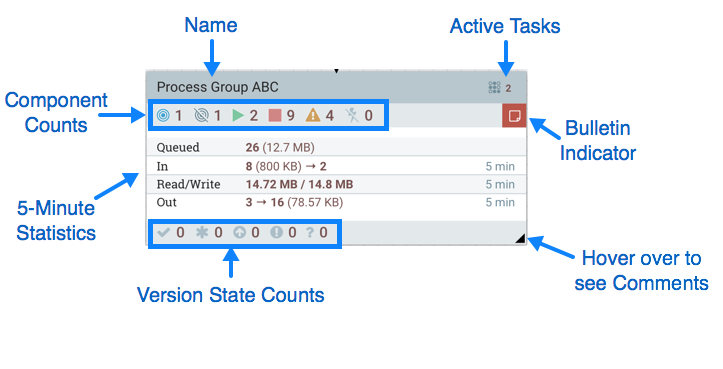
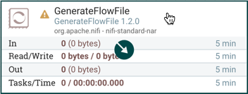
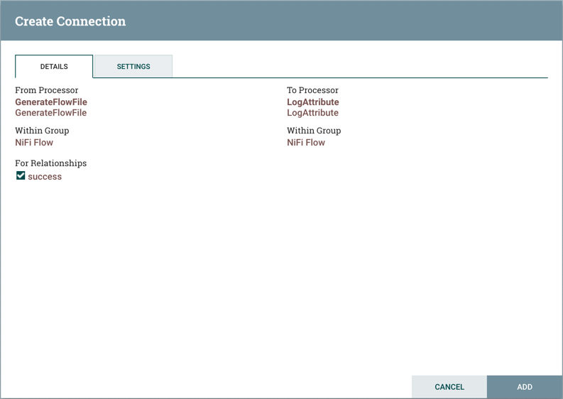
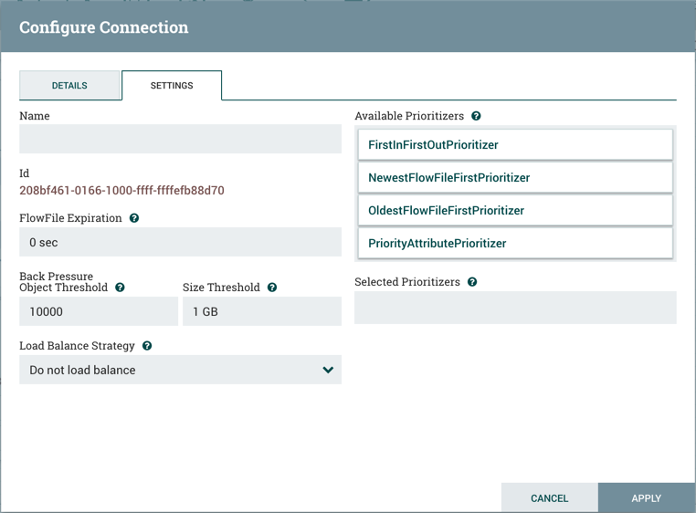
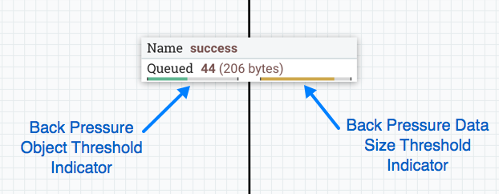
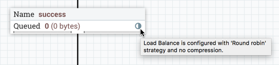
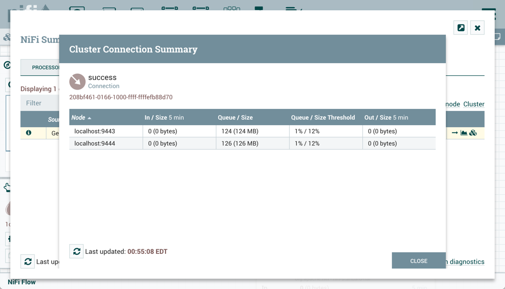

# Nifi深入学习

NiFi集群的部署和使用

FlowFile生成器案例

NiFi模版案例

FlowFile的深入学习和实践

NiFi表达式语言实践

NiFi监控功能的深入学习和实践

NiFi连接与关系的深入学习和实践


## 术语

**DataFlow Manager**：DataFlow Manager(DFM)是NiFi用户,具有添加,删除和修改NiFi数据流组件的权限。

**FlowFile**：FlowFile代表NiFi中的单个数据。FlowFile由两个组件组成：FlowFile属性(attribute)和FlowFile内容(content)。内容是FlowFile表示的数据。属性是提供有关数据的信息或上下文的特征,它们由键值对组成。所有FlowFiles都具有以下标准属性：

- uuid：一个通用唯一标识符,用于区分FlowFile与系统中的其他FlowFiles
- filename：在将数据存储到磁盘或外部服务时可以使用的可读文件名
- path：在将数据存储到磁盘或外部服务时可以使用的分层结构值,以便数据不存储在单个目录中

**Processor**：处理器是NiFi组件,用于监听传入数据、从外部来源提取数据、将数据发布到外部来源、路由,转换或提取FlowFiles。

**Relationship**：每个处理器都为其定义了零个或多个关系。命名这些关系以指示处理FlowFile的结果含义。处理器处理完FlowFile后,它会将FlowFile路由(传输)到其中一个关系。DFM能够将每一个关系连接到其他组件,以指定FlowFile应该在哪里进行下一步处理。

**Connection**：DFM通过将组件从NiFi工具栏的Components部分拖动到画布,然后通过Connections将组件连接在一起来创建自动的数据处理流程。每个连接由一个或多个关系组成。对于每个Connection,DFM都可以为其确定使用哪些关系。这样我们可以基于其处理结果的不同来以不同的方式路由数据。每个连接都包含一个FlowFile队列。将FlowFile传输到特定关系时,会将其添加到属于当前Connection的队列中。

**Controller Service**：控制器服务是扩展点,在用户界面中由DFM添加和配置后,将在NiFi启动时启动,并提供给其他组件(如处理器或其他控制器服务)需要的信息。常见Controller Service比如StandardSSLContextService,它提供了一次配置密钥库和/或信任库属性的能力,并在整个应用程序中重用该配置。我们的想法是,控制器服务不是在每个可能需要它的处理器中配置这些信息,而是根据需要为任何处理器提供。

**Funnel**：漏斗是一个NiFi组件,用于将来自多个Connections的数据合并到一个Connection中。

**Process Group**：当数据流变得复杂时,在更高,更抽象的层面上推断数据流是很有用的。NiFi允许将多个组件(如处理器)组合到一个过程组中。然后,DFM可以在NiFi用户界面轻松地将多个流程组连接到逻辑数据处理流程中,DFM还可以进入流程组查看和操作流程组中的组件。

**Port**：使用一个或多个进程组构建的数据流需要一种方法将进程组连接到其他数据流组件。这是通过使用Ports实现的。DFM可以向进程组添加任意数量的输入端口和输出端口,并相应地命名这些端口。

**Remote Process Group**：正如数据传输进出进程组一样,有时需要将数据从一个NiFi实例传输到另一个NIFI实例。虽然NiFi提供了许多不同的机制来将数据从一个系统传输到另一个系统,但是如果将数据传输到另一个NiFi实例,远程进程组通常是实现此目的的最简单方法。

**Bulletin**：NiFi用户界面提供了大量有关应用程序当前状态的监视和反馈。除了滚动统计信息和为每个组件提供的当前状态之外,组件还能够报告公告。每当组件报告公告时,该组件上都会显示公告图标(处理器右上角红色的图标)。系统级公告显示在页面顶部附近的状态栏上。使用鼠标悬停在该图标上将提供一个工具提示,显示公告的时间和严重性(Debug, Info, Warning, Error)以及公告的消息。也可以在全局菜单中的公告板页面中查看和过滤所有组件的公告。

**Template**：通常,DataFlow由许多可以重用的组件组成。NiFi允许DFM选择DataFlow的一部分(或整个DataFlow)并创建模板。此模板具有名称,然后可以像其他组件一样拖动到画布上。最终,可以将若干组件组合在一起以形成更大的构建块,然后从该构建块创建数据流处理流程。这些模板也可以导出为XML并导入到另一个NiFi实例中,从而可以共享这些构建块。

**flow.xml.gz**：DFM放入NiFi用户界面画布的所有内容都实时写入一个名为flow.xml.gz的文件。该文件默认位于conf目录中。在画布上进行的任何更改都会自动保存到此文件中,而无需用户单击保存按钮。此外,NiFi在更新时会自动在归档目录中创建此文件的备份副本。您可以使用这些归档文件来回滚配置,如果想要回滚,先停止NiFi,将flow.xml.gz替换为所需的备份副本,然后重新启动NiFi。在集群环境中,停止整个NiFi集群,替换其中一个节点的flow.xml.gz,删除自其他节点的flow.xml.gz,然后重新启动该节点。确认此节点启动为单节点集群后,然后启动其他节点。替换的流配置将在集群中同步。flow.xml.gz的名称和位置以及自动存档行为是可配置的。


## Linux配置优化

如果您在Linux上运行，请考虑这些最佳实践。典型的Linux默认设置不一定能够满足像NiFi这样的IO密集型应用程序的需求。对于这些最佳实践，NIFI所在的Linux发行版的实际情况可能会有所不同，可以参考下面的介绍，但是请参考特定发行版的文档。

**最大文件句柄(Maximum File Handles)**

NiFi在任何时候都可能会打开非常大量的文件句柄。通过编辑 */etc/security/limits.conf* 来增加限制，添加类似的内容

> ```text
> * hard nofile 50000
> * soft nofile 50000
> ```

**最大派生进程数(Maximum Forked Processes)**

NiFi可以配置生成大量的线程。要增加Linux允许的数量，请编辑 */etc/security/limits.conf*

> ```text
> *  hard  nproc  10000
> *  soft  nproc  10000
> ```

你的发行版Linux可能需要通过添加来编辑 */etc/security/limits.d/20-nproc.conf*

> ```text
> * soft nproc 10000
> ```

**增加可用的TCP套接字端口数(Increase the number of TCP socket ports available)**

如果你的流程会在很短的时间内设置并拆除大量socket，这一点尤为重要。

> ```text
> sudo sysctl -w net.ipv4.ip_local_port_range ="10000 65000"
> ```

**设置套接字在关闭时保持TIMED_WAIT状态的时间(Set how long sockets stay in a TIMED_WAIT state when closed)**

考虑到你希望能够快速设置和拆卸新套接字，你不希望您的套接字停留太长时间。最好多阅读一下并调整类似的东西

> ```text
> sudo sysctl -w net.ipv4.netfilter.ip_conntrack_tcp_timeout_time_wait ="1"
> ```

**告诉Linux你永远不希望NiFi交换(Tell Linux you never want NiFi to swap)**

对于某些应用程序来说，swapping非常棒。对于像NiFi一样想要运行的程序并不好。要告诉Linux你想关掉swapping，你可以编辑 */etc/sysctl.conf* 来添加以下行

> ```text
> vm.swappiness = 0
> ```

对于处理各种NiFi repos的分区，请关闭诸如`atime`之类的选项。这样做会导致吞吐量的惊人提高。编辑`/etc/fstab`文件，对于感兴趣的分区，添加`noatime`选项。

比如我要在根文件系统使用noatime，可以编辑/etc/fstab文件，如下：

> ```text
> /dev/mapper/centos-root /      xfs     defaults,noatime        0 0
> UUID=47f23406-2cda-4601-93b6-09030b30e2dd /boot     xfs     defaults        0 0
> /dev/mapper/centos-swap swap     swap    defaults        0 0
> ```

修改后重新挂载

> ```text
> mount -o remount /
> 或者 mount -o remount /boot
> ```


## NIFI集群

### 为什么集群？

​		DFM可能会发现在单个服务器上使用一个NiFi实例不足以处理他们拥有的数据量。因此，一种解决方案是在多个NiFi服务器上运行相同的数据流。但是，这会产生管理问题，因为每次DFM想要更改或更新数据流时，他们必须在每个服务器上进行这些更改，然后逐个监视每个服务器。而集群NiFi服务器，可以增加处理能力同时，支持单接口控制，通过该接口可以更改整个集群数据流并监控数据流。集群允许DFM只进行一次更改，然后将更改的内容复制到集群的所有节点。通过单一接口，DFM还可以监视所有节点的健康状况和状态。


### 零主集群

​	NiFi采用Zero-Master Clustering范例。集群中的每个节点都对数据执行相同的任务，但每个节点都在不同的数据集上运行。其中一个节点自动被选择(通过Apache ZooKeeper)作为集群协调器。然后，集群中的所有节点都会向此节点发送心跳/状态信息，并且此节点负责断开在一段时间内未报告任何心跳状态的节点。此外，当新节点选择加入集群时，新节点必须首先连接到当前选定的集群协调器，以获取最新的流。如果集群协调器确定允许该节点加入(基于其配置的防火墙文件)，则将当前流提供给该节点，并且该节点能够加入集群，假设节点的流副本与集群协调器提供的副本匹配。如果节点的流配置版本与集群协调器的版本不同，则该节点将不会加入集群。


### 术语

NiFi Clustering是独一无二的，有自己的术语。在设置集群之前了解以下术语非常重要：

**NiFi集群协调器(NiFi Cluster Coordinator)**：NiFi集群协调器是NiFi集群中的节点，负责管理集群中允许执行任务的节点，并为新加入的节点提供最新的数据流量。当DataFlow Manager管理集群中的数据流时，可以通过集群中任何节点的用户界面执行此操作。然后，所做的任何更改都将复制到集群中的所有节点。

**节点(Nodes)**：每个集群由一个或多个节点组成。节点执行实际的数据处理。

**主节点(Primary Node)**：每个集群都有一个主节点。在此节点上，可以运行"隔离处理器"(见下文)。ZooKeeper用于自动选择主节点。如果该节点由于任何原因断开与集群的连接，将自动选择新的主节点。用户可以通过查看用户界面的"集群管理"页面来确定当前选择哪个节点作为主节点。


**孤立的Processor**：在NiFi集群中，相同的数据流会在所有节点上运行。但是，可能存在DFM不希望每个处理器在每个节点上运行的情况。最常见的情况是使用的处理器存在与外部服务进行通信得的情况。例如，GetSFTP处理器从远程目录中提取。如果GetSFTP处理器在集群中的每个节点上运行并同时尝试从同一个远程目录中提取，则可能存在重复读取。因此，DFM可以将主节点上的GetSFTP配置为独立运行，这意味着它仅在该节点上运行。通过适当的数据流配置，它可以提取数据并在集群中的其余节点之间对其进行负载平衡。注意，虽然存在此功能，但仅使用独立的NiFi实例来提取数据并将其输出内容分发给集群也很常见。它仅取决于可用资源以及管理员配置集群的方式。

**心跳**：节点通过"心跳"将其健康状况和状态传达给当前选定的集群协调器，这使协调器知道它们仍然处于连接状态并正常工作。默认情况下，节点每5秒发出一次心跳，如果集群协调器在40秒内没有从节点收到心跳，则由于"缺乏心跳"而断开节点。5秒设置可在_nifi.properties_文件中配置。集群协调器断开节点的原因是协调器需要确保集群中的每个节点都处于同步状态，并且如果没有定期收听到节点，协调器无法确定它是否仍与其余节点同步。如果在40秒后节点发送新的心跳，协调器将自动把请求节点重新加入集群。一旦接收到心跳，由于心跳不足导致的断开连接和重新连接信息都会报告给用户界面中的DFM。


### 集群安装

　　环境基础

　　　　1、系统：CentOS 7.4

　　　　2、Java环境：JDK8

#### 使用NiFi集成的zookeeper

​		NiFi依赖于ZooKeeper以实现集群配置。但是，在有些环境中，部署了NiFi，而没有维护现有的ZooKeeper集合。为了避免强迫管理员维护单独的ZooKeeper实例的负担，NiFi提供了嵌入式ZooKeeper服务器的选项。

| **属性**                                              | **描述**                                                     |
| :---------------------------------------------------- | :----------------------------------------------------------- |
| `nifi.state.management.embedded.zookeeper.start`      | 指定此NiFi实例是否应运行嵌入式ZooKeeper服务器                |
| `nifi.state.management.embedded.zookeeper.properties` | 如果`nifi.state.management.embedded.zookeeper.start`设置为`true`,则要提供使用的ZooKeeper属性的属性文件 |

​		通过设置 *nifi.properties* 中的`nifi.state.management.embedded.zookeeper.start`属性为`true`来运行嵌入式的ZooKeeper服务器。

​		通常建议在3或5个节点上运行ZooKeeper。在少于3个节点上运行可在遇到故障时提供较低的耐用性。在超过5个节点上运行通常会产生不必要的网络流量。此外，在4个节点上运行ZooKeeper并不会比在3个节点上运行有优势，ZooKeeper要求大多数节点处于活动状态才能运行。

​		如果`nifi.state.management.embedded.zookeeper.start`属性设置为`true`，则 *nifi.properties* 中的`nifi.state.management.embedded.zookeeper.properties`属性也需要设置。它用来指定要使用的ZooKeeper属性文件。这个属性文件至少需要配置ZooKeeper的服务器列表。另注意，由于ZooKeeper将侦听这些端口，因此可能需要将防火墙配置为打开这些端口。默认值为`2181`，但可以通过_zookeeper.properties_文件中的_clientPort_属性进行配置。

​		使用嵌入式ZooKeeper时，/ _conf / zookeeper.properties_文件具有名为`dataDir`的属性。默认情况下，此值为`./state/zookeeper`。如果多个NiFi节点正在运行嵌入式ZooKeeper，则必须告知服务器它是哪一个。通过创建名为_myid_的文件 并将其放在ZooKeeper的数据目录中来实现。此文件的内容应该是不同服务器的唯一索引值。因此，对于某一个ZooKeeper服务器，我们将通过执行以下命令来完成此任务:

```text
cd $NIFI_HOME
mkdir state
mkdir state/zookeeper
echo 1 > state/zookeeper/myid
```

对于将运行ZooKeeper的下一个NiFi节点，我们可以通过执行以下命令来实现此目的:

```text
cd $NIFI_HOME
mkdir state
mkdir state/zookeeper
echo 2 > state/zookeeper/myid
```

　　我们采用三个节点的集群，且在一台机器上搭建，所以不同节点的端口会不同，如果搭建在三台机器上，IP不同，那么端口可以相同。

**1、上传并解压**

上传资料中提供的nifi-1.9.2-bin.tar.gz文件到服务器的/export/download目录下，并进行解压：

```shell
tar -zxvf nifi-1.9.2-bin.tar.gz
```

移动并复制，共三个副本。

```
mv nifi-1.9.2 ../soft/nifi-1.9.2-18001
cd ../soft
cp -r nifi-1.9.2-18001/ nifi-1.9.2-18002
cp -r nifi-1.9.2-18001/ nifi-1.9.2-18003
```


**2、编辑实例中，conf/zookeeper.properties文件，不同节点改成对应内容，内容如下：**

```properties
# zk客户端连接接口：1节点12181，2节点12182，1节点12183
clientPort=12181
# 不同服务的IP和选举端口号
server.1=192.168.52.150:12888:13888
server.2=192.168.52.150:14888:15888
server.3=192.168.52.150:16888:17888
```

**3、在单个实例中新建文件夹，${NIFI_HOME}/state/zookeeper，在此文件夹中新建文件myid，且输入内容如下：**

```tex
1
```

**4、编辑节点conf/nifi.properties文件，修改内容如下：**

```properties
####################
# State Management #
####################
nifi.state.management.configuration.file=./conf/state-management.xml
nifi.state.management.provider.local=local-provider
nifi.state.management.provider.cluster=zk-provider
#  指定此NiFi实例是否应运行嵌入式ZooKeeper服务器，默认是false
nifi.state.management.embedded.zookeeper.start=true

nifi.state.management.embedded.zookeeper.properties=./conf/zookeeper.properties 

# web properties #                                                 
nifi.web.war.directory=./lib
# HTTP主机。默认为空白
nifi.web.http.host=192.168.52.150
# HTTP端口。默认值为8080；修改为18001、18002、18003
nifi.web.http.port=18001

# cluster node properties (only configure for cluster nodes) #   
# 如果实例是群集中的节点，请将此设置为true。默认值为false
nifi.cluster.is.node=true 
# 节点的完全限定地址。默认为空白
nifi.cluster.node.address=192.168.52.150
# 节点的协议端口。默认为空白，修改为：28001、28002、28003
nifi.cluster.node.protocol.port=28001

# 指定在选择Flow作为“正确”流之前等待的时间量。如果已投票的节点数等于nifi.cluster.flow.election.max.candidates属性指定的数量，则群集将不会等待这么长时间。默认值为5 mins
nifi.cluster.flow.election.max.wait.time=1 mins 
# 指定群集中所需的节点数，以便提前选择流。这允许群集中的节点避免在开始处理之前等待很长时间，如果我们至少达到群集中的此数量的节点
nifi.cluster.flow.election.max.candidates=1

# cluster load balancing properties #  
nifi.cluster.load.balance.host=
# 修改为：16342、26342、36342
nifi.cluster.load.balance.port=16342

# zookeeper properties, used for cluster management # 
# 连接到Apache ZooKeeper所需的连接字符串。这是一个以逗号分隔的hostname：port对列表
nifi.zookeeper.connect.string=192.168.52.150:12181,192.168.52.150:12182,192.168.52.150:12183
nifi.zookeeper.connect.timeout=3 secs                                                      
nifi.zookeeper.session.timeout=3 secs                                                   
nifi.zookeeper.root.node=/nifi
```

　	节点2，节点3内容跟节点1相同，只是nifi.web.http.port，nifi.cluster.node.protocol.port，nifi.cluster.load.balance.port，这三个端口区分开来，避免端口重复

**5、编辑实例conf/state-management.xml文件，内容如下：**

```xml
<cluster-provider>
    <id>zk-provider</id>
    <class>
        org.apache.nifi.controller.state.providers.zookeeper.ZooKeeperStateProvider
    </class>
    <property name="Connect String">
        192.168.52.150:12181,192.168.52.150:12182,192.168.52.150:12183
    </property>
    <property name="Root Node">/nifi</property>
    <property name="Session Timeout">10 seconds</property>
    <property name="Access Control">Open</property>
</cluster-provider>
```

6、启动三个实例，浏览器输入：192.168.52.150:18001，访问即可


#### 使用外部zookeeper

**1、安装启动集群Zookeeper**

**2、准备三个单机NIFI实例**

**3、实例中，conf/zookeeper.properties文件，可以不用编辑**

**4、编辑节点conf/nifi.properties文件**

```properties
####################
# State Management #                                                                                                 
####################
nifi.state.management.configuration.file=./conf/state-management.xml                                             
nifi.state.management.provider.local=local-provider  
nifi.state.management.provider.cluster=zk-provider
#  指定此NiFi实例是否应运行嵌入式ZooKeeper服务器，默认是false  
# 连接外部的时候，设置为false
nifi.state.management.embedded.zookeeper.start=false                          
nifi.state.management.embedded.zookeeper.properties=./conf/zookeeper.properties 

# web properties #                                                 
nifi.web.war.directory=./lib    
# HTTP主机。默认为空白                                               
nifi.web.http.host=192.168.52.150
# HTTP端口。默认值为8080
nifi.web.http.port=18001

# cluster node properties (only configure for cluster nodes) #   
# 如果实例是群集中的节点，请将此设置为true。默认值为false
nifi.cluster.is.node=true 
# 节点的完全限定地址。默认为空白
nifi.cluster.node.address=192.168.52.150
# 节点的协议端口。默认为空白
nifi.cluster.node.protocol.port=28001

# 指定在选择Flow作为“正确”流之前等待的时间量。如果已投票的节点数等于nifi.cluster.flow.election.max.candidates属性指定的数量，则群集将不会等待这么长时间。默认值为5 mins
nifi.cluster.flow.election.max.wait.time=1 mins 
# 指定群集中所需的节点数，以便提前选择流。这允许群集中的节点避免在开始处理之前等待很长时间，如果我们至少达到群集中的此数量的节点
nifi.cluster.flow.election.max.candidates=1

# cluster load balancing properties #  
nifi.cluster.load.balance.host=
nifi.cluster.load.balance.port=16342

# zookeeper properties, used for cluster management # 
# 连接到Apache ZooKeeper所需的连接字符串。这是一个以逗号分隔的hostname：port对列表
# 连接外部的时候使用外部ZooKeeper连接地址
nifi.zookeeper.connect.string=192.168.52.150:12181,192.168.52.150:12182,192.168.52.150:12183
nifi.zookeeper.connect.timeout=3 secs                                                      
nifi.zookeeper.session.timeout=3 secs                                                   
nifi.zookeeper.root.node=/nifi
```

**5、编辑实例conf/state-management.xml文件，内容如下：**

```xml
<cluster-provider>                   
    <id>zk-provider</id>                        
    <class>
        org.apache.nifi.controller.state.providers.zookeeper.ZooKeeperStateProvider
    </class>
    <!-- 使用外部zookeeper连接地址 --> 
    <property name="Connect String">
        192.168.52.150:12181,192.168.52.150:12182,192.168.52.150:12183
    </property>           
    <property name="Root Node">/nifi</property>               
    <property name="Session Timeout">10 seconds</property>
    <property name="Access Control">Open</property>
</cluster-provider>
```

6、启动三个实例，浏览器输入：192.168.52.150:18001，访问即可

### 故障排除

如果遇到问题并且您的集群无法按照描述运行，请调查 节点上的_nifi-app.log_和_nifi-user.log_文件。如果需要，可以通过编辑`conf/logback.xml`文件将日志记录级别更改为DEBUG 。具体来说，设置`level="DEBUG"`以下行(而不是`"INFO"`):

```xml
<logger name="org.apache.nifi.web.api.config" level="INFO" additivity="false">				<appender-ref ref="USER_FILE"/>
</logger>
```

### State管理

NiFi为处理器，报告任务，控制器服务和框架本身提供了一种机制来保持状态。例如，允许处理器在重新启动NiFi后从其停止的位置恢复。处理器可以从集群中的所有不同节点访问它的状态信息。

#### 配置状态提供程序

当组件决定存储或检索状态时，有两种实现：节点本地或集群范围。在 *nifi.properties* 文件包含有关配置项。

| **属性**                                   | **描述**                                                     |
| :----------------------------------------- | :----------------------------------------------------------- |
| `nifi.state.management.configuration.file` | 第一个是指定外部XML文件的属性，该文件用于配置本地和/或集群范围的状态提供程序。此XML文件可能包含多个提供程序的配置 |
| `nifi.state.management.provider.local`     | 提供此XML文件中配置的本地State Provider标识符的属性          |
| `nifi.state.management.provider.cluster`   | 同样，该属性提供在此XML文件中配置的集群范围的State Provider的标识符。 |

此XML文件由顶级`state-management`元素组成，该元素具有`local-provider`和`cluster-provider` 元素。然后，这些元素中的每一个都包含一个`id`元素，用于指定可在 *nifi.properties* 文件中引用的标识符， 以及一个`class`元素，该元素指定要用于实例化State Provider的完全限定类名。最后，这些元素中的每一个可以具有零个或多个`property`元素。每个`property`元素都有一个属性，`name`即`property`State Provider支持的名称。property元素的文本内容是属性的值。


在_state-management.xml_文件(或配置的任何文件)中配置了这些状态提供程序后，这些提供程序可通过标识符被引用。

默认情况下，本地状态提供程序配置为将`WriteAheadLocalStateProvider`数据持久保存到 `$NIFI_HOME/state/local`目录。默认的集群状态提供程序配置为 `ZooKeeperStateProvider`。

默认的基于ZooKeeper的提供程序必须先`Connect String`填充其属性，然后才能使用它。

`Connect String`采用逗号分隔，IP和端口号使用`:`分割，例如 `my-zk-server1:2181,my-zk-server2:2181,my-zk-server3:2181`。如果没有为任何主机指定端口,`2181`则假定为ZooKeeper默认值 。


向ZooKeeper添加数据时，Access Control有两个选项:`Open`和`CreatorOnly`。如果该`Access Control`属性设置为`Open`，则允许任何人登录ZooKeeper并拥有查看，更改，删除或管理数据的完全权限。如果指定`CreatorOnly`，则仅允许创建数据的用户读取，更改，删除或管理数据。为了使用该`CreatorOnly`选项，NiFi必须提供某种形式的身份验证。建议使用Open。

如果NiFi配置为在独立模式下运行，则`cluster-provider`无需在_state-management.xml_ 文件中填充该元素，如果填充它们，实际上将忽略该元素。但是，`local-provider`元素必须始终存在并填充。

此外，如果NiFi在集群中运行，则每个节点还必须配置引用`nifi.state.management.provider.cluster`元素。否则，NiFi将无法启动。

这些都是通过外部的 *state-management.xml* 文件，而不是通过 *nifi.properties* 文件进行配置。

应注意，如果处理器和其他组件使用集群作用域保存状态，则如果实例是独立实例(不在集群中)或与集群断开连接，则将使用本地状态提供程序。这也意味着如果将独立实例迁移到集群中，则本地的状态将不再可用，因为该组件将开始使用集群状态提供程序而不是本地状态提供程序。


### 管理节点

#### 断开节点

DFM可以手动断开节点与集群的连接。节点也可能由于其他原因而断开连接，例如由于缺乏心跳。当节点断开连接时，集群协调器将在用户界面上显示公告。在解决断开连接节点的问题之前，DFM将无法对数据流进行任何更改。DFM或管理员需要对节点的问题进行故障排除，并在对数据流进行任何新的更改之前解决该问题。但是，值得注意的是，仅仅因为节点断开连接并不意味着它不起作用。这可能由于某些原因而发生，例如，当节点由于网络问题而无法与集群协调器通信时。

要手动断开节点，请从节点的行中选择"断开连接"图标()。


断开连接的节点可以连接()，卸载()或删除()。

并非所有处于"已断开连接"状态的节点都可以卸载。如果节点断开连接且无法访问，则节点无法接收卸载请求以启动卸载。此外，由于防火墙规则，可能会中断或阻止卸载。


#### 卸载节点

保留在断开连接的节点上的流文件可以通过卸载重新平衡到集群中的其他活动节点。在Cluster Management对话框中，为Disconnected节点选择"Offload"图标()。这将停止所有处理器，终止所有处理器，停止在所有远程进程组上传输，并将流文件重新平衡到集群中的其他连接节点。


由于遇到错误(内存不足，没有网络连接等)而保持"卸载"状态的节点可以通过重新启动节点上的NiFi重新连接到集群。卸载的节点可以重新连接到集群(通过选择连接或重新启动节点上的NiFi)或从集群中删除。


#### 删除节点

在某些情况下，DFM可能希望继续对流进行更改，即使节点未连接到集群也是如此。在这种情况下，DFM可以选择完全从集群中删除节点。在Cluster Management对话框中，为Disconnected或Offloaded节点选择"Delete"图标()。删除后，在重新启动节点之前，节点无法重新加入集群。

#### 退役节点

停用节点并将其从集群中删除的步骤如下：

1. 断开节点。
2. 断开连接完成后，卸载节点。
3. 卸载完成后，删除该节点。
4. 删除请求完成后，停止/删除主机上的NiFi服务。

NiFi CLI节点命令

作为UI的替代方案，以下NiFi CLI命令可用于检索单个节点，检索节点列表以及连接/断开/卸载/删除(connecting/disconnecting/offloading/deleting ) 节点：

- `nifi get-node`

- `nifi get-nodes`

- `nifi connect-node`

- `nifi disconnect-node`

- `nifi offload-node`

- `nifi delete-node`

  

### 流动选举

cluster启动的时候，NiFi必须确定哪个节点具有流的"正确"版本信息。这是通过对每个节点具有的流进行投票来完成的。当节点尝试连接到集群时，它会将其本地流的副本flow.xml.gz提供给集群协调器。如果尚未选择流"正确"流，则将节点的流与每个其他节点的流进行比较。然后每台对和自己一样的flow进行投票。如果还没有其他节点报告相同的流，则此流将以一票投票的方式添加到可能选择的流池中。如果投票时间(nifi.cluster.flow.election.max.wait.time)到了或者某一个flow.xml.gz已经达到票数（nifi.cluster.flow.election.max.candidates），则选出一个正确的flow.xml.gz。然后，不一致的node自动挂掉，除非它自己没有flow.xml.gz；而具有兼容流的节点将继承集群的流。选举是根据"民众投票"进行的，但需要注意的是，除非所有流量都是空的，否则获胜者永远不会是"空流"。

对于加入集群失败的节点，可以通过删除flow.xml.gz文件来加入集群。


## FlowFile生成器

FlowFile生成器：GenerateFlowFile和ReplaceText处理器，用于生成数据，对调试流程很有用。

### GenerateFlowFile解析

**描述**

该处理器使用随机数据或自定义内容创建流文件。GenerateFlowFile用于负载测试、配置和仿真。

**属性配置**

在下面的列表中，必需属性的名称以粗体显示。任何其他属性(不是粗体)都被认为是可选的，并且指出属性默认值（如果有默认值），以及属性是否支持表达式语言。

| 属性名称             | 默认值 | 可选值     | 描述                                                         |
| :------------------- | :----- | :--------- | :----------------------------------------------------------- |
| **File Size**        | 0B     |            | 将使用的文件流的大小                                         |
| **Batch Size**       | 1      |            | 每次调用时要传输出去的流文件的数量                           |
| **Data Format**      | Text   | BinaryText | 指定数据应该是文本还是二进制                                 |
| **Unique FlowFiles** | false  | truefalse  | 如果选择true，则生成的每个流文件都是惟一的。 如果选择false，此处理器将生成一个随机值，所有的流文件都是相同的内容，模仿更高的吞吐量时可以这样使用 |
| Custom Text          |        |            | 如果Data Format选择Text，且Unique FlowFiles选择为false，那么这个自定义文本将用作生成的流文件的内容，文件大小将被忽略。 如果Custom Text中使用了表达式语言，则每批生成的流文件只执行一次表达式语言的计算 支持表达式语言:true(只使用变量注册表进行计算) |
| **Character Set**    | UTF-8  |            | 指定将自定义文本的字节写入流文件时要使用的编码               |

**应用场景**

该处理器多用于测试，配置生成设计人员所需要的特定数据，模拟数据来源或者压力测试、负载测试；

某些场景中可以作为配置灵活使用，比如设计人员想设计一个流程查询多个表，表名就可以做出json数组配置到Custom Text，之后再使用其他相关处理器生成含有不同表名属性的多个流文件，就可以实现一个流程查询多表。(额外延伸，也可以在变量注册表、缓存保存配置，通过不同的配置读取不同的表)


### ReplaceText解析

**描述**

使用其他值替换匹配正则表达式的流文件部分内容，从而更新流文件的内容。

**属性配置**

在下面的列表中，必需属性的名称以粗体显示。任何其他属性(不是粗体)都被认为是可选的，并且指出属性默认值（如果有默认值），以及属性是否支持表达式语言。

| 属性名称                 | 默认值        | 可选值                                                       | 描述                                                         |
| ------------------------ | ------------- | ------------------------------------------------------------ | ------------------------------------------------------------ |
| **Search Value**         | (?s)(^.*$)    |                                                              | 正则表达式，仅用于“Literal Replace”和“Regex Replace”匹配策略 支持表达式语言:true |
| **Replacement Value**    | $1            |                                                              | 使用“Replacement Strategy”策略时插入的值。 支持表达式语言:true |
| **Character Set**        | UTF-8         |                                                              | 字符集                                                       |
| **Maximum Buffer Size**  | 1 MB          |                                                              | 指定要缓冲的最大数据量(每个文件或每行，取决于计算模式)，以便应用替换。如果选择了“Entire Text”，并且流文件大于这个值，那么流文件将被路由到“failure”。在“Line-by-Line”模式下，如果一行文本比这个值大，那么FlowFile将被路由到“failure”。默认值为1 MB，主要用于“Entire Text”模式。在“Line-by-Line”模式中，建议使用8 KB或16 KB这样的值。如果将<**Replacement Strategy**>属性设置为一下其中之一:Append、Prepend、Always Replace，则忽略该值 |
| **Replacement Strategy** | Regex Replace | Prepend<br/>Append<br/>Regex Replace<br/>Literal Replace<br/>Always Replace | 在流文件的文本内容中如何替换以及替换什么内容的策略。         |
| **Evaluation Mode**      | Entire text   | Line-by-Line<br/>Entire text                                 | 对每一行单独进行“替换策略”(Line-by-Line)；或将整个文件缓冲到内存中(Entire text)，然后对其进行“替换策略”。 |

**应用场景**

使用正则表达式，来逐行或者全文本替换文件流内容，往往用于业务逻辑处理。


### 示例

1. **创建GenerateFlowFile并设置大小**

   

   

2. **配置FlowFile**

   

   

   

3. **创建ReplaceText并连接**

   

   

4. **启动GenerateFile**

   

   

5. **配置ReplaceText**


**6.创建PutFile**

停止GenerateFlowFile，然后创建PutFile。


7. **停止，查看结果**

停止所有处理器，查看结果：

```shell
cd /export/tmp/target
ls
cat XXX-XXX
```


## Nifi模板

### 导入模板

#### 1.导入

导入【Nifi课程\资料\template】目录下的CsvToJSON.xml模版文件。

#### 2.查看模板列表


#### 3.创建模板引用


### 组、导出模板

#### 1.创建组


#### 2.移动处理器到组


#### 3.进入与退出组


#### 4.创建模板


#### 5.下载模板


#### 6.嵌套组


## FlowFile拓扑：内容和属性

### 理论

#### FlowFile包含两部分

1. 属性：
   - FlowFile的元数据
   - 保存了关于内容的信息，比如：什么时候创建的，从哪里来，代表什么等等
2. 内容：
   - FlowFile的实际内容。比如：使用getfile读取数据时，读取到的实际内容文本。


#### 处理器对FlowFile的操作

1. 更新，添加，或者删除FlowFile属性
2. 改变FlowFile内容


#### ExtractText

**描述**

该处理器使用正则表达式，匹配流文件中的内容，并将匹配成功的内容输出到属性中；如果正则匹配到多个结果，默认只取第一个结果；匹配成功则流文件路由matched，没有匹配则到unmatched；

**属性配置**

在下面的列表中，必需属性的名称以粗体显示。任何其他属性(不是粗体)都被认为是可选的，并且指出属性默认值（如果有默认值），以及属性是否支持表达式语言。

| 属性名称                                        | 默认值  | 可选值    | 描述                                                         |
| :---------------------------------------------- | :------ | :-------- | :----------------------------------------------------------- |
| **Character Set**                               | UTF-8   |           | 字符集                                                       |
| **Maximum Buffer Size**                         |         |           | 指定(每个文件)要缓冲的最大数据量，应用于正则表达式。大于指定最大值的文件部分将不会被计算匹配。 |
| Maximum Capture Group Length                    | 1024    |           | 指定给定匹配值可以拥有的最大字符数。超过最大值的字符将被截断。 |
| **Enable Canonical Equivalence**                | false   | truefalse | 当且仅当两个字符的"正规分解(canonical decomposition)"都完全相同的情况下，才认定匹配。比如用了这个标志之后，表达式"a/u030A"会匹配"?"。默认情况下，不考虑"规范相等性(canonical equivalence)"。 |
| **Enable Case-insensitive Matching              | false** | truefalse | 是否忽略大小写；也可以使用 (?i)标志 默认情况下，大小写不明感的匹配只适用于US-ASCII字符集。这个标志(?i)能让表达式忽略大小写进行匹配。要想对Unicode字符进行大小不明感的匹配，只要将UNICODE_CASE与这个标志(?i)合起来就行了。 |
| **Permit Whitespace and Comments in Pattern**   | false   | truefalse | 在这种模式下，空格将被忽略，以#开头的嵌入注释将被忽略，直到行尾。也可以通过嵌入的标志(?x)指定。 |
| **Enable DOTALL Mode**                          | false   | truefalse | 在这种模式下，表达式'.'可以匹配任意字符，包括表示一行的结束符。默认情况下，表达式'.'不匹配行的结束符。也可以通过嵌入的标志(?s)指定。 |
| **Enable Literal Parsing of the Pattern**       | false   | truefalse | 表示不应赋予元字符和转义字符特殊含义。                       |
| Enable Multiline Mode                           | false   | truefalse | 指示'^'和'$'应在行结束符或序列结束符之后和之前匹配，而不是只匹配整个输入的开始或结束符。也可以通过嵌入的标志(?m)指定。 |
| **Enable Unicode-aware Case Folding**           | false   | truefalse | 当与“启用不区分大小写的匹配”一起使用时，以与Unicode标准一致的方式匹配。也可以通过嵌入的标志(?u)指定。 |
| **Enable Unicode Predefined Character Classes** | false   | truefalse | 指定与Unicode技术标准#18:Unicode正则表达式附件C:兼容性属性的一致性。也可以通过嵌入的标志(?U)指定。 |
| **Enable Unix Lines Mode**                      | false   | truefalse | 只有'/n'才被认作一行的中止，并且与'.'，'^'，以及'$'进行匹配。也可以通过嵌入的标志(?d)指定。 |
| **Include Capture Group 0**                     | true    | truefalse | 指示捕获组0应包含为属性。Capture Group 0表示正则表达式匹配的全部，通常不使用，可能有相当长的长度。 |
| **Enable repeating capture group**              | false   | truefalse | 如果设置为true，将提取与捕获组匹配的每个字符串。否则，如果正则表达式匹配不止一次，则只提取第一个匹配。 |

**应用场景**

提取content中的内容，输出到流属性当中 。


#### UpdateAttribute

**描述**

该处理器使用属性表达式语言更新流文件的属性，并且/或则基于正则表达式删除属性

**属性配置**

在下面的列表中，必需属性的名称以粗体显示。任何其他属性(不是粗体)都被认为是可选的，并且指出属性默认值（如果有默认值），以及属性是否支持表达式语言。

| 属性名称                         |       默认值       | 可选值                                | 描述                                                         |
| -------------------------------- | :----------------: | ------------------------------------- | ------------------------------------------------------------ |
| Delete Attributes Expression     |                    |                                       | 删除的属性正则表达式 支持表达式语言:true                     |
| **Store State**                  | Do not store state | Do not store stateStore state locally | 选择是否存储状态。                                           |
| Stateful Variables Initial Value |                    |                                       | 如果使用**Store State**，则此值用于设置有状态变量的初值。只有当状态不包含变量的值时，才会在@OnScheduled方法中使用。如果是有状态运行，这是必需配置的，但是如果需要，这可以是空的。 |

**应用场景**

该处理器基本用法最为常用，及增加，修改或删除流属性；

此处理器使用用户添加的属性或规则更新FlowFile的属性。有三种方法可以使用此处理器添加或修改属性。一种方法是“基本用法”; 默认更改通过处理器的每个FlowFile的匹配的属性。第二种方式是“高级用法”; 可以进行条件属性更改，只有在满足特定条件时才会影响FlowFile。可以在同一处理器中同时使用这两种方法。第三种方式是“删除属性表达式”; 允许提供正则表达式，并且将删除匹配的任何属性。

请注意，“删除属性表达式”将取代发生的任何更新。如果现有属性与“删除属性表达式”匹配，则无论是否更新，都将删除该属性。也就是说，“删除属性表达式”仅适用于输入FlowFile中存在的属性，如果属性是由此处理器添加的，则“删除属性表达式”将不会匹配到它。


### 练习

#### 1.改为单点造数据

改为单点造数据，并启动GenerateFlowFile。


#### 2.负载均衡消费数据


#### 3.查看队列数据


#### 4.ReplaceText为a,b,c,d


#### 5.通过ExtractText将数据写入属性

设置新属性csv，通过正则表达式"(.+),(.+),(.+),(.+)"进行匹配后，将FlowFile的内容"a,b,c,d"写入名为csv的属性。


查看输出数据属性


## 使用表达式语言

### 为什么需要NiFi表达式

​		FlowFile由两个主要部分组成：内容和属性。FlowFile的属性部分表示有关数据本身或元数据的信息。属性是键值对，它们代表关于数据的已知知识以及对适当地路由和处理数据有用的信息。与从本地文件系统中提取的文件的示例相同，FlowFile将具有一个名为的属性`filename`，该属性反映了文件系统上文件的名称。另外，FlowFile将具有`path`反映该文件所在文件系统上目录的属性。FlowFile还将具有名为的属性`uuid`，这是此FlowFile的唯一标识符。

​		但是，如果用户无法使用这些属性，则将这些属性放在FlowFile上不会带来太多好处。NiFi表达式语言提供了引用这些属性，将它们与其他值进行比较以及操纵其值的功能。

### 表达式语言介绍

当我们从FlowFiles的内容中提取属性并添加用户定义的属性时，除非我们有一些可以使用它们的机制，否则它们不会作为运算符进行计算。NiFi表达式语言允许我们在配置流时访问和操作FlowFile属性值。并非所有处理器属性都允许使用表达式语言，但很多处理器都可以。为了确定属性是否支持表达式语言，用户可以将鼠标悬停在处理器配置对话框的属性选项卡中的图标上，然后会有一个提示，显示属性的描述，默认值（如果有）以及属性是否支持表达式语言。


### NiFi表达式的结构

​		NiFi表达式语言始终以开始定界符开始，`${`并以结束定界符结束`}`。在开始和结束定界符之间是表达式本身的文本。在最基本的形式中，表达式可以只包含一个属性名称。例如，`${filename}`将返回`filename` 属性的值。

​		在稍微复杂一点的示例中，我们可以返回此值的操作。例如，我们可以通过调用`toUpper`函数来返回文件名的全部大写形式 `${filename:toUpper()}`。在这种情况下，我们引用该`filename` 属性，然后使用该`toUpper`函数操纵该值。函数调用包含5个元素。首先，有一个函数调用定界符`:`。第二个是函数的名称-在这种情况下为`toUpper`。接下来是一个开放的括号（`(`），后跟函数参数。必要的参数取决于调用哪个函数。在此示例中，我们使用的`toUpper`函数没有任何参数，因此将省略此元素。最后，右括号（`)`）表示函数调用结束。表达式语言支持许多不同的功能，以实现许多不同的目标。某些函数提供了String（文本）操作，例如该`toUpper`函数。其他功能（例如`equals`和`matches`功能）提供比较功能。还存在用于操纵日期和时间以及执行数学运算的功能。

​		当我们对属性执行函数调用时，我们将属性称为函数的 *主题*，因为属性是函数在其上运行的实体。然后，我们可以将多个函数调用链接在一起，其中第一个函数的返回值成为第二个函数的主题，而其返回值成为第三个函数的主题，依此类推。继续我们的示例，我们可以使用表达式将多个函数链接在一起`${filename:toUpper():equals('HELLO.TXT')}`。可以链接在一起的功能数量没有限制。

​		通常，我们需要将两个不同属性的值相互比较。我们能够通过使用嵌入式表达式来完成此任务。例如，我们可以检查`filename`属性是否与`uuid`属性：相同`${filename:equals( ${uuid} )}`。还要注意，在`equals`方法的左括号和嵌入的Expression 之间有一个空格。这不是必需的，并且不会影响表达式的评估方式。相反，其目的是使表达式更易于阅读。分隔符之间的表达式语言会忽略空格。因此，我们可以使用Expression `${ filename : equals(${ uuid}) }`或`${filename:equals(${uuid})}`并且两个Expression表示同一件事。但是，我们不能使用`${file name:equals(${uuid})}`，因为这会导致`file`和`name`被解释为不同的变量，而不是单个变量`filename`。


### 使用表达式语言修改内容

ReplaceText设置Replacement Value（替代值）属性的时候，使用表达式语言${csv.1}来获取属性值：

{ "field1" : "${csv.1}", "field2" : "${csv.2}", "field3" : "${csv.3}", "field4" : "${csv.4}" }

相当于

{ "field1" : "a", "field2" : "b", "field3" : "c", "field4" : "d" }


### 查看替换后的内容


## 监控Nifi

​		NiFi提供有关DataFlow的大量信息，以便监控其健康状况。状态栏提供有关整体系统运行状况的信息。处理器，进程组和远程进程组提供有关其操作的细粒度详细信息。连接和进程组提供有关其队列中数据量的信息。摘要页面以表格格式提供有关画布上所有组件的信息，还提供包括磁盘使用情况，CPU利用率以及Java堆和垃圾收集信息的系统诊断。在集群环境中，此信息可以按节点使用，也可以作为整个集群中的聚合使用。我们将在下面探讨每个监控工件。

### 操作:启动CsvToJson


### 状态栏


### 处理器面板

## NiFi提供有关画布上每个处理器的大量信息。


概述了以下元素：

- **处理器类型**：NiFi提供多种不同类型的处理器,以便执行各种任务。每种类型的处理器都旨在执行一项特定任务。处理器类型(在此示例中为PutFile)描述了此处理器执行的任务。在这种情况下,处理器将FlowFile写入磁盘 - 或者将FlowFile放入文件。
- **公告指示器**：当处理器记录某个事件已发生时,它会生成一个公告,以通过用户界面通知正在监控NiFi的人员。DFM能够通过更新处理器配置对话框的设置选项卡中的公告级别字段来配置应在用户界面中显示的公告。默认值为WARN,这意味着UI中仅显示警告和错误。除非此处理器存在公告,否则此图标不存在。当它出现时,用鼠标悬停在图标上将提供一个工具提示,说明处理器和公告级别提供的消息。如果NiFi的实例是集群的,它还将显示发布公告的节点。
- **状态指示灯**：显示处理器的当前状态。以下指标是可能的：
  -  正在运行：处理器当前正在运行。
  -  已停止：处理器有效并已启用但未运行。
  -  无效：处理器已启用但当前无效且无法启动。将鼠标悬停在此图标上将提供工具提示,指示处理器无效的原因。
  -  已禁用：处理器未运行,在启用之前无法启动。此状态不表示处理器是否有效。
- **处理器名称**：这是处理器的用户定义名称。默认情况下,Processor的名称与Processor Type相同。在示例中,此值为"Copy to /review"。
- **活动任务**：此处理器当前正在执行的任务数。此数字受处理器配置对话框的计划选项卡中的并发任务设置的约束。在这里,我们可以看到处理器当前正在执行一项任务。如果NiFi实例是集群的,则此值表示当前正在集群中的所有节点上执行的任务数。
- **5分钟统计**：处理器以表格形式显示几种不同的统计数据。这些统计数据中的每一个都代表过去五分钟内完成的工作量。如果NiFi实例是集群的,则这些值表示在过去五分钟内所有节点组合完成了多少工作。这些指标是：
  - **In**：处理器从其传入Connections的队列中提取的数据量。此值表示为count size,其中count是从队列中提取的FlowFiles的数量,size是这些FlowFiles内容的总大小。在此示例中,处理器已从输入队列中提取了29个FlowFiles,总计14.16兆字节(MB)。
  - **Read/Write**：处理器从磁盘读取并写入磁盘的FlowFile内容的总大小。这提供了有关此处理器所需的I/O性能的有用信息。某些处理器可能只读取数据而不写入任何内容,而某些处理器不会读取数据但只会写入数据。其他可能既不会读取也不会写入数据,而某些处理器会读取和写入数据。在这个例子中,我们看到在过去的五分钟内,这个处理器读取了4.88 MB的FlowFile内容,并且写了4.88 MB。这是我们所期望的,因为这个处理器只是将FlowFile的内容复制到磁盘。但请注意,这与从输入队列中提取的数据量不同。这是因为它从输入队列中提取的某些文件已经存在于输出目录中,并且处理器配置为在发生这种情况时将FlowFiles路由到失败。因此,对于那些已经存在于输出目录中的文件,数据既不会被读取也不会被写入磁盘。
  - **Out**：处理器已传输到其出站连接的数据量。这不包括处理器自行删除的FlowFiles,也不包括路由到自动终止的连接的FlowFiles。与上面的"In"指标一样,此值表示为count size,其中count是已转移到出站Connections的FlowFiles的数量,size是这些FlowFiles内容的总大小。在此示例中,所有关系都配置为自动终止,因此不会报告任何FlowFiles已被转出。
  - Tasks/Time：此处理器在过去5分钟内被触发运行的次数,以及执行这些任务所花费的时间。时间格式为hour：minute：second。请注意,所花费的时间可能超过五分钟,因为许多任务可以并行执行。例如,如果处理器计划运行60个并发任务,并且每个任务都需要一秒钟才能完成,则所有60个任务可能会在一秒钟内完成。但是,在这种情况下,我们会看到时间指标显示它需要60秒,而不是1秒。或换句话说，这个时间可以被认为是"系统时间"。

### 进程组面板

进程组提供了一种机制,用于将组件组合到一个逻辑构造中,以便以更高级别更容易理解的方式组织DataFlow。下图突出显示了构成Process Group解剖结构的不同元素：



过程组由以下元素组成：

- **名称**：这是进程组的用户定义名称。将进程组添加到画布时,将设置此名称。稍后可以通过右键单击"进程组"并单击"配置"菜单选项来更改名称。在此示例中,进程组的名称是"Process Group ABC"。
- **公告指示器**：当进程组的子组件发布公告时,该公告也会传播到组件的父进程组。当任何组件具有活动公告时,将显示此指示符,允许用户使用鼠标将鼠标悬停在图标上以查看公告。
- **活动任务**：此进程组中组件当前正在执行的任务数。在这里,我们可以看到Process Group当前正在执行两项任务。如果NiFi实例是集群的,则此值表示当前正在集群中的所有节点上执行的任务数。
- **统计信息**：流程组提供有关过程组在过去5分钟内处理的数据量以及当前在流程组中排队的数据量的统计信息。以下元素包含流程组的"统计"部分：
  - **队列**：当前在进程组中排队的FlowFiles数。此字段表示为count(size),其中count是当前在Process Group中排队的FlowFiles的数量,size是这些FlowFiles内容的总大小。在此示例中,Process Group当前有26个FlowFiles排队,总大小为12.7兆字节(MB)。
  - **In**：在过去5分钟内通过其所有输入端口传输到Process Group的FlowFiles数。此字段表示为count / size→ports,其中count是过去5分钟内进入Process Group的FlowFiles的数量,size是这些FlowFiles内容的总大小, ports是输入端口的数量。在此示例中,8个FlowFiles已进入进程组,总大小为800 KB,并且存在两个输入端口。
  - **Read/Write**：进程组中的组件已从磁盘读取并写入磁盘的FlowFile内容的总大小。这提供了有关此Process Group所需的I / O性能的有用信息。在此示例中,我们看到在过去五分钟内,此Process Group中的组件读取了14.72 MB的FlowFile内容,并写入了14.8 MB。
  - **Out**：在过去5分钟内通过其输出端口传输出Process Group的FlowFiles数。此字段表示为ports→count(size),其中ports是输出端口的数量,count是过去5分钟内退出Process Group的FlowFiles的数量和size是FlowFiles内容的总大小。在此示例中,有三个输出端口,16个FlowFiles已退出进程组,其总大小为78.57 KB。
- **组件计数**：组件计数元素提供有关进程组中每种类型的组件数量的信息。以下提供了有关这些图标及其含义的信息：
  - ![img](data:image/png;base64,iVBORw0KGgoAAAANSUhEUgAAABAAAAAQCAYAAAAf8/9hAAAAAXNSR0IArs4c6QAAArJJREFUOBFdk89LVFEUxz/v9/x4M6OVKFr+FhNrEUW1aBMUBSXV1lZRIK36B/onoqWbFi4qghYR9APaWC4CIYzKzEgryrRSZxzfzJv7Zjr3mZN24L573/nxPed8z73Go4nJGv+JVph6GUZsiWo1tG7jL1bVP3b99PfgWCYJ1yEyLYqREQelrRpmpAhChapWt4VsA0h7DuuGx+OfNWbzCtvcrAD25RyO7HRIqnIMtIlSB/A9ly8VlzvzIX0NLpcGcqTsjQqWy1Uefi7yajbiYmeCnFuqg8QArm2xgsvt+Qrnu3w6fIsH80V+BBG6+Y6MzXCvz8vFkLFPASN9HnZURcnSXJGU7E8WFAeaXFpTJjdf5+nKOlwdzDEiK+Oa3Jha5bDYm1M2z6XFpPCkxbSF6RVlshjAibYkdz8WOduZojtjMfo2z9hMnqPNHoeaEtyfKzIktumVCGXYMcGmJUQtK4OcZxEKwZVqjb2NLqPvCsyshEz9Crk1vcax1iTfihEpx8CzTYRjdKwuAD0ZvSvpV2wyKgiiGpYo9fzXKtKr2Dd99TmS/LLJeCWjVBs7+cJ6ICg64Ex7moT8ZyTjhe40s6shKUuCBEX7+EK/vmC2LnlXoopj1HizHHJqT0pKznN5IMv1g41xFUuBYuzDGpf6fca/B7QkDFIo8rpizWSkQo4LUffm1rm2P8vp9qSAFMi6hmSBkmQc7k3HZU8slLjS61IOhXURQ78F3Vs26TH+2+LFUsS5rjT9DQ4FYVXbfMdkcrHE068BQ20Og76iEJT/AeiTfjh+wuN9YPNM7oTuNeeZSJsslyOSwtPJFpvdboU1Cdbkaqlf5ap4FoISPa5NX4/LQtlgVcarb1qDY9PsRlTCkvjI/LZIHUDrNOq6vDijothhmjTJBLRSCdGFYrWedUs8fwAvqxue4UVLBwAAAABJRU5ErkJggg==) **传输端口**：当前配置为将数据传输到远程NiFi实例或从远程NiFi实例提取数据的远程进程组端口的数量。
  - ![img](data:image/png;base64,iVBORw0KGgoAAAANSUhEUgAAABIAAAASCAMAAABhEH5lAAAAAXNSR0IArs4c6QAAAchQTFRFZ4aVdJCedJGfdpKgeZWiepWie5ejfJekfZekfZikfpilfpmlfpmmf5mlf5mmf5qngJmmgJqmgJqngZqngZungpung52ohJ2ohZ6qhZ+rhp+rh5+riKCriaGsiaGtiqGtiqKti6Kui6Oui6OvjKKujKOujKSvjaSvjaSwjqWwj6axkKeykaiykqizk6mzk6m0lau0lau1lqy2l6y3l623mK23mq+5m6+5m7C5m7C6nLG6nbK7nrG7nrK7nrK8n7K8oLO8oLS9obS9o7W/o7a/pLa/pLe/prfAq7zFrb7Frr7Grr/Hr7/Hr7/IsL/IscLJs8LKtMPLtcTMtsTMtsXMt8XMt8bNuMbNucbNucfNucfOusfOusfPusjOusjPu8jPu8nPu8nQvMnPvMnQvMrQvcnPvcnQvcrQvcrRvcvRvsrQvsrRvsvRvsvSv8vRv8vSv8zSv8zTwMzSwMzTwM3Twc3Uws7Uws7Vws/Vw87Uw8/UxM/VxNDVxNDWxdDVxdDWxdHWxdHXxtHWxtHXx9LXx9LYx9PYyNLYyNPZydTZydXZy9bbzNbbzdbczdfbzdfcztfcztjcztjd0Nne0Nre0drf09vf1d3hUTlUCwAAAStJREFUGFdjCIeAsNDQ0DAIkyE8JT8tPDyprLm1uSIdIhQdpluUn5Hhoi2pZptcGwNWVWwnX1mmpOoV62/IZlcfDxKKa3VWaa+t9XHw6GwUNWmOAgqFF5cwKbYkq5vrsHr0c3iWAoXC6vVt3CXaugs6Epnj/KQbQarq+Zod2TSbo8QyvGQn8CfGA83KEJwkkWgqPTHBspW7TyIwAyiUxzdJJs6XQaGrOoqzXyI4HaixTjjTRWOqPqN8U45ts0BuHFCoxkp7Cpfx1GnOUi291lr1IONTC9m9u5V45IQE1VviQrJAQuFlASyuk9vSG6Yri9eXgVwPBFVRMrx69gYiyhYK2ckQofCCxiAXM7eA5h4no3yoUHhUdll5aXZkVFF8AkwIGIZh4BCMCA8HAKIFaXW6srCIAAAAAElFTkSuQmCC) **非传输端口**：当前连接到此进程组中的组件但当前已禁用其传输的远程进程组端口的数量。
  -  **运行组件**：当前在此进程组中运行的处理器,输入端口和输出端口的数量。
  -  **已停止的组件**：当前未运行但有效且已启用的处理器,输入端口和输出端口的数量。这些组件已准备好启动。
  -  **无效组件**：已启用但当前未处于有效状态的处理器,输入端口和输出端口的数量。这可能是由于配置错误或缺少关系造成的。
  -  **已禁用组件**：当前已禁用的处理器,输入端口和输出端口的数量。这些组件可能有效,也可能无效。如果启动了进程组,则这些组件不会导致任何错误,但不会启动。
- **版本状态计数**：版本状态计数元素提供有关进程组中有多少版本化进程组的信息。有关更多信息,请参阅版本状态
- **注释**：将流程组添加到画布时,将为用户提供指定注释的选项,以便提供有关流程组的信息。稍后可以通过右键单击"进程组"并单击"配置"菜单选项来更改注释。


### NiFi Summary(摘要)

虽然NiFi画布对于了解如何布置配置的DataFlow非常有用,但在尝试辨别系统状态时,此视图并不总是最佳的。为了帮助用户了解DataFlow在更高级别的运行方式,NiFi提供了摘要页面。此页面位于用户界面右上角的"全局菜单"中。

通过从全局菜单中选择摘要来打开摘要页面。这将打开摘要表对话框：


此对话框提供有关画布上每个组件的大量信息。下面,我们在对话框中注释了不同的元素,以便更容易地讨论对话框。


摘要页面主要由一个表组成,该表提供有关画布上每个组件的信息。此表上方是一组五个选项卡,可用于查看不同类型的组件。表中提供的信息与为画布上的每个组件提供的信息相同。可以通过单击列的标题对表中的每个列进行排序。

摘要页面还包含以下元素：

- **Bulletin Indicator**：与整个用户界面中的其他位置一样,当此图标存在时,将鼠标悬停在图标上将提供有关生成的公告的信息,包括消息,严重性级别,公告生成的时间以及(在集群环境中)生成公告的节点。与"摘要"表中的所有列一样,可以通过单击标题对显示公告的列进行排序,以便所有当前存在的公告显示在列表顶部。
- **Details**：单击详细信息图标将为用户提供组件的详细信息。此对话框与用户右键单击组件并选择查看配置菜单项时提供的对话框相同。
- **Go To**：单击此按钮将关闭摘要页面,并将用户直接带到NiFi画布上的组件。这可能会更改用户当前所在的进程组。如果已在新的浏览器选项卡或窗口中打开摘要页面(通过单击"Pop Out"按钮,如下所述),则此图标不可用。
- **Status History**：单击状态历史记录图标将打开一个新对话框,其中显示为此组件呈现的统计信息的历史视图。
- **Refresh**：该Refresh按钮允许用户刷新显示的信息,而无需关闭对话框并再次打开它。上次刷新信息的时间显示在Refresh按钮右侧。页面上的信息不会自动刷新。
- **Filter**：Filter元素允许用户通过键入全部或部分条件(例如处理器类型或处理器名称)来过滤摘要表的内容。可用的过滤器类型根据所选选项卡而不同。例如,如果查看处理器选项卡,则用户可以按名称或类型进行过滤。查看连接选项卡时,用户可以按源,名称或目标名称进行筛选。更改文本框的内容时,将自动应用过滤器。文本框下方是表中表中有多少条目与过滤器匹配以及表中存在多少条目的指示符。
- **Pop-Out**：监视流时,能够在单独的浏览器选项卡或窗口中打开摘要表是有帮助的。按钮旁边的Pop-Out按钮Close将导致在新的浏览器选项卡或窗口中打开整个摘要对话框(具体取决于浏览器的配置)。页面弹出后,对话框将在原始浏览器选项卡/窗口中关闭。在新选项卡/窗口中,"Pop-Out"按钮和"Go To"按钮将不再可用。
- **System Diagnostics**：系统诊断窗口提供有关系统在系统资源利用率方面的执行情况的信息。虽然这主要适用于管理员,但在此视图中提供了它,因为它确实提供了系统摘要。此对话框显示CPU利用率,磁盘空闲程度以及特定于Java的度量标准(如内存大小和利用率)以及垃圾收集信息等信息。


#### 操作


### Status History

虽然摘要表和画布显示了与过去五分钟内组件性能相关的数字统计信息,但查看历史统计信息通常也很有用。通过右键单击组件并选择状态历史记录菜单选项或单击摘要页面中的状态历史记录( 有关详细信息,请参阅摘要页面),可以获得此信息。

存储的历史信息量可在NiFi属性中配置,但默认为24 hours。打开状态历史记录对话框时,它会提供历史统计信息的图表：


对话框的左侧提供有关统计信息所用组件的信息,以及绘制统计信息的文本表示。左侧提供以下信息：

- **Id**：正在显示统计信息的组件的ID。
- **Group Id**：组件所在的进程组的ID。
- **Name**：要显示统计信息的组件的名称。
- **Component-Specific Entries**：显示每种不同类型组件的信息。例如,对于处理器,将显示处理器的类型。对于Connection,将显示源和目标名称和ID。
- **Start**：图表上显示的最早时间。
- **End**：图表上显示的最新时间。
- **Min/Max/Mean**：显示最小值,最大值和平均值(算术平均值或平均值)。如果选择了任何时间范围,这些值仅基于所选时间范围。如果对此NiFi实例进行聚类,则会为整个集群以及每个单独节点显示这些值。在集群环境中,每个节点以不同的颜色显示。这也用作图形的图例,显示图形中显示的每个节点的颜色。将鼠标悬停在集群上或图例中的其中一个节点上也会使相应的节点在图形中变为粗体。

对话框的右侧提供了下表中要呈现的不同类型度量标准的下拉列表。顶部图形较大,以便提供更容易阅读的信息呈现。在该图的右下角是一个小手柄(),可以拖动它来调整图形的大小。也可以拖动对话框的空白区域以移动整个对话框。

底部图表更短,并提供选择时间范围的能力。在此处选择时间范围将使顶部图形仅显示所选的时间范围,但是以更详细的方式显示。此外,这将导致重新计算左侧的最小值/最大值/平均值。通过在图形上拖动矩形创建选择后,双击所选部分将使选择在垂直方向上完全展开(即,它将选择此时间范围内的所有值)。单击底部图形而不拖动将删除选择。

#### 操作


### Data Provenance(数据来源)

在监视数据流时,用户通常需要一种方法来确定特定数据对象(FlowFile)的发生情况。NiFi的Data Provenance页面提供了该信息。由于NiFi在对象流经系统时记录和索引数据来源详细信息,因此用户可以执行搜索,进行故障排除并实时评估数据流合规性和优化等内容。默认情况下,NiFi每五分钟更新一次此信息,但这是可配置的。

要访问Data Provenance页面,请从Global Menu中选择"Data Provenance"。这将打开一个对话框窗口,允许用户查看可用的最新数据源文件信息,搜索特定项目的信息,并过滤搜索结果。还可以打开其他对话框窗口以查看事件详细信息,在数据流中的任何位置重放数据,以及查看数据的沿袭或流程路径的图形表示。(这些功能将在下面详细介绍。)

启用授权后,访问Data Provenance信息需要"查询出处"全局策略以及生成事件的组件的"查看出处"组件策略。此外,访问包含FlowFile属性和内容的事件详细信息需要为生成事件的组件"查看数据"组件策略。


#### 种源事件

以某种方式处理FlowFile的数据流中的每个点都被视为"起源事件"。根据数据流设计,会发生各种类型的起源事件。例如,当数据进入流程时,会发生RECEIVE事件,并且当数据从流程中发出时,会发生SEND事件。可能会发生其他类型的处理事件,例如克隆数据(CLONE事件),路由(ROUTE事件),修改(CONTENT_MODIFIED或ATTRIBUTES_MODIFIED事件),拆分(FORK事件),与其他数据对象(JOIN事件)相结合,并最终从流程中删除(DROP事件)。

起源事件类型是：

| 种源事件            | 描述                                                         |
| :------------------ | :----------------------------------------------------------- |
| ADDINFO             | 当添加其他信息(例如新链接到新URI或UUID)时,表示源项事件       |
| ATTRIBUTES_MODIFIED | 表示以某种方式修改了FlowFile的属性                           |
| CLONE               | 表示FlowFile与其父FlowFile完全相同                           |
| CONTENT_MODIFIED    | 表示以某种方式修改了FlowFile的内容                           |
| CREATE              | 表示FlowFile是从未从远程系统或外部进程接收的数据生成的       |
| DOWNLOAD            | 表示用户或外部实体下载了FlowFile的内容                       |
| DROP                | 表示由于对象到期之外的某些原因导致对象生命结束的起源事件     |
| EXPIRE              | 表示由于未及时处理对象而导致对象生命结束的起源事件           |
| FETCH               | 指示使用某些外部资源的内容覆盖FlowFile的内容                 |
| FORK                | 表示一个或多个FlowFiles是从父FlowFile派生的                  |
| JOIN                | 表示单个FlowFile是通过将多个父FlowFiles连接在一起而派生的    |
| RECEIVE             | 表示从外部进程接收数据的来源事件                             |
| REPLAY              | 表示重放FlowFile的originance事件                             |
| ROUTE               | 表示FlowFile已路由到指定的关系,并提供有关FlowFile路由到此关系的原因的信息 |
| SEND                | 表示将数据发送到外部进程的originance事件                     |
| UNKNOWN             | 表示原产地事件的类型未知,因为尝试访问该事件的用户无权知道该类型 |


#### 搜索Events

在Data Provenance页面中执行的最常见任务之一是搜索给定的FlowFile以确定它发生了什么。为此,请单击数据源页面右上角的Search按钮。这将打开一个对话框窗口,其中包含用户可以为搜索定义的参数。参数包括感兴趣的处理事件,区分FlowFile或产生事件的组件的特征,搜索的时间范围以及FlowFile的大小。


例如,要确定是否收到特定的FlowFile,请搜索"RECEIVE"的事件类型,并包含FlowFile的标识符,例如其uuid或文件名。星号(*)可用作任意数量字符的通配符。因此,要确定在2015年1月6日的任何时间是否收到了文件名中任何位置带有"ABC"的FlowFile,可以执行下图所示的搜索：


#### Event详情

在Data Provenance页面的最左侧列中View Details,每个事件都有一个图标()。单击此按钮将打开一个对话框窗口,其中包含三个选项卡：详细信息,属性和内容。


详细信息选项卡显示有关事件的各种详细信息,例如事件发生的时间,事件的类型以及生成事件的组件。显示的信息将根据事件类型而有所不同。此选项卡还显示有关已处理的FlowFile的信息。除了显示在详细信息选项卡左侧的FlowFile的UUID之外,与详细信息选项卡右侧显示的与该FlowFile相关的任何父文件或子级FlowFile的UUID也显示在该详细信息选项卡的右侧。

属性选项卡显示流程中该点上FlowFile中存在的属性。为了仅查看由于处理事件而修改的属性,用户可以选择属性选项卡右上角仅显示已修改旁边的复选框。


#### 重播FlowFile

DFM可能需要在数据流中的某个点检查FlowFile的内容,以确保按预期处理它。如果没有正确处理,DFM可能需要调整数据流并再次重放FlowFile。查看详细信息对话框窗口的内容选项卡是DFM可以执行这些操作的位置。"内容"选项卡显示有关FlowFile内容的信息,例如其在内容存储库中的位置及其大小。此外,用户可以在此处单击Download按钮以下载流程中此时存在的FlowFile内容的副本。用户还可以单击该Replay按钮以在流程中的此时重放FlowFile。点击后Replay,FlowFile被发送到为生成此处理事件的组件提供的连接。


###  

#### 查看FlowFile Lineage

查看FlowFile在数据流中采用的谱系或路径的图形表示通常很有用。要查看FlowFile的谱系,请单击Data Provenance表的最右侧列中的"Show Lineage"图标。这将打开一个图形,显示FlowFile(![img](data:image/png;base64,iVBORw0KGgoAAAANSUhEUgAAACMAAAAgCAMAAACvkzHFAAAAAXNSR0IArs4c6QAAAU1QTFRFBQUFBgYGBwcHCwsLDg4ODw8PEhISKCgoKioqMDAwNDQ0NjY2Nzc3OTk5Pz8/QUFCQUJCQkNDRUZGU1NTVFRUV1dXWFhYWlpaW1tbZ2dnampqa2trbm5uc3NzdnZ2d3d3hYWGhoaHiYmKjo6PkJGSkZKTk5SUlJWWl5iYmpubm5ycnp+fpKSkp6enrpiXr5uasJybsp6ds6CftKGgtaKhtaKitqOiuKemuaemubm5u6qpvLy8vayrvb29v6+uwLCvwMDAw8TFxLa1xMXGyLq6ybu6z8PC1MnJ1crJ1dXV19fX2M7N2Nna29LS29zd3N3d3N3e3tXV3t/g3+Dg4dnZ4tvb5N3c5uDg5+Hh5+jp6OLi6uvs6+bm6+zt7Ojn7ejo7unp7u/w7+vr8e3t8vP08/T19PDw9PX29vPz9/X1+fr7+vj4+vn5+/r6////c+jPwQAAAYpJREFUOMt91OdbgkAcB3DcA620yNDcmrgo22Zq03JUVjZMrWxYkt3//7LjQISD/L66393nebgJwU3SCFEWvYOmHXoLFW5O+olJM+oMZmsApZYN2GNq055ZBor4ZjuYYcwHAEvRlFSYlSWgEYqRGUaTQJSSTNuMjf1c1Ov1F9gw9sZmBp/L+Xq5vJeDjYJLNFH5ip7LpVNQOQGgy/KlN45Mw4kG31swr+CaZXdkBpBXvAkFUZFjYSqiORoM7gTjj/CGyqKClZkW3y6h7oyHN5aayoDRcDgU5le1QvOhB5hZa93DiAboPgnu0IEbIY+iIY8JLkFPN3RCZZ42N1C23mQG+5Yq/LcUc97/Hgn5lQzxha1dyvaYoLUr9lBthD0MB6YZ4Swu7dOM7RbdjZiPL1YVZldauXjH5oqwejiTpyuQvHt8Dzsm8E8MfenOJxe1yXxa9nYYSosspBRvMGUs4CJvSGNvuefyKgnt7qv/CXHSn6mKB5Dx2xJa/w2uGfFYdSRNk4TVE7mZ9P8BIm16T16xKZMAAAAASUVORK5CYII=))和已发生的各种处理事件。所选事件将以红色突出显示。它可以右键单击或任何事件双击看到事件的详细信息(参见事件的详细信息)。要查看谱系如何随时间演变,请单击窗口左下角的滑块并将其向左移动以查看数据流中较早阶段的谱系状态。


##### 找到Parents

有时,用户可能需要跟踪从中生成另一个FlowFile的原始FlowFile。例如,当发生FORK或CLONE事件时,NiFi会跟踪生成其他FlowFiles的父FlowFile,并且可以在Lineage中找到父FlowFile。右键单击沿袭图中的事件,然后从上下文菜单中选择"查找父项"。


选择"Find parents"后,将重新绘制图形以显示父FlowFile及其谱系以及子项及其谱系。


##### 扩展活动

与查找父FlowFile有用的方式相同,用户可能还想确定从给定FlowFile生成的子项。要执行此操作,请右键单击沿袭图中的事件,然后从上下文菜单中选择"展开"。


选择"Expand"后,将重新绘制图形以显示子项及其谱系。


#### 操作


## 连接与关系

将处理器和其他组件添加到画布并进行配置后,下一步是将它们彼此连接,以便让NiFi知道在处理完每个FlowFile后如何传输数据。这是通过在每个组件之间创建连接来实现的。当用户将鼠标悬停在组件的中心上时,会出现一个新的连接图标



用户将连接图标从一个组件拖动到另一个组件当用户释放鼠标时,会出现创建连接对话框。该对话框包含两个选项卡：详细信息和设置。它们将在下面详细讨论。请注意,可以绘制在同一处理器上循环的连接。如果DFM希望处理器在失败关系时尝试重新处理FlowFiles,这将非常有用。要创建这种类型的循环连接,只需将连接图标拖离,然后再返回到同一处理器,然后释放鼠标,出现相同的创建连接对话框。

### 细节

创建连接对话框的详细信息选项卡提供有关上下游组件的信息,包括组件名称,组件类型和组件所在的进程组：



此外,此选项卡还提供了选择此Connection中应包含哪些关系的功能。必须至少选择一个关系。如果只有一个关系可用,则会自动选择它。

如果使用相同的关系添加多个Connections,则路由到该关系的任何FlowFile将自动clone,并且将向每个Connections发送一个副本。

### 设置

设置选项卡提供配置连接名称,FlowFile到期,背压阈值,负载平衡策略和优先级的功能：



连接名称是可选的。如果未指定,则为Connection显示的名称将是Connection的活动关系的名称。

#### FlowFile到期

FlowFile到期是一个概念,通过该概念可以自动从流中删除无法及时处理的积压数据。在这种情况下,到期可以与优先级排序器一起使用,以确保首先处理最高优先级数据,然后可以丢弃在特定时间段(例如,一小时)内无法处理的任何内容。到期时间基于数据进入NiFi实例的时间。换句话说,如果给定连接上的文件到期时间设置为1小时,并且已经在NiFi实例中存在一小时的文件到达该连接,则该文件将过期。默认值为0 sec表示数据永不过期。当设置了0秒以外的文件到期时,连接标签上会出现一个小时钟图标,因此在查看画布上的流时,DFM可以一目了然地看到它。


#### 背压

NiFi为背压提供两种配置元素。这些阈值表示允许在队列中存在多少数据。这允许系统避免数据溢出。提供的第一个选项是Back pressure object threshold(背压对象阈值)。这是在应用背压之前可以在队列中的FlowFiles的数量。第二个配置选项是Back pressure data size threshold(背压数据大小阈值)。这指定了在应用反压之前应排队的最大数据量(大小)。通过输入数字后跟数据大小(B对于字节,KB对于千字节,MB对于兆字节,GB对于千兆字节或TB对于太字节)来配置此值。

默认情况下,添加的每个新连接都将具有默认的背压对象阈值10000 objects和背压数据大小阈值1 GB。可以通过修改nifi.properties文件中的相应属性来更改这些默认值：

```shell
#对象数量阈值
nifi.queue.backpressure.count=10000
#数据大小阈值
nifi.queue.backpressure.size=1 GB
```

启用背压时,连接标签上会出现小进度条,因此在查看画布上的流时,DFM可以一目了然地看到它。进度条根据队列百分比更改颜色：绿色(0-60％),黄色(61-85％)和红色(86-100％)。



将鼠标悬停在条形图上会显示确切的百分比。


队列完全填满后,Connection将以红色突出显示。


#### 负载均衡

##### 负载平衡策略

为了在集群中的节点之间分配流中的数据,NiFi提供以下负载平衡策略：

- **不负载平衡**：不在集群中的节点之间平衡FlowFile。这是默认值。
- **按属性划分**：根据用户指定的FlowFile属性的值确定将给定FlowFile发送到哪个节点。具有相同Attribute值的所有FlowFile将发送到集群中的同一节点。如果目标节点与集群断开连接或无法通信,则数据不会故障转移到另一个节点。数据将排队,等待节点再次可用。此外,如果节点加入或离开集群需要重新平衡数据,则应用一致性散列以避免必须重新分发所有数据。
- **循环**：FlowFiles将以循环方式分发到集群中的节点。如果节点与集群断开连接或无法与节点通信,则排队等待该节点的数据将自动重新分发到另一个节点。
- **单个节点**：所有FlowFiles将发送到集群中的单个节点。它们被发送到哪个节点是不可配置的。如果节点与集群断开连接或无法与节点通信,则排队等待该节点的数据将保持排队,直到该节点再次可用。

NiFi会在重新启动时持久保存集群中的节点。这可以防止在所有节点都已连接之前重新分配数据。如果集群已关闭且不打算重新启动节点,则用户有责任通过UI中的集群对话框从集群中删除该节点。

##### 负载平衡压缩

选择负载平衡策略后,用户可以配置在集群中的节点之间传输时是否应压缩数据。


可以使用以下压缩选项：

- **不压缩**：FlowFiles不会被压缩。这是默认值。
- **仅压缩属性**：将压缩FlowFile属性,但不会压缩FlowFile内容。
- **压缩属性和内容**：将压缩FlowFile属性和内容。

##### 负载平衡指示器

为连接实施负载平衡策略后,连接负载平衡图标上![img](data:image/png;base64,iVBORw0KGgoAAAANSUhEUgAAABcAAAAXCAYAAADgKtSgAAAAAXNSR0IArs4c6QAAAtJJREFUSA21lftPE0EQx79310Lpk/IyIq8ggiUgIgRR1BCMJpLoD/7uH2jiL5qQGIOJFdAAPtAUiEIEAvKQV+mDvrjWmTW3udOCLQnTXHe6N/vZ2dmZqZIjwRmJWgw3lc6gGFdsJ8GTqTTmV9YQWljGXiSKJMFLbDb43C4EmuvR0dwAj8t5LEI5LiyhxRWMTExjY2cPup5FNpuFqqrQ6OFIciyry72429eFG1cCUBTln03ywkenZvDy3UekMxko9PF5XKitrkTsMIH17V0J0mlDlttd7Xg02A87ncos1l/0ZnruO0bGppAl75xlDgxe60RfRysqvB6MfZ7Fs9fjsGmaYBinePMpBKfTgQc3e81sWOC/9sJ4EZykEOQolmV4MjyEtqY6ucDwVE6QwuGw2zSMTs7gYl0tWhtq5WtLtrDX4Wgcqqbi4Z3rFrBckUfhDTJHOiZmZsVdGCYSnkil8JWygqXpfA16Ai1CL/RLI4cWV9fBpzdEwvcjMUTih2I+0FQv42oY/m9UyftYIondg6g0lfA4veA85kuq8nulQTEKp2g4GpNLJFxRVEo6EiUnLlRaFKmoxDFEam5KO0dpiSiYLVPcDMNCRr7YcqoJQyTc73PD73HTvIL5pVUqoCPDpqCRK9hLraCKqtYQCS+129Hd1ixSaW1rBxNf5gybgsYjahGXKRHywpnQ296KcxU+ZGkLLv/puYWCwFzNLgrrravtFnvpOc9yvB4PDYjOl0yn8fRVkJ63WN3cpkxKi4ZlWU0/OEO4cocHetFI9WGWvI1rMvQNz4PvEY0nqbyBMrroKr8PGbqHnXBElDx3RV3XYddsuNffLR7OdbPkhbPB8sYWRsY/YOnnJv78SeQEVFUV4S03rws1lbjf34POlkYzU+rHwtmCj/yD4Jw92/sHVMEJuKn7VVJmXWqoE03q7zYryaScCDcbnka3XOhpACetOVP4bzr/HXCSg3ImAAAAAElFTkSuQmCC)将显示负载平衡指示符：



将鼠标悬停在该图标上将显示连接的负载平衡策略和压缩配置。此状态下的图标还表示连接中的所有数据都已在集群中分布。


当在集群中的节点之间主动传输数据时,负载平衡指示器将更改方向和颜色：


##### 集群连接摘要

要查看在集群节点之间分配数据的位置,请从全局菜单中选择摘要。然后选择Connections选项卡和View Connection Details：


这将打开集群连接摘要对话框,该对话框显示集群中每个节点上的数据：



#### 优先级

选项卡的右侧提供了对队列中数据进行优先级排序的功能，以便首先处理更高优先级的数据。优先级可以从顶部(可用的优先级排序器)拖动到底部(选择的优先级排序器)。可以选择多个优先级排序器。位于所选优先级列表顶部的优先级排序是最高优先级。如果两个FlowFiles根据此优先级排序器具有相同的值，则第二个优先级排序器将确定首先处理哪个FlowFile,依此类推。如果不再需要优先级排序器，则可以将其从选定的优先级排序器列表拖动到可用的优先级排序器列表。

可以使用以下优先顺序：

- **FirstInFirstOutPrioritizer**：给定两个FlowFiles,首先处理首先到达连接的FlowFiles。
- **NewestFlowFileFirstPrioritizer**：给定两个FlowFiles,将首先处理数据流中最新的FlowFiles。
- **OldestFlowFileFirstPrioritizer**：给定两个FlowFiles,将首先处理数据流中最旧的FlowFiles。这是在没有选择优先级的情况下使用的默认方案。
- **PriorityAttributePrioritizer**：给定两个FlowFiles,将提取名为priority的属性。将首先处理具有最低优先级值的那个。
  - 请注意，应使用UpdateAttribute处理器在FlowFiles到达具有此优先级设置的连接之前将priority属性添加到FlowFiles。
  - 如果只有一个具有该属性，它将首先出现。
  - priority属性的值可以是字母数字，其中"a"将出现在"z"之前，"1"出现在"9"之前。
  - 如果priority属性无法解析为long型数字，则将使用unicode字符串排序。例如："99"和"100"将被排序，因此带有"99"的流文件首先出现，但"A-99"和"A-100"将排序，因此带有"A-100"的流文件首先出现。

配置了负载平衡策略后，连接除了本地队列外，每个集群节点都有一个队列。优先排序器将独立地对每个队列中的数据进行排序。

### 更改配置和上下文菜单选项

在两个组件之间建立连接之后，可以更改连接的配置，并且可以将连接移动到新目的地;但是，必须先停止连接任一侧的处理器，然后才能进行配置或目标更改。


要更改连接的配置或以其他方式与连接交互,请右键单击连接以打开连接上下文菜单。


可以使用以下选项：

- **Configure**：此选项允许用户更改连接的配置。
- **View status history**：此选项打开连接统计信息随时间的图形表示。
- **List queue**：此选项列出可能正在等待处理的FlowFiles队列。
- **Go to source**：如果画布上连接的源组件和目标组件之间有很长的距离,则此选项很有用。通过单击此选项,画布视图将跳转到连接源。
- **Go to destination**：与"转到源"选项类似,此选项将视图更改为画布上的目标组件,如果两个连接的组件之间存在较长距离,则此选项可能很有用。
- **Bring to front**：如果其他东西(例如另一个连接)与其重叠,则此选项将连接带到画布的前面。
- **Empty queue**：此选项允许DFM清除可能正在等待处理的FlowFiles队列。当DFM不关心从队列中删除数据时,此选项在测试期间特别有用。选择此选项后,用户必须确认是否要删除队列中的数据。
- **Delete**：此选项允许DFM删除两个组件之间的连接。请注意,必须先停止连接两侧的组件,并且连接必须为空才能删除。

### 弯曲连接

要向现有连接添加弯曲点(或弯头),只需双击要弯曲点所在位置的连接即可。然后,您可以使用鼠标抓住弯曲点并拖动它,以便以所需的方式弯曲连接。您可以根据需要添加任意数量的弯曲点。您还可以使用鼠标将连接上的标签拖动并移动到任何现有折弯点。要删除折弯点,只需再次双击即可。


### 操作

​	修改第二个处理器：ReplaceText，Replacement Value改为【a,b,c】，这样便不会被下一个ExtractText处理器所捕获。


​	启动处理器观察数据流向


将未匹配到的FlowFile发送到LogAttribute组件，观察流向


修改ReplaceText的Replacement Value改为【a,b,c,d】


