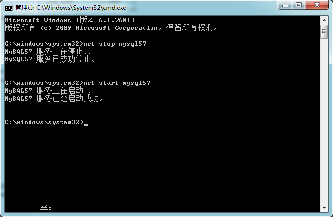
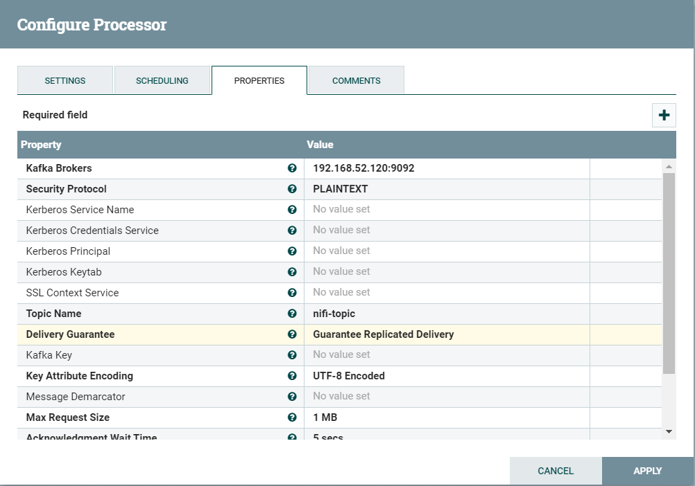
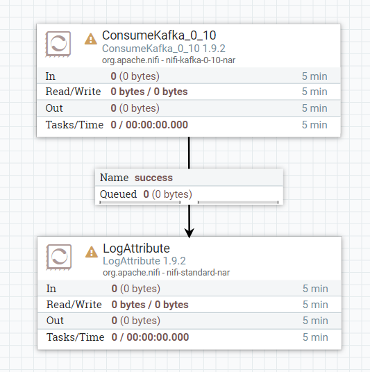

# NIFI典型案例

**课程目标**

1、离线同步Mysql数据到DFS

2、Json内容转换为Hive支持的文本格式

3、实时同步Mysql数据到Hive

4、Kafka的使用


## 1.离线同步Mysql数据到hdfs

大数据数据仓库系统中，经常需要进行数据同步操作，可以使用nifi来进行灵活的全流程操作。

**准备工作：**

1. 启动Mysql服务(5.7版本)，在Mysql中运行`\资料\mysql\nifi_test.sql`中的SQL语句。
2. 启动Hadoop集群(与NiFi集群在同一个可访问的局域网网段)

### 1.1处理器流程

QueryDatabaseTable	——>	ConvertAvroToJSON	——>	SplitJson	——>	PutHDFS

QueryDatabaseTable读取Mysql数据，ConvertAvroToJSON将数据转换为可阅读的Json格式，再通过SplitJson进行切割获得单独的对象，PutHDFS将所有对象写入HDFS中。

### 1.2处理器说明

#### QueryDatabaseTable

##### 描述

生成SQL选择查询，或使用提供的语句，并执行该语句以获取其指定的“最大值”列中的值大于先前看到的最大值的所有行。查询结果将转换为Avro格式。几种属性都支持表达式语言，但不允许传入连接。变量注册表可用于为包含表达式语言的任何属性提供值。如果需要利用流文件属性来执行这些查询，则可以将GenerateTableFetch和/或ExecuteSQL处理器用于此目的。使用流技术，因此支持任意大的结果集。使用标准调度方法，可以将该处理器调度为在计时器或cron表达式上运行。该处理器只能在主节点上运行。

##### 属性配置

在下面的列表中，必需属性的名称以**粗体显示**。其他任何属性（非粗体）均视为可选。该表还指示所有默认值，以及属性是否支持NiFi表达式语言。

| 名称                                    | 默认值 | 描述                                                         |
| :-------------------------------------- | ------ | :----------------------------------------------------------- |
| **Database Connection Pooling Service** |        | 用于获得与数据库的连接的Controller Service。<br>DBCPConnectionPoolLookup<br/>DBCPConnectionPoo<br/>HiveConnectionPool |
| **Database Type**                       | 泛型   | 数据库的类型/风格，用于生成特定于数据库的代码。在许多情况下，通用类型就足够了，但是某些数据库（例如Oracle）需要自定义SQL子句。<br>Generic<br/>Oracle<br/>Oracle 12+<br/>MS SQL 2012+<br/>MS SQL 2008<br/>MySQL |
| **Table Name**                          |        | 要查询的数据库表的名称。使用自定义查询时，此属性用于别名查询，并在FlowFile上显示为属性。 **支持表达式语言：true（仅使用变量注册表进行评估）** |
| Columns to Return                       |        | 查询中要使用的列名的逗号分隔列表。如果您的数据库需要对名称进行特殊处理（例如，引号），则每个名称都应包括这种处理。如果未提供任何列名，则将返回指定表中的所有列。注意：对于给定的表使用一致的列名很重要，这样增量提取才能正常工作。 **支持表达式语言：true（仅使用变量注册表进行评估）** |
| Additional WHERE clause                 |        | 构建SQL查询时要在WHERE条件中添加的自定义子句。 **支持表达式语言：true（仅使用变量注册表进行评估）** |
| Custom Query                            |        | 用于检索数据的自定义SQL查询。代替从其他属性构建SQL查询，此查询将包装为子查询。查询必须没有ORDER BY语句。 **支持表达式语言：true（仅使用变量注册表进行评估）** |
| Maximum-value Columns                   |        | 列名的逗号分隔列表。自处理器开始运行以来，处理器将跟踪返回的每一列的最大值。使用多列意味着列列表的顺序，并且期望每列的值比前一列的值增长得更慢。因此，使用多个列意味着列的层次结构，通常用于分区表。该处理器只能用于检索自上次检索以来已添加/更新的那些行。请注意，某些JDBC类型（例如位/布尔值）不利于保持最大值，因此这些类型的列不应在此属性中列出，并且会在处理期间导致错误。如果未提供任何列，则将考虑表中的所有行，这可能会对性能产生影响。注意：对于给定的表使用一致的最大值列名称很重要，这样增量提取才能正常工作。 **支持表达式语言：true（仅使用变量注册表进行评估）** |
| **Max Wait Time**                       | 0秒    | 正在运行的SQL选择查询所允许的最长时间，零表示没有限制。少于1秒的最长时间将等于零。 **支持表达式语言：true（仅使用变量注册表进行评估）** |
| **Fetch Size**                          | 0      | 一次要从结果集中获取的结果行数。这是对数据库驱动程序的提示，可能不被尊重和/或精确。如果指定的值为零，则忽略提示。 **支持表达式语言：true（仅使用变量注册表进行评估）** |
| **Max Rows Per Flow File**              | 0      | 一个FlowFile中将包含的最大结果行数。这将使您可以将非常大的结果集分解为多个FlowFiles。如果指定的值为零，那么所有行都将在单个FlowFile中返回。 **支持表达式语言：true（仅使用变量注册表进行评估）** |
| **Output Batch Size**                   | 0      | 提交流程会话之前要排队的输出FlowFiles的数量。设置为零时，将在处理所有结果集行并且输出FlowFiles准备好转移到下游关系时提交会话。对于较大的结果集，这可能导致在处理器执行结束时传输大量的FlowFiles。如果设置了此属性，则当指定数量的FlowFiles准备好进行传输时，将提交会话，从而将FlowFiles释放到下游关系。注意：设置此属性后，将不会在FlowFiles上设置maxvalue。*和fragment.count属性。 **支持表达式语言：true（仅使用变量注册表进行评估）** |
| **Maximum Number of Fragments**         | 0      | 最大片段数。如果指定的值为零，那么将返回所有片段。当此处理器提取大表时，这可以防止OutOfMemoryError。注意：设置此属性可能会导致数据丢失，因为未按顺序排列传入结果，并且片段可能会在任意边界处终止，其中结果集中不包含行。 **支持表达式语言：true（仅使用变量注册表进行评估）** |
| **Normalize Table/Column Names**        | 假     | 是否将列名中的非Avro兼容字符更改为Avro兼容字符。例如，冒号和句号将更改为下划线，以建立有效的Avro记录。<br>真正<br/>假 |
| Transaction Isolation Level             |        | 此设置将为支持此设置的驱动程序设置数据库连接的事务隔离级别。TRANSACTION_NONE<br/>TRANSACTION_READ_COMMITTED<br/>TRANSACTION_READ_UNCOMMITTED<br/>TRANSACTION_REPEATABLE_READ<br/>TRANSACTION_SERIALIZABLE |
| **Use Avro Logical Types**              | 假     | 是否对DECIMAL / NUMBER，DATE，TIME和TIMESTAMP列使用Avro逻辑类型。如果禁用，则写为字符串。如果启用，则使用逻辑类型并将其写为其基础类型，特别是DECIMAL / NUMBER为逻辑“十进制”：以具有附加精度和小数位元数据的字节形式写入，DATE为逻辑“ date-millis”：以int表示天自Unix时代（1970-01-01）起，TIME为逻辑'time-millis'：写为int，表示自Unix纪元以来的毫秒数； TIMESTAMP为逻辑'timestamp-millis'：写为长时，表示自Unix纪元以来的毫秒数。如果书面Avro记录的阅读者也知道这些逻辑类型，则可以根据阅读器的实现在更多上下文中反序列化这些值。<br>真正<br/>假 |
| **Default Decimal Precision**           | 10     | 当将DECIMAL / NUMBER值写入为“十进制” Avro逻辑类型时，需要表示可用位数的特定“精度”。通常，精度是由列数据类型定义或数据库引擎默认定义的。但是，某些数据库引擎可以返回未定义的精度（0）。写入那些未定义的精度数字时，将使用“默认十进制精度”。 **支持表达式语言：true（仅使用变量注册表进行评估）** |
| **Default Decimal Scale**               | 0      | 当将DECIMAL / NUMBER值写入为“十进制” Avro逻辑类型时，需要一个特定的“标度”来表示可用的十进制数字。通常，规模是由列数据类型定义或数据库引擎默认定义的。但是，当返回未定义的精度（0）时，某些数据库引擎的比例也可能不确定。写入那些未定义的数字时，将使用“默认小数位数”。如果一个值的小数位数超过指定的小数位数，那么该值将被四舍五入，例如1.53在小数位数为0时变为2，在小数位数1时变为1.5。 **支持表达式语言：true（仅使用变量注册表进行评估）** |


#### ConvertAvroToJSON

##### 描述

​		将Binary Avro记录转换为JSON对象。该处理器提供了Avro字段到JSON字段的直接映射，因此，生成的JSON将具有与Avro文档相同的层次结构。请注意，Avro模式信息将丢失，因为这不是从二进制Avro到JSON格式的Avro的转换。输出JSON编码为UTF-8编码。如果传入的FlowFile包含多个Avro记录的流，则生成的FlowFile将包含一个JSON Array，其中包含所有Avro记录或JSON对象序列。如果传入的FlowFile不包含任何记录，则输出为空JSON对象。空/单个Avro记录FlowFile输入可以根据“包装单个记录”的要求选择包装在容器中。

##### 属性配置

在下面的列表中，必需属性的名称以**粗体显示**。其他任何属性（非粗体）均视为可选。该表还指示任何默认值。

| 名称             | 默认值 | 允许值   | 描述                                                         |
| :--------------- | ------ | -------- | :----------------------------------------------------------- |
| **JSON容器选项** | 数组   | 没有数组 | 确定如何显示记录流：作为单个Object序列（无）（即，将每个Object写入新行），或者作为Objects数组（array）。 |
| **包装单条记录** | 假     | 真正假   | 确定是否将空记录或单个记录的结果输出包装在“ JSON容器选项”指定的容器数组中 |
| Avro模式         |        |          | 如果Avro记录不包含架构（仅基准），则必须在此处指定。         |


#### SplitJson

##### 描述

该处理器使用JsonPath表达式指定需要的数组元素，将JSON数组分割为多个单独的流文件。每个生成的流文件都由指定数组的一个元素组成，并传输到关系“split”，原始文件传输到关系“original”。如果没有找到指定的JsonPath，或者没有对数组元素求值，则将原始文件路由到“failure”，不会生成任何文件。

该处理器需要使用人员掌握JsonPath表达式语言。

##### 属性配置

在下面的列表中，必需属性的名称以粗体显示。任何其他属性(不是粗体)都被认为是可选的，并且指出属性默认值（如果有默认值），以及属性是否支持表达式语言。

| 属性名称                  | 默认值 | 可选值                            | 描述                                           |
| :------------------------ | :----- | :-------------------------------- | :--------------------------------------------- |
| JsonPath Expression       |        |                                   | 一个JsonPath表达式，它指定用以分割的数组元素。 |
| Null Value Representation | 1      | empty string<br>the string 'null' | 指定结果为空值时的表示形式。                   |


#### PutHDFS

##### 描述

将FlowFile数据写入Hadoop分布式文件系统（HDFS）

##### 属性配置

在下面的列表中，必需属性的名称以**粗体显示**。其他任何属性（非粗体）均视为可选。该表还指示所有默认值，以及属性是否支持NiFi表达式语言。

| 名称                             | 默认值<br> | 允许值                                          | 描述                                                         |
| :------------------------------- | ---------- | ----------------------------------------------- | :----------------------------------------------------------- |
| Hadoop Configuration Resources   |            |                                                 | 由文件或逗号分隔的文件列表，其中包含Hadoop文件系统配置。否则，Hadoop将在类路径中搜索“ core-site.xml”和“ hdfs-site.xml”文件，或者将恢复为默认配置。要使用swebhdfs，请参阅PutHDFS文档的“其他详细信息”部分。 **支持表达式语言：true（仅使用变量注册表进行评估）** |
| Kerberos Credentials Service     |            |                                                 | 指定应用于Kerberos身份验证的Kerberos凭据控制器服务           |
| Kerberos Principal               |            |                                                 | Kerberos主体作为身份验证。需要在您的nifi.properties中设置nifi.kerberos.krb5.file。 **支持的表达语言：true（仅使用变量注册表进行评估）** |
| Kerberos Keytab                  |            |                                                 | 与主体关联的Kerberos密钥表。需要在您的nifi.properties中设置nifi.kerberos.krb5.file。 **支持的表达语言：true（仅使用变量注册表进行评估）** |
| Kerberos Relogin Period          | 4小时      |                                                 | 尝试重新登录kerberos之前应该经过的时间。此属性已被弃用，并且对处理没有影响。现在，重新登录会自动发生。 **支持表达式语言：true（仅使用变量注册表进行评估）** |
| Additional Classpath Resources   |            |                                                 | 以逗号分隔的文件和/或目录的路径列表，该列表将添加到类路径中，并用于加载本机库。指定目录时，该目录中所有具有的文件都将添加到类路径中，但不包括其他子目录。 |
| **Directory**                    |            |                                                 | 文件应写入的父HDFS目录。如果目录不存在，将创建该目录。 **支持表达式语言：true（将使用流文件属性和变量注册表进行评估）** |
| **Conflict Resolution Strategy** | 失败       | 更换 <br>忽视 <br/>失败 <br>附加                | 指示当输出目录中已经存在同名文件时应该怎么办                 |
| Block Size                       |            |                                                 | 写入HDFS的每个块的大小。这将覆盖Hadoop配置                   |
| IO Buffer Size                   |            |                                                 | IO期间用于缓冲文件内容的内存量。这将覆盖Hadoop配置           |
| Replication                      |            |                                                 | HDFS复制每个文件的次数。这将覆盖Hadoop配置                   |
| Permissions umask                |            |                                                 | 用八进制数表示的umask，用于确定写入HDFS的文件的权限。这将覆盖Hadoop属性“ fs.permissions.umask-mode”。如果未定义此属性和“ fs.permissions.umask-mode”，则将使用Hadoop默认值“ 022”。 |
| Remote Owner                     |            |                                                 | 写入后，将HDFS文件的所有者更改为此值。仅当NiFi以具有HDFS超级用户特权来更改所有者的用户身份运行时才有效 **支持表达式语言：true（将使用流文件属性和变量注册表进行评估）** |
| Remote Group                     |            |                                                 | 写入后，将HDFS文件的组更改为此值。仅当NiFi以具有HDFS超级用户特权来更改组的用户身份运行时才有效 **支持表达式语言：true（将使用流文件属性和变量注册表进行评估）** |
| **Compression codec**            | 没有       | 没有   默认  邮编   邮编  LZ4 LZO   贪睡   自动 | 没有描述。                                                   |
| Ignore Locality                  | 假         | 真正假                                          | 指示HDFS系统忽略位置规则，以便在群集中随机分配数据           |

### 1.3操作

#### 1.3.1创建组


#### 1.3.2创建QueryDatabaseTable


#### 1.3.3创建并配置Mysql连接池

**1.3.3.1创建连接池**


**1.3.3.2配置连接池**


```properties
Database Connection URL = jdbc:mysql://192.168.52.6:3306/nifi_test?characterEncoding=UTF-8&useSSL=false&allowPublicKeyRetrieval=true
Database Driver Class Name = com.mysql.jdbc.Driver
#此处的jar包需要提前上传到nifi服务器中
Database Driver Location(s) = /export/download/jars/mysql-connector-java-5.1.40.jar
Database User = root
Password = 123456
```

**1.3.3.3启动连接池**


#### 1.3.4配置QueryDatabaseTable


```properties
Custom Query = select id,name,mobile,email,son_json from user_info_nifi limit 15
```


#### 1.3.5创建配置ConvertAvroToJSON

**1.3.5.1创建配置ConvertAvroToJSON**


**1.3.5.2连接**


**1.3.5.3 负载均衡消费数据**


#### 1.3.6创建配置SplitJson

**1.3.6.1 SplitJson配置**


```properties
JsonPath Expression = $.*
```


**1.3.6.2 连接**


#### 1.3.7创建配置PutHDFS


```properties
Hadoop Configuration Resources = /export/download/config/hdfs-site.xml,/export/download/config/core-site.xml
Directory = /user/hive/warehouse/nifi_test.db/user_info_nifi
Conflict Resolution Strategy = append
```


#### 1.3.8运行查看效果

##### 1.3.8.1 启动QueryDatabaseTable，并查看队列中数据


##### 1.3.8.2 启动ConvertAvroToJSON，并查看队列中数据


##### 1.3.8.3 启动SplitJson，并查看队列中数据


##### 1.3.8.4 启动PutHDFS，并查看处理器接收和输出的数据


##### 1.3.8.5 查看HDFS数据


## 2. Json内容转换为Hive支持的文本格式

在向HDFS同步数据的示例中，我们保存的文本内容是Json格式的，如图：


如果数据需要被Hive的外部表所使用，那么目前的Json数据格式是不满足要求的，我们如何将Json格式数据转换为Hive所需要的文本格式呢？


### 2.1处理器流程

QueryDatabaseTable	——>	ConvertAvroToJSON	——>	SplitJson	——>	**EvaluateJsonPath**	——>	**ReplaceText**	——>	PutHDFS

这里的重点是，增加了EvaluateJsonPath和ReplaceText处理器，EvaluateJsonPath用来提取json中的属性，ReplaceText用来替换掉FlowFile中的内容，以使内容符合Hive外部表所支持的文本格式。

1. 将Json数据中的属性值提取出来；
2. 转换为\t分割字段；\n分割行数据的格式。


### 2.2处理器说明

#### EvaluateJsonPath

##### 描述

该处理器根据流文件的内容计算一个或多个JsonPath表达式。这些表达式的结果被写入到FlowFile属性，或者写入到FlowFile本身的内容中，这取决于处理器的配置。通过添加用户自定义的属性来输入jsonpath，添加的属性的名称映射到输出流中的属性名称(如果目标是flowfile-attribute;否则，属性名将被忽略)。属性的值必须是有效的JsonPath表达式。“auto-detect”的返回类型将根据配置的目标进行确定。当“Destination”被设置为“flowfile-attribute”时，将使用“scalar”的返回类型。当“Destination”被设置为“flowfile-content”时，将使用“JSON”返回类型。如果JsonPath计算为JSON数组或JSON对象，并且返回类型设置为“scalar”，则流文件将不进行修改，并将路由到失败。如果所提供的JsonPath计算为指定的值，JSON的返回类型可以返回“scalar”。如果目标是“flowfile-content”，并且JsonPath没有计算到一个已定义的路径，那么流文件将被路由到“unmatched”，无需修改其内容。如果目标是“flowfile-attribute”，而表达式不匹配任何内容，那么将使用空字符串创建属性作为值，并且FlowFile将始终被路由到“matched”。

##### 属性配置

在下面的列表中，必需属性的名称以粗体显示。任何其他属性(不是粗体)都被认为是可选的，并且指出属性默认值（如果有默认值），以及属性是否支持表达式语言。

| 属性名称                      | 默认值           | 可选值                           | 描述                                                         |
| :---------------------------- | :--------------- | :------------------------------- | :----------------------------------------------------------- |
| **Destination**               | flowfile-content | flowfile-contentflowfile-content | 指示是否将JsonPath计算结果写入流文件内容或流文件属性;如果使用flowfile-attribute，则必须指定属性名称属性。如果设置为flowfile-content，则只能指定一个JsonPath，并且忽略属性名。 |
| **Return Type**               | auto-detect      | auto-detectjsonscalar            | 指示JSON路径表达式的期望返回类型。选择“auto-detect”，“flowfile-content”的返回类型自动设置为“json”，“flowfile-attribute”的返回类型自动设置为“scalar”。 |
| **Path Not Found Behavior**   | ignore           | warnignore                       | 指示在将Destination设置为“flowfile-attribute”时如何处理丢失的JSON路径表达式。当没有找到JSON路径表达式时，选择“warn”将生成一个警告。 |
| **Null Value Representation** | empty string     | empty stringempty string         | 指示产生空值的JSON路径表达式的所需表示形式。                 |

##### 动态属性：

该处理器允许用户指定属性的名称和值。

| 属性名称               | 属性值               | 描述                                                         |
| :--------------------- | :------------------- | :----------------------------------------------------------- |
| 用户自由定义的属性名称 | 用户自由定义的属性值 | 在该处理器生成的文件流上添加用户自定义的属性。如果使用表达式语言，则每批生成的流文件只执行一次计算 . 支持表达式语言:true(只使用变量注册表进行计算) |

##### 应用场景

通常当需要从流文件json中提取某些数据作为流属性时，使用此处理器；或者从流文件json内容中提取一部分内容作为下一个流文件内容，使用此处理器。


#### ReplaceText

##### 描述

使用其他值替换匹配正则表达式的流文件部分内容，从而更新流文件的内容。

##### 属性配置

在下面的列表中，必需属性的名称以粗体显示。任何其他属性(不是粗体)都被认为是可选的，并且指出属性默认值（如果有默认值），以及属性是否支持表达式语言。

| 属性名称                 | 默认值        | 可选值                                                  | 描述                                                         |
| ------------------------ | ------------- | ------------------------------------------------------- | ------------------------------------------------------------ |
| **Search Value**         | (?s)(^.*$)    |                                                         | 正则表达式，仅用于“Literal Replace”和“Regex Replace”匹配策略 支持表达式语言:true |
| **Replacement Value**    | $1            |                                                         | 使用“Replacement Strategy”策略时插入的值。 支持表达式语言:true |
| **Character Set**        | UTF-8         |                                                         | 字符集                                                       |
| **Maximum Buffer Size**  | 1 MB          |                                                         | 指定要缓冲的最大数据量(每个文件或每行，取决于计算模式)，以便应用替换。如果选择了“Entire Text”，并且流文件大于这个值，那么流文件将被路由到“failure”。在“Line-by-Line”模式下，如果一行文本比这个值大，那么FlowFile将被路由到“failure”。默认值为1 MB，主要用于“Entire Text”模式。在“Line-by-Line”模式中，建议使用8 KB或16 KB这样的值。如果将<**Replacement Strategy**>属性设置为一下其中之一:Append、Prepend、Always Replace，则忽略该值 |
| **Replacement Strategy** | Regex Replace | PrependAppendRegex ReplaceLiteral ReplaceAlways Replace | 在流文件的文本内容中如何替换以及替换什么内容的策略。         |
| **Evaluation Mode**      | Entire text   | Line-by-LineEntire text                                 | 对每一行单独进行“替换策略”(Line-by-Line)；或将整个文件缓冲到内存中(Entire text)，然后对其进行“替换策略”。 |

##### 应用场景

使用正则表达式，来逐行或者全文本替换文件流内容，往往用于业务逻辑处理。


### 2.3操作

#### 2.3.1 EvaluateJsonPath提取Json字段值

##### 2.3.1.1 创建并连接EvaluateJsonPath


##### 2.3.1.2 将Json字段配置到attribute


flowfile-attribute即为将变量放置在属性中；

扩展属性就是我们读取到的Json属性。

同时处理把**Invalid**警告处理掉


##### 2.3.1.3 启动查看结果


我们可以看到，经过EvaluateJsonPath处理后，FlowFile的属性中，已经包含了Json的字段值。


#### 2.3.2 ReplaceText变更文本内容和格式

虽然我们已经获取到了Json中的具体字段值，但是可以看到，FlowFile的内容还是Json。如何替换掉FlowFile中的内容数据呢？

##### 2.3.2.1 创建ReplaceText并连接


##### 2.3.2.2 解决Invalid


##### 2.3.2.3 配置替换FlowFile内容


#### 2.3.3 运行查看结果

##### 2.3.3.1 运行所有处理器，查看最后的FlowFile输出


##### 2.3.3.2 查看输出的HDFS文件


我们发现，最终的HDFS文件，已经符合Hive的格式要求，抽取完成。


## 3.实时同步Mysql数据到Hive

### 3.1 处理器流程

​		NiFi监控MySQL binlog处理调用流程如下:  CaptureChangeMySQL  ——>  RouteOnAttribute  ——>  EvaluateJsonPath  ——> ReplaceText  ——>  PutHiveQL

#### 准备工作

Mysql建库建表：

```sql
create table nifi_test.nifi_hive
(
    id       int auto_increment
        primary key,
    name     varchar(64) null,
    day_time date        null
);
```

Hive建表：

```sql
CREATE TABLE myhive.nifi_hive(id int,name string,day_time string)
STORED AS ORC
TBLPROPERTIES('transactional'='true');
```

替换Hive支持nar包：

​		上传文件`NiFi\资料\nifi安装包\nifi-hive-nar-1.9.2.nar`，将其替换到NiFi服务的lib目录下，并重启NiFi集群。


### 3.2 处理器说明

#### CaptureChangeMySQL

**描述**

从MySQL数据库检索更改数据捕获（CDC）事件。CDC事件包括INSERT，UPDATE，DELETE操作。事件将作为单独的流文件输出，并按操作发生的时间排序。

**属性配置**

在下面的列表中，必需属性的名称以**粗体显示**。其他任何属性（非粗体）均视为可选。该表还指示任何默认值，属性是否支持[NiFi表达式语言](http://nifi.apache.org/docs/nifi-docs/html/expression-language-guide.html)以及属性是否被视为“敏感”，这意味着将加密其值。在敏感属性中输入值之前，请确保**nifi.properties**文件具有属性**nifi.sensitive.props.key**的条目。

| 名称                            | 默认值<br> | 允许值         | 描述                                                         |
| :------------------------------ | ---------- | -------------- | :----------------------------------------------------------- |
| **MySQL Hosts**                 |            |                | 与MySQL群集中的节点相对应的主机名/端口条目的列表。条目应使用冒号（例如host1：port，host2：port等）以逗号分隔。例如mysql.myhost.com:3306。该处理器将尝试按顺序连接到列表中的主机。如果一个节点发生故障并为集群启用了故障转移，则处理器将连接到活动节点（假定在此属性中指定了其主机条目。MySQL连接的默认端口为3306。 **支持表达式语言：true（将为仅使用变量注册表进行评估）** |
| **MySQL Driver Class Name**     |            |                | MySQL数据库驱动程序类的类名称 **支持表达式语言：true（仅使用变量注册表进行评估）** |
| MySQL Driver Location(s)        |            |                | 包含MySQL驱动程序JAR及其依赖项（如果有）的文件/文件夹和/或URL的逗号分隔列表。例如，“ / var / tmp / mysql-connector-java-5.1.38-bin.jar” **支持表达式语言：true（仅使用变量注册表进行评估）** |
| Username                        |            |                | 访问MySQL集群的用户名 **支持表达式语言：true（仅使用变量注册表进行评估）** |
| Password                        |            |                | 访问MySQL集群的密码 **敏感属性：true** **支持表达式语言：true（仅使用变量注册表进行评估）** |
| Server ID                       |            |                | 连接到MySQL复制组的客户端实际上是一个简化的从属服务器（服务器），并且服务器ID值在整个复制组中必须是唯一的（即不同于任何主服务器或从属服务器使用的任何其他服务器ID）。因此，每个CaptureChangeMySQL实例在复制组中必须具有唯一的服务器ID。如果未指定服务器ID，则默认值为65535。 **支持表达式语言：true（仅使用变量注册表进行评估）** |
| Database/Schema Name Pattern    |            |                | 用于将数据库（或模式，取决于RDBMS术语）与CDC事件列表进行匹配的正则表达式（regex）。正则表达式必须与存储在RDBMS中的数据库名称匹配。如果未设置该属性，则数据库名称将不会用于过滤CDC事件。注意：DDL事件（即使它们影响不同的数据库）也与会话用来执行DDL的数据库相关联。这意味着，如果与一个数据库建立了连接，但针对另一个数据库发出了DDL，则连接的数据库将是与指定模式匹配的数据库。 |
| Table Name Pattern              |            |                | 用于影响影响匹配表的CDC事件的正则表达式（regex）。正则表达式必须与存储在数据库中的表名匹配。如果未设置该属性，则不会基于表名过滤任何事件。 |
| **Max Wait Time**               | 30秒       |                | 建立连接所允许的最长时间，零表示实际上没有限制。 **支持表达式语言：true（仅使用变量注册表进行评估）** |
| Distributed Map Cache Client    |            |                | 标识用于保留有关处理器所需的各种表，列等的信息的分布式映射缓存客户端控制器服务。如果未指定客户端，则生成的事件将不包括列类型或名称信息。 |
| **Retrieve All Records**        | true       | true<br>false  | 指定是否获取所有可用的CDC事件，而与当前binlog文件名和/或位置无关。如果binlog文件名和位置值存在于处理器的状态中，则将忽略此属性的值。这允许进行4种不同的配置：1）如果Binlog数据在处理器状态下可用，则该数据用于确定开始位置，并且“检索所有记录”的值将被忽略。2）如果没有二进制日志数据处于处理器状态，则将“检索所有记录”设置为true表示从二进制日志历史记录的开头开始。3）如果没有Binlog数据处于处理器状态，并且未设置Initial Binlog文件名/位置，则Retrieve All Records设置为false意味着从Binlog历史记录的末尾开始。4）如果没有二进制日志数据处于处理器状态，并且设置了初始二进制日志文件名/位置，然后将“检索所有记录”设置为false意味着从指定的初始Binlog文件/位置开始。要重置行为，请清除处理器状态（请参阅处理器文档的“状态管理”部分）。 |
| **Include Begin/Commit Events** | false      | true<br/>false | 指定是否在二进制日志中发出与BEGIN或COMMIT事件相对应的事件。如果在下游流中需要BEGIN / COMMIT事件，则将其设置为true，否则将其设置为false，这将抑制这些事件的产生并提高流性能。 |
| **Include DDL Events**          | false      | true<br/>false | 指定是否在二进制日志中发出与数据定义语言（DDL）事件相对应的事件，例如ALTER TABLE，TRUNCATE TABLE。如果在下游流中需要DDL事件是必需的，则将其设置为true；否则，将其设置为false，这将抑制这些事件的生成并提高流性能。 |
| **State Update Interval**       | 0秒        |                | 指示使用二进制日志文件/位置值更新处理器状态的频率。零值表示仅在处理器停止或关闭时才更新状态。如果在某个时候处理器状态不包含所需的二进制日志值，则发出的最后一个流文件将包含最后观察到的值，并且可以使用“初始二进制日志文件”，“初始二进制日志位置”和“初始序列”将处理器返回到该状态。 ID属性。 **支持表达式语言：true（仅使用变量注册表进行评估）** |
| Initial Sequence ID             |            |                | 指定一个初始序列标识符，如果该处理器的状态没有当前序列标识符，则使用该序列标识符。如果处理器的状态中存在序列标识符，则将忽略此属性。序列标识符是单调递增的整数，它记录处理器生成的流文件的顺序。它们可以与EnforceOrder处理器一起使用，以保证CDC事件的有序交付。 **支持表达式语言：true（仅使用变量注册表进行评估）** |
| Initial Binlog Filename         |            |                | 指定一个初始binlog文件名，如果该处理器的State没有当前binlog文件名，则使用该文件名。如果处理器的状态中存在文件名，则忽略此属性。如果不需要先前的事件，可以将其与初始Binlog位置一起使用以“向前跳过”。请注意，支持NiFi表达式语言，但是在配置处理器时会评估此属性，因此可能不会使用FlowFile属性。支持使用表达式语言来启用变量注册表和/或环境属性。 **支持表达式语言：true（仅使用变量注册表进行评估）** |
| Initial Binlog Position         |            |                | 如果该处理器的State没有当前的binlog文件名，则指定要使用的binlog的初始偏移量（由Initial Binlog Filename指定）。如果处理器的状态中存在文件名，则忽略此属性。如果不需要先前的事件，可以将其与初始Binlog文件名一起使用以“向前跳过”。请注意，支持NiFi表达式语言，但是在配置处理器时会评估此属性，因此可能不会使用FlowFile属性。支持使用表达式语言来启用变量注册表和/或环境属性。 **支持表达式语言：true（仅使用变量注册表进行评估）** |

**写入属性**

| 名称            | 描述                                                         |
| :-------------- | :----------------------------------------------------------- |
| cdc.sequence.id | 序列标识符（即严格增加的整数值），用于指定CDC事件流文件相对于其他事件流文件的顺序。 |
| cdc.event.type  | 一个字符串，指示发生的CDC事件的类型，包括（但不限于）'begin', 'insert', 'update', 'delete', 'ddl' 和 'commit'。 |
| mime.type       | 处理器以JSON格式输出流文件内容，并将mime.type属性设置为application / json |


#### DistributedMapCacheServer

**描述**

提供可通过套接字访问的映射（键/值）缓存。与该服务的交互通常是通过DistributedMapCacheClient服务完成的。

**属性配置**

在下面的列表中，必需属性的名称以**粗体显示**。其他任何属性（非粗体）均视为可选。该表还指示任何默认值。

| 名称             | 默认值   | 允许值                              | 描述                                                         |
| :--------------- | -------- | ----------------------------------- | :----------------------------------------------------------- |
| **港口**         | 4557     |                                     | 侦听传入连接的端口                                           |
| **最大缓存条目** | 10000    |                                     | 缓存可以容纳的最大缓存条目数                                 |
| **驱逐策略**     | 最少使用 | 最少使用最近最少使用先进先出        | 确定应使用哪种策略从缓存中逐出值以为新条目腾出空间           |
| 持久性目录       |          |                                     | 如果指定，则缓存将保留在给定目录中；如果未指定，则高速缓存将仅在内存中 |
| SSL上下文服务    |          | StandardRestrictedSSLContextService | 如果指定，此服务将用于创建SSL上下文，以用于保护通信；如果未指定，则通信将不安全 |


#### DistributedMapCacheClientService

**描述**

提供与DistributedMapCacheServer通信的功能。可以使用它来在NiFi群集中的节点之间共享地图

**属性配置**

在下面的列表中，必需属性的名称以**粗体显示**。其他任何属性（非粗体）均视为可选。该表还指示任何默认值。

| 名称             | 默认值 | 描述                                                         |
| :--------------- | ------ | :----------------------------------------------------------- |
| **服务器主机名** |        | 运行DistributedMapCacheServer服务的服务器的名称              |
| **服务器端口**   | 4557   | 与DistributedMapCacheServer服务通信时将使用的远程服务器上的端口 |
| SSL上下文服务    |        | 如果指定，则表示用于与远程服务器通信的SSL上下文服务。如果未指定，通讯将不会被加密<br>StandardSSLContextService<br/>StandardRestrictedSSLContextService |
| **通讯超时**     | 30秒   | 指定在无法发送或接收数据时确定存在通信故障之前与远程服务器通信之前要等待多长时间 |


#### RouteOnAttribute

**描述**

该处理器使用属性表达式语言，根据流文件的属性去计算然后进行路由。该处理器往往用于判断逻辑。

**属性配置**

在下面的列表中，必需属性的名称以粗体显示。任何其他属性(不是粗体)都被认为是可选的，并且指出属性默认值（如果有默认值），以及属性是否支持表达式语言。

| 属性名称             | 默认值                 | 可选值                                                       | 描述                                       |
| -------------------- | ---------------------- | ------------------------------------------------------------ | ------------------------------------------ |
| **Routing Strategy** | Route to Property name | Route to Property nameRoute to 'matched' if all matchRoute to 'matched' if any matches | 指定如何确定在计算表达式语言时使用哪个关系 |

**动态属性**

该处理器允许用户指定属性的名称和值。

| 属性名称                                   | 属性值                                               | 描述                                                         |
| ------------------------------------------ | ---------------------------------------------------- | ------------------------------------------------------------ |
| 用户自由定义的属性名称 (Relationship Name) | 用户自由定义的属性值 (Attribute Expression Language) | 将其属性与动态属性值中指定的属性表达式语言相匹配的流文件路由到动态属性键中指定的关系. 支持表达式语言:true |

**连接关系**

| 名称      | 描述                                           |
| --------- | ---------------------------------------------- |
| unmatched | 不匹配任何用户定义表达式的流文件将被路由到这里 |

**自定义连接关系**

可以根据用户配置处理器的方式创建动态连接关系。

| Name             | Description                          |
| ---------------- | ------------------------------------ |
| 动态属性的属性名 | 匹配动态属性的属性表达式语言的流文件 |


#### PutHiveQL

**描述**

执行HiveQL DDL / DML命令（例如，UPDATE，INSERT）。预期传入File的内容是要执行的HiveQL命令。HiveQL命令可以使用？转义参数。在这种情况下，要使用的参数必须作为FlowFile属性存在，命名约定为hiveql.args.N.type和hiveql.args.N.value，其中N是一个正整数。hiveql.args.N.type应该是指示JDBC类型的数字。FlowFile的内容应采用UTF-8格式。

**属性配置**

在下面的列表中，必需属性的名称以**粗体显示**。其他任何属性（非粗体）均视为可选。该表还指示任何默认值。

| 名称                                              | 默认值<br> | 描述                                                         |
| :------------------------------------------------ | ---------- | :----------------------------------------------------------- |
| **Hive Database Connection Pooling Service**<br/> |            | Hive Controller Service，用于获取与Hive数据库的连接          |
| **Batch Size**                                    | 100        | 在单个事务中放入数据库的首选FlowFiles数                      |
| **Character Set**                                 | UTF-8      | 指定记录数据的字符集。                                       |
| **Statement Delimiter**                           | ;          | 语句分隔符，用于在多语句脚本中分隔SQL语句                    |
| **Rollback On Failure**                           | false      | 指定如何处理错误。默认情况下（false），如果在处理FlowFile时发生错误，则FlowFile将根据错误类型路由到“失败”或“重试”关系，处理器可以继续下一个FlowFile。相反，您可能想回滚当前已处理的FlowFile，并立即停止进一步的处理。在这种情况下，您可以通过启用此“回滚失败”属性来实现。如果启用，失败的FlowFiles将保留在输入关系中，而不会受到惩罚，并会反复处理，直到成功处理或通过其他方式将其删除为止。重要的是要设置足够的“有效期限”，以免重试次数过多。 |


#### HiveConnectionPool

**描述**

为Apache Hive提供数据库连接池服务。可以从池中请求连接，使用后返回连接。

**属性配置**

在下面的列表中，必需属性的名称以**粗体显示**。其他任何属性（非粗体）均视为可选。该表还指示任何默认值，属性是否支持NiFi表达式语言。

| 名称                         | 默认值<br> | 描述                                                         |
| :--------------------------- | ---------- | :----------------------------------------------------------- |
| **Database Connection URL**  |            | 用于连接数据库的数据库连接URL。可能包含数据库系统名称，主机，端口，数据库名称和一些参数。数据库连接URL的确切语法由Hive文档指定。例如，当连接到安全的Hive服务器时，通常将服务器主体作为连接参数包括在内。 **支持表达式语言：true（仅使用变量注册表进行评估）** |
| Hive Configuration Resources |            | 包含Hive配置（例如，hive-site.xml）的文件或文件的逗号分隔列表。否则，Hadoop将在类路径中搜索“ hive-site.xml”文件，或恢复为默认配置。请注意，例如要启用Kerberos身份验证，必须在配置文件中设置适当的属性。请参阅Hive文档以获取更多详细信息。 **支持表达式语言：true（仅使用变量注册表进行评估）** |
| Database User                |            | 数据库用户名 **支持表达式语言：true（仅使用变量注册表进行评估）** |
| Password                     |            | 数据库用户的密码 **敏感属性：true** **支持表达式语言：true（仅使用变量注册表进行评估）** |
| **Max Wait Time**            | 500毫秒    | 池在失败之前将等待（如果没有可用连接时）返回连接的最大时间，或者无限期等待-1。 **支持表达式语言：true（仅使用变量注册表进行评估）** |
| **Max Total Connections**    | 8          | 可以同时从该池分配的活动连接的最大数量，或者为无限制的最大数量。 **支持表达式语言：true（仅使用变量注册表进行评估）** |
| Validation query             |            | 验证查询，用于在返回连接之前对其进行验证。当借用的连接无效时，它将被丢弃并返回新的有效连接。注意：使用验证可能会降低性能。 **支持表达式语言：true（仅使用变量注册表进行评估）** |
| Kerberos Credentials Service |            | 指定应用于Kerberos身份验证的Kerberos凭据控制器服务           |
| Kerberos Principal           |            | Kerberos主体作为身份验证。需要在您的nifi.properties中设置nifi.kerberos.krb5.file。 **支持表达式语言：true（仅使用变量注册表进行评估）** |
| Kerberos Keytab              |            | 与主体关联的Kerberos密钥表。需要在您的nifi.properties中设置nifi.kerberos.krb5.file。 **支持表达式语言：true（仅使用变量注册表进行评估）** |


### 3.3 操作

#### 3.3.1 开启Mysql的binlog日志

Mysql的版本号要求5.7。

##### 3.3.1.1 登陆MySQL查看日志状态

```shell
# mysql -u root -p123456
mysql> show variables like '%log_bin%';
```


##### 3.3.1.2 退出MySQL登陆

```shell
mysql> exit
```


##### 3.3.1.3 Linux开启binlog

**编辑配置文件**

```shell
vi /etc/my.cnf
```

行尾加上

```properties
server_id = 1
log_bin = mysql-bin
binlog_format = row
```

server-id :表示单个结点的id,单个节点可以随意写，多个节点不能重复，
log-bin指定binlog日志文件的名字为mysql-bin，以及其存储路径。


**重启服务**

```shell
systemctl restart mysqld.service
```

或者

```shell
service mysqld restart
```

**重新登陆查询开启状态**


##### 3.3.1.4 Windows开启binlog

**修改配置文件**

找到mysql配置文件**my.ini**所在目录，一般在**C:\ProgramData\MySQL\MySQL Server 5.7**。

注意目录不是C:\ **Program Files** \MySQL\MySQL Server 5.7。


```properties
server_id = 1
log_bin = mysql-bin
binlog_format = row
```


**重启Mysql服务**



**查询开启状态**


##### 3.3.1.5 开启Mysql远程访问权限

```sql
GRANT ALL PRIVILEGES ON *.* TO 'root'@'%' IDENTIFIED BY '123456' WITH GRANT OPTION;
FLUSH PRIVILEGES;
```

#### 3.3.2 实时获取Mysql变更

##### 3.3.2.1 创建处理器组

​	组名：MySqlToHive_Timely

##### 3.3.2.2 创建CaptureChangeMySQL

CaptureChangeMySQL的配置中需要DistributedMapCacheClientService、DistributedMapCacheServer处理器，一并创建。


##### 3.3.2.3 配置DistributedMapCacheServer


##### 3.3.2.4 配置DistributedMapCacheClientService


##### 3.3.2.5 启动Cache服务和客户端

​	在模拟的集群模式下，因为三台服务都在同一台主机，所以会存在端口冲突的问题，但是并不影响使用。因为只要有一个节点的缓存服务启动正常就可以使用。


##### 3.3.2.6 配置CaptureChangeMySQL


```properties
MySQL Hosts = 192.168.52.6:3306
MySQL Driver Class Name = com.mysql.jdbc.Driver
MySQL Driver Location(s) = /export/download/jars/mysql-connector-java-5.1.40.jar
Username = root
Password = 123456
Include Begin/Commit Events = true
Include DDL Events = true
```


##### 3.3.2.7 启动CaptureChangeMysql


**启动后报错：**


**FlowFile数据的属性信息：**


#### 3.3.3 根据条件路由

##### 3.3.3.1 RouteOnAttribute多线程消费

根据自己的服务器硬件配置，以及数据的更新速率，进行评估后填写。


##### 3.3.3.2 NiFi表达式

NiFi表达式官网：https://nifi.apache.org/docs/nifi-docs/html/expression-language-guide.html

之前我们已经了解过NiFi表达式语言，这里我们仅针对equals函数进行说明。

###### NiFi表达式的equals函数

**equals**

说明：`equals`函数使用非常广泛，它确定其主题是否等于另一个String值。请注意，该`equals`函数直接比较两个String值。注意不要将此函数与[matchs](https://nifi.apache.org/docs/nifi-docs/html/expression-language-guide.html#matches)函数混淆，后者会根据正则表达式评估其主题。

学科类型：任意

参数：

- *value*：用于比较Subject的值。必须与主题类型相同。

返回类型：布尔值

示例：我们可以使用表达式`${filename:equals('hello.txt')}`检查FlowFile的文件名是否为“ hello.txt” ，或者可以检查属性`hello`的值是否等于属性的值`filename`： `${hello:equals( ${filename} )}`。


##### 3.3.3.3 设置自定义属性


##### 3.3.3.4 运行并查看输出


**输出的数据内容：**

```json
{
    "type": "insert",
    "timestamp": 1582484253000,
    "binlog_filename": "mysql-bin.000005",
    "binlog_position": 375,
    "database": "nifi_test",
    "table_name": "nifi_hive_streaming",
    "table_id": 108,
    "columns": [
        {
            "id": 1,
            "name": "id",
            "column_type": 4,
            "value": 7
        },
        {
            "id": 2,
            "name": "name",
            "column_type": 12,
            "value": "testName5"
        },
        {
            "id": 3,
            "name": "day_time",
            "column_type": 91,
            "value": "2020-02-24"
        }
    ]
}
```


#### 3.3.4  提取关键属性

​	

​	EvaluateJsonPath等处理器在提取数据时，可以使用JsonPath表达式，来灵活的获取信息。

##### 3.3.4.1  JsonPath表达式

###### 简介

类似于XPath在xml文档中的定位，JsonPath表达式通常是用来路径检索或设置Json的。

JsonPath中的“根成员对象”始终称为$，无论是对象还是数组。

其表达式可以接受“dot–notation”和“bracket–notation”格式，例如

```
$.store.book[0].title、$[‘store’][‘book’][0][‘title’]
```

###### 操作符

| 符号                    | 描述                                                         |
| ----------------------- | ------------------------------------------------------------ |
| $                       | 查询的根节点对象，用于表示一个json数据，可以是数组或对象     |
| @                       | 过滤器断言（filter predicate）处理的当前节点对象，类似于java中的this字段 |
| *                       | 通配符，可以表示一个名字或数字                               |
| ..                      | 可以理解为递归搜索，Deep scan. Available anywhere a name is required. |
| .<name>                 | 表示一个子节点                                               |
| [‘<name>’ (, ‘<name>’)] | 表示一个或多个子节点，                                       |
| [<number> (, <number>)] | 表示一个或多个数组下标                                       |
| [start:end]             | 数组片段，区间为[start,end),不包含end                        |
| [?(<expression>)]       | 过滤器表达式，表达式结果必须是boolean                        |

###### 函数

可以在JsonPath表达式执行后进行调用，其输入值为表达式的结果。

| 名称     | 描述                     | 输出    |
| -------- | ------------------------ | ------- |
| min()    | 获取数值类型数组的最小值 | Double  |
| max()    | 获取数值类型数组的最大值 | Double  |
| avg()    | 获取数值类型数组的平均值 | Double  |
| stddev() | 获取数值类型数组的标准差 | Double  |
| length() | 获取数值类型数组的长度   | Integer |

###### 过滤器

过滤器是用于过滤数组的逻辑表达式，一个通常的表达式形如：[?(@.age > 18)]，可以通过逻辑表达式&&或||组合多个过滤器表达式，例如[?(@.price < 10 && @.category == ‘fiction’)]，字符串必须用单引号或双引号包围，例如[?(@.color == ‘blue’)] or [?(@.color == “blue”)]。

| 操作符 | 描述                                                         |
| ------ | ------------------------------------------------------------ |
| ==     | 等于符号，但数字1不等于字符1(note that 1 is not equal to ‘1’) |
| !=     | 不等于符号                                                   |
| <      | 小于符号                                                     |
| <=     | 小于等于符号                                                 |
| >      | 大于符号                                                     |
| >=     | 大于等于符号                                                 |
| =~     | 判断是否符合正则表达式，例如[?(@.name =~ /foo.*?/i)]         |
| in     | 所属符号，例如[?(@.size in [‘S’, ‘M’])]                      |
| nin    | 排除符号                                                     |
| size   | size of left (array or string) should match right            |
| empty  | 判空符号                                                     |

###### 示例

```json
{
    "store": {
        "book": [
            {
                "category": "reference",
                "author": "Nigel Rees",
                "title": "Sayings of the Century",
                "price": 8.95
            },
            {
                "category": "fiction",
                "author": "Evelyn Waugh",
                "title": "Sword of Honour",
                "price": 12.99
            },
            {
                "category": "fiction",
                "author": "Herman Melville",
                "title": "Moby Dick",
                "isbn": "0-553-21311-3",
                "price": 8.99
            },
            {
                "category": "fiction",
                "author": "J. R. R. Tolkien",
                "title": "The Lord of the Rings",
                "isbn": "0-395-19395-8",
                "price": 22.99
            }
        ],
        "bicycle": {
            "color": "red",
            "price": 19.95
        }
    },
    "expensive": 10
}
```

| JsonPath (点击链接测试)                       | 结果                                                         |
| :-------------------------------------------- | :----------------------------------------------------------- |
| $.store.book[*].author <br/>或 <br/>$..author | 获取json中store下book下的所有author值                        |
| $.store.* 显示所有叶子节点值                  | 所有的东西，书籍和自行车                                     |
| $.store..price                                | 获取json中store下所有price的值                               |
| $..book[2]                                    | 获取json中book数组的第3个值                                  |
| $..book[-2]                                   | 倒数的第二本书                                               |
| $..book[0,1]<br/>或<br/>$..book[:2]           | 前两本书                                                     |
| $..book[1:2]                                  | 从索引1（包括）到索引2（排除）的所有图书                     |
| $..book[-2:]                                  | 获取json中book数组的最后两个值                               |
| $..book[2:]                                   | 获取json中book数组的第3个到最后一个的区间值                  |
| $..book[?(@.isbn)]                            | 获取json中book数组中包含isbn的所有值                         |
| $.store.book[?(@.price < 10)]                 | 获取json中book数组中price<10的所有值                         |
| $..book[?(@.price <= $[‘expensive’])]         | 获取json中book数组中price<=expensive的所有值                 |
| $..book[?(@.author =~ /.*REES/i)]             | 获取json中book数组中的作者以REES结尾的所有值（REES不区分大小写） |
| $..*                                          | 逐层列出json中的所有值，层级由外到内                         |
| $..book.length()                              | 获取json中book数组的长度                                     |


##### 3.3.4.2 提取Json属性到Attribute


##### 3.3.4.3 运行并查看输出


#### 3.3.5 ReplaceText转换Sql

**配置ReplaceText**


```properties
Replacement Value = insert into myhive.nifi_hive (id,name,day_time) values (${id},'${name}','${day_time}')
```

**启动查看结果**


#### 3.3.6 写入Hive

##### 3.3.6.1 创建PutHiveQL

略

##### 3.3.6.2 创建配置HiveConnectionPool


```properties
Database Connection URL = jdbc:hive2://192.168.52.120:10000
Hive Configuration Resources = /export/download/config/core-site.xml,/export/download/config/hdfs-site.xml,/export/download/config/hive-site.xml
```

配置完成后，记得启用HiveConnectionPool。

##### 3.3.6.3 PutHiveQL关联HiveConnectionPool


##### 3.3.7 验证Hive表中是否成功写入数据

略。


## 4. Kafka的使用

​		Kafka是一个由Scala和java编写的高吞吐量的分布式发布订阅消息。它拥有很高的吞吐量、稳定性和扩容能力，在OLTP和OLAP中都会经常使用。使用NiFi可以简单快速的建立起kafka的生产者和消费者，而不需要编写繁杂的代码。

### 4.1 处理器说明

#### 4.1.1 PublishKafka_0_10

**描述**

使用Kafka 0.10.x Producer API将FlowFile的内容作为消息发送到Apache Kafka。要发送的消息可以是单独的FlowFiles，也可以使用用户指定的定界符（例如换行符）进行定界。用于获取消息的辅助NiFi处理器是ConsumeKafka_0_10。

**属性配置**

| Name                         | Default Value           | Description                                                  |
| ---------------------------- | ----------------------- | ------------------------------------------------------------ |
| **Kafka Brokers**            | localhost:9092          | 逗号分隔的已知Kafka Broker列表，格式为<主机>：<端口> **支持表达式语言：true（仅使用变量注册表进行评估）** |
| **Security Protocol**        | 纯文本                  | 与经纪人通信的协议。对应于Kafka的“ security.protocol”属性。  |
| Kerberos Service Name        |                         | 与代理JAAS文件中配置的Kafka服务器的主要名称匹配的服务名称。可以在Kafka的JAAS配置或Kafka的配置中定义。对应于Kafka的'security.protocol'属性，除非选择<Security Protocol>的SASL选项之一，否则它将被忽略。 **支持表达式语言：true（仅使用变量注册表进行评估）** |
| Kerberos Credentials Service |                         | 指定应用于Kerberos身份验证的Kerberos凭据控制器服务           |
| Kerberos Principal           |                         | 将用于连接到代理的Kerberos主体。如果未设置，则应在bootstrap.conf文件中定义的JVM属性中设置JAAS配置文件。该主体将被设置为“ sasl.jaas.config” Kafka的属性。 **支持表达式语言：true（仅使用变量注册表进行评估）** |
| Kerberos Keytab              |                         | 用于连接代理的Kerberos密钥表。如果未设置，则应在bootstrap.conf文件中定义的JVM属性中设置JAAS配置文件。该主体将被设置为“ sasl.jaas.config” Kafka的属性。 **支持表达式语言：true（仅使用变量注册表进行评估）** |
| SSL Context Service          |                         | 指定用于与Kafka通信的SSL上下文服务。                         |
| **Topic Name**               |                         | 要发布到的Kafka主题的名称。 **支持表达式语言：true（将使用流文件属性和变量注册表进行评估）** |
| **Delivery Guarantee**       | 0                       | 指定保证消息发送到Kafka的要求。对应于Kafka的“ acks”属性：<br>Best Effort<br>Guarantee Single Node Delivery<br>Guarantee Replicated Delivery |
| Kafka Key                    |                         | 用于消息的密钥。如果未指定，则将流文件属性'kafka.key'用作消息密钥（如果存在）。请注意，同时设置Kafka密钥和标界可能会导致许多具有相同密钥的Kafka消息。这不是问题，因为Kafka不会强制执行或假定消息和密钥的唯一性。尽管如此，同时设置分界符和Kafka密钥仍存在Kafka数据丢失的风险。在Kafka上进行主题压缩时，将基于此密钥对消息进行重复数据删除。 **支持表达式语言：true（将使用流文件属性和变量注册表进行评估）** |
| **Key Attribute Encoding**   | utf-8                   | 发出的FlowFiles具有名为“ kafka.key”的属性。此属性指示应如何编码属性的值。 |
| Message Demarcator           |                         | 指定用于在单个FlowFile中划分多个消息的字符串（解释为UTF-8）。如果未指定，则FlowFile的全部内容将用作一条消息。如果指定，则FlowFile的内容将在此定界符上分割，并且每个部分作为单独的Kafka消息发送。要输入特殊字符（例如“换行”），请根据您的操作系统使用CTRL + Enter或Shift + Enter。 **支持表达式语言：true（将使用流文件属性和变量注册表进行评估）** |
| **Max Request Size**         | 1兆字节                 | 请求的最大大小（以字节为单位）。对应于Kafka的'max.request.size'属性，默认值为1 MB（1048576）。 |
| **Acknowledgment Wait Time** | 5秒                     | 在向Kafka发送消息后，这表明我们愿意等待Kafka做出回应的时间。如果Kafka在此时间段内未确认该消息，则FlowFile将被路由为“失败”。 |
| **Max Metadata Wait Time**   | 5秒                     | 在整个“发送”调用失败之前，发布者将在“发送”调用期间等待获取元数据或等待缓冲区刷新的时间。对应于Kafka的'max.block.ms'属性 **支持表达式语言：true（仅使用变量注册表进行评估）** |
| Partitioner class            | org..DefaultPartitioner | 指定用于计算消息的分区标识的类。对应于Kafka的'partitioner.class'属性。<br>RoundRobinPartitioner、DefaultPartitioner |
| **Compression Type**         | 没有                    | 此参数允许您为此生产者生成的所有数据指定压缩编解码器。       |


#### 4.1.2 ConsumeKafka_0_10

**描述**

消耗来自专门针对Kafka 0.10.x Consumer API构建的Apache Kafka的消息。用于发送消息的辅助NiFi处理器是PublishKafka_0_10。

**属性配置**

在下面的列表中，必需属性的名称以**粗体显示**。其他任何属性（非粗体）均视为可选。该表还指示所有默认值，以及属性是否支持NiFi表达式语言。

| 名称                         | 默认值         | 描述                                                         |
| :--------------------------- | -------------- | :----------------------------------------------------------- |
| **Kafka Brokers**            | localhost:9092 | 逗号分隔的已知Kafka Broker列表，格式为<主机>：<端口> **支持表达式语言：true（仅使用变量注册表进行评估）** |
| **Security Protocol**        | 纯文本         | 与经纪人通信的协议。对应于Kafka的“ security.protocol”属性。  |
| Kerberos Service Name        |                | 与代理JAAS文件中配置的Kafka服务器的主要名称匹配的服务名称。可以在Kafka的JAAS配置或Kafka的配置中定义。对应于Kafka的'security.protocol'属性，除非选择<Security Protocol>的SASL选项之一，否则它将被忽略。 **支持表达式语言：true（仅使用变量注册表进行评估）** |
| Kerberos Credentials Service |                | 指定应用于Kerberos身份验证的Kerberos凭据控制器服务           |
| Kerberos Principal           |                | 将用于连接到代理的Kerberos主体。如果未设置，则应在bootstrap.conf文件中定义的JVM属性中设置JAAS配置文件。该主体将被设置为“ sasl.jaas.config” Kafka的属性。 **支持表达式语言：true（仅使用变量注册表进行评估）** |
| Kerberos Keytab              |                | 用于连接代理的Kerberos密钥表。如果未设置，则应在bootstrap.conf文件中定义的JVM属性中设置JAAS配置文件。该主体将被设置为“ sasl.jaas.config” Kafka的属性。 **支持表达式语言：true（仅使用变量注册表进行评估）** |
| SSL Context Service          |                | 指定用于与Kafka通信的SSL上下文服务。                         |
| **Topic Name(s)**            |                | 要从中提取的Kafka主题的名称。如果逗号分隔，则可以提供多个。 **支持表达式语言：true（仅使用变量注册表进行评估）** |
| **Topic Name Format**        | names          | 指定提供的主题是逗号分隔的名称列表还是单个正则表达式。<br>names、pattern |
| **Group ID**                 |                | 组ID用于标识同一使用者组内的使用者。对应于Kafka的'group.id'属性。 **支持表达式语言：true（仅使用变量注册表进行评估）** |
| **Offset Reset**             | latest         | 当Kafka中没有初始偏移量或服务器上不再存在当前偏移量时（例如，因为该数据已被删除），使您可以管理条件。对应于Kafka的'auto.offset.reset'属性。<br>earliest、latest、none |
| **Key Attribute Encoding**   | utf-8          | 发出的FlowFiles具有名为“ kafka.key”的属性。此属性指示应如何编码属性的值。 |
| Message Demarcator           |                | 由于KafkaConsumer批量接收消息，因此您可以选择输出FlowFiles，其中包含给定主题和分区的单个批次中的所有Kafka消息，并且该属性允许您提供一个字符串（解释为UTF-8）以用于分界多封Kafka讯息。这是一个可选属性，如果未提供，则收到的每条Kafka消息都会在触发该消息时产生一个FlowFile。要输入特殊字符（例如“换行”），请使用CTRL + Enter或Shift + Enter，具体取决于操作系统 **支持的表达语言：true（仅使用变量注册表进行评估）** |
| Max Poll Records             | 10000          | 指定Kafka在一次轮询中应返回的最大记录数。                    |
| Max Uncommitted Time         | 1 secs         | 指定在必须提交偏移量之前允许通过的最长时间。该值影响补偿的提交频率。较少地提交偏移量会增加吞吐量，但是如果在提交之间重新平衡或JVM重新启动，则可能会增加潜在数据重复的窗口。此值还与最大轮询记录和消息定界符的使用有关。使用消息分界器时，未提交的消息会比未分配的消息多得多，因为跟踪内存的情况要少得多。 |


### 4.2 Producer生产

#### 4.2.1 创建处理器

​		创建处理器组kafka，进入组后分别创建GenerateFlowFile和PublishKafka_0_10处理器。

#### 4.2.2 负载均衡生产消息

##### 		4.2.2.1 连接GenerateFlowFile和PublishKafka_0_10


##### 4.2.2.2 负载均衡并发


#### 4.2.3 配置GenerateFlowFile

##### 4.2.3.1 调度配置：

每1秒生产一次数据


##### 4.2.3.2 属性配置

文件大小100b；每次生成10个相同文件；每次生成的流文件内容唯一。


#### 4.2.4 配置PublishKafka_0_10

##### 4.2.4.1 属性配置

Brokers设置为192.168.52.100:9092,192.168.52.110:9092,192.168.52.120:9092

topic设置为nifi-topic，如果topic不存在，会自动创建；

Delivery Guarantee，对应kafka的acks机制，选择最为保险的Guarantee Replicated Delivery，相当于acks=all。



##### 4.2.4.2 关系配置


#### 4.2.5 启动流程并监听数据

##### 4.2.5.1 启动流程

略

##### 4.2.5.2 监听kafka消费数据

在kafka所在服务器执行监听命令：

```shell
/export/servers/kafka_2.11-0.10.2.1/bin/kafka-console-consumer.sh --bootstrap-server  192.168.52.110:9092 --topic nifi-topic
```


### 4.3 Consumer消费

##### 4.3.1 创建处理器并连接

创建ConsumeKafka_0_10和LogAttribute处理器，并连接。




##### 4.3.2 配置ConsumeKafka_0_10

Brokers地址要和Producer的设置一样：192.168.52.100:9092,192.168.52.110:9092,192.168.52.120:9092

Topic设置和Producer一致：nifi-topic

GroupId随意设置：nifi

Offset Reset设置为：latest，从最新的消息开始消费


##### 4.3.3 设置LogAttribute

**设置为自连接**


##### 4.3.4 启动流程并查看日志

略、


##### 4.3.5 增加生产频率

注意：如果服务器资源有限，不要进行此操作。

GenerateFlowFile的调度频率加快：20ms


观察kafka消费情况，和nifi日志打印。